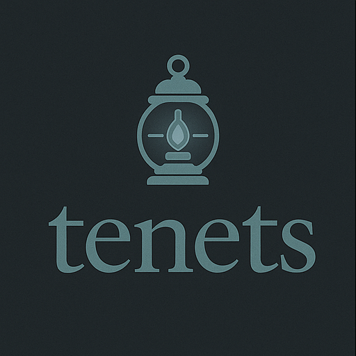

#  **tenets**

**context that feeds your prompts.**

[](https://opensource.org/licenses/MIT)
[](https://www.python.org/downloads/)
[](https://pypi.org/project/tenets/)
[](https://github.com/jddunn/tenets/actions/workflows/ci.yml)
[](https://codecov.io/gh/jddunn/tenets)
[](https://docs.tenets.dev)

**tenets** automatically finds and builds the most relevant context from your codebase. Instead of manually copying files or searching for documentation, tenets intelligently aggregates exactly what you need - whether you're debugging, building features, or chatting with an AI assistant.

## What is tenets?

Think of it as intelligent context aggregation. You give it a prompt or query, and it:

- 🔍 **Finds** all relevant files automatically 
- 🎯 **Ranks** them by importance using multiple factors
- 📦 **Aggregates** them within your token budget
- 📋 **Formats** perfectly for any use case

Plus powerful development intelligence:

- 📊 **Visualize** dependencies and architecture
- 📈 **Track** velocity and code evolution  
- 🔥 **Identify** hotspots and technical debt
- 👥 **Understand** team patterns and expertise

```bash
# Instead of manually finding and copying files...
tenets distill "implement OAuth2" ./src

# It automatically finds auth.py, user.py, config.yaml, recent commits, 
# related tests, dependency files - everything you actually need
```

## Why tenets?

### The Problem

When working with large codebases, you're constantly:

- Manually searching for relevant files
- Copy-pasting code into ChatGPT/Claude
- Missing important context and dependencies
- Repeating the same searches over and over
- Paying for AI to process irrelevant code

### The Solution

tenets uses intelligent algorithms to solve this:

```bash
# Old way: Manual search and copy
$ grep -r "payment" . 
$ cat payment.py api.py models.py  # Did I miss anything?
# Copy... paste... hope for the best

# With tenets: Automatic context building
$ tenets distill "fix payment processing bug"
# Finds: payment.py, api endpoints, models, recent payment commits,
# config files, tests, error handlers - ranked by relevance
```

## Key Features

### 🎯 Intelligent Context Distillation

Like repomix on steroids - smart filters, automatic relevance ranking, and configurable aggregation:

```bash
# Distill by file types
tenets distill "review API" --include "*.py,*.js" --exclude "test_*"

# Smart aggregation with summaries
tenets distill "understand auth flow" --max-tokens 50000

# Session-based for iterative work
tenets session start "new-feature"
tenets distill "design database schema"  # Full context
tenets distill "add user model"          # Incremental updates
```

### 🧭 Guiding Principles (Tenets)

Add persistent instructions that guide AI interactions:

```bash
# Add guiding principles
tenets tenet add "Always use type hints in Python"
tenets tenet add "Follow RESTful conventions"
tenets tenet add "Include error handling"

# Instill them into your context
tenets instill  # Applies all pending tenets

# They'll be strategically injected to maintain context
```

### 📊 Code Intelligence & Visualization

Understand your codebase at a glance:

```bash
# Dependency graphs
tenets viz deps . --output architecture.svg

# Complexity analysis
tenets viz complexity . --hotspots

# Git integration - automatic, no setup
tenets chronicle --since "last week"
tenets viz contributors --active
```

### 🚀 Developer Productivity

Track velocity, identify bottlenecks, measure progress:

```bash
# Sprint velocity
tenets momentum --team --since "sprint-start"

# Code ownership
tenets examine . --ownership

# Technical debt trends
tenets examine . --complexity-trend
```

### 🔧 Flexible Configuration

Works instantly with smart defaults, fully configurable when needed:

```yaml
# .tenets.yml (optional)
context:
  ranking: balanced  # fast, balanced, thorough
  include_git: true  # Add git context automatically
  max_tokens: 100000

ignore:
  - vendor/
  - "*.generated.*"
  
output:
  format: markdown  # markdown, json, xml
```

## Installation

### Quick Install (pip)

```bash
# Core features only - lightweight, no ML dependencies
pip install tenets

# Add specific features
pip install tenets[light]  # Adds numpy, scikit-learn for TF-IDF ranking
pip install tenets[viz]    # Adds visualization capabilities
pip install tenets[ml]     # Adds deep learning models (large dependencies)

# Everything
pip install tenets[all]
```

### Install with Poetry (Recommended for Development)

```bash
# Clone the repository
git clone https://github.com/jddunn/tenets.git
cd tenets

# Install with poetry
poetry install           # Core only
poetry install -E light  # With TF-IDF ranking
poetry install -E viz    # With visualization
poetry install -E ml     # With deep learning
poetry install -E all    # Everything

# Activate shell
poetry shell
```

### Feature Sets Explained

| Feature Set | Includes | Use When |
|-------------|----------|----------|
| **core** (default) | Basic file scanning, keyword matching, git integration | You want fast, lightweight context building |
| **light** | + numpy, scikit-learn, YAKE keyword extraction, TF-IDF ranking | You want better ranking without heavy ML dependencies |
| **viz** | + matplotlib, networkx, dependency graphs, complexity charts | You want to visualize your codebase |
| **ml** | + PyTorch, transformers, semantic search, embeddings | You want state-of-the-art ranking (slower, 2GB+ dependencies) |
| **web** | + FastAPI, web UI (coming soon) | You want to run tenets as a service |
| **all** | Everything above | You want all features |

### Troubleshooting Installation

**numpy/scipy installation fails on Python 3.9?**

```bash
# Use compatible versions
pip install "numpy<2.0" "scikit-learn<1.4"
# Or upgrade to Python 3.10+
```

**Import errors after installation?**

```bash
# Ensure you have the right extras
pip install tenets[light]  # For NLP features
pip install tenets[ml]     # For deep learning
```

**Poetry dependency conflicts?**

```bash
# Clear cache and reinstall
rm poetry.lock
poetry cache clear pypi --all
poetry install -E light
```

## Quick Start

### Basic Context Building

```bash
# For debugging - finds error handling, logs, recent changes
tenets distill "users getting 401 errors"

# For new features - finds related code, patterns, examples
tenets distill "add caching layer"

# For code review - includes recent changes, tests, dependencies
tenets distill "review payment refactor" --since yesterday
```

### Working with AI Assistants

```bash
# Generate context for ChatGPT/Claude
tenets distill "explain authentication flow" > context.md
# Paste context.md into your AI chat

# Add guiding principles
tenets tenet add "Always validate user input"
tenets tenet add "Use async/await for I/O operations"
tenets instill  # Apply to future contexts

# Interactive session for back-and-forth
tenets session start "debug-memory-leak"
# AI: "Show me the memory allocation code"
tenets session find "malloc|alloc" --lang c
# AI: "I need to see the cleanup functions"
tenets session find "free|cleanup" --near "alloc"
```

### Exploration & Analysis

```bash
# Instant project overview
tenets examine .

# What's been happening?
tenets chronicle --since "1 month" --summary

# Visualize your architecture
tenets viz deps . --cluster-by directory

# Find complex areas
tenets examine . --complexity --threshold 10
```

## How It Works

1. **Scans** your codebase respecting .gitignore
2. **Analyzes** code structure, imports, and dependencies
3. **Ranks** files using multi-factor scoring:
   - Keyword matching (TF-IDF with `light` extra)
   - Import relationships
   - Git activity and recency
   - Code complexity
   - Path relevance
   - Semantic similarity (with `ml` extra)
4. **Aggregates** intelligently within token limits
5. **Formats** for optimal consumption

*All processing is local. Your code never leaves your machine.*

## Storage and Cache

- Main SQLite database lives at `${CACHE_DIR}/tenets.db` where `CACHE_DIR` is `config.cache.directory`.
  - Defaults: `~/.tenets/cache` (Linux/macOS), `%USERPROFILE%\.tenets\cache` (Windows)
- Sub-directories for caches (future/optional), e.g. `analysis/`, `general/` under the same cache root
- SQLite PRAGMAs applied by default for safety and performance: `journal_mode=WAL`, `synchronous=NORMAL`, in-memory temp store, and larger page cache. This keeps writes safe and works well even when tenets is installed via pip because the DB resides in a writable user cache directory.
- Override location via either environment or config file:
  - Env: `TENETS_CACHE_DIRECTORY=/path/to/cache`
  - `.tenets.yml`:
    ```yaml
    cache:
      directory: /path/to/cache
    ```
- Sessions: when you pass `--session <name>` and a configuration is loaded, session state is persisted to the SQLite database so your context history can survive CLI runs.

## Advanced Features

### Multi-Factor Ranking

Choose the algorithm that fits your needs:

- **fast** - Quick keyword matching (always available)
- **balanced** - Keywords + structure + git (requires `light` extra)
- **thorough** - Deep analysis with AST + ML (requires `ml` extra)

### Smart Summarization

When files exceed token budgets, tenets intelligently preserves:

- Function/class signatures
- Import statements
- Complex logic blocks
- Recent changes
- Documentation

### Session Management

Maintain context across multiple interactions:

```python
session = tenets.create_session("feature-x")
session.distill("design API")         # Full context
session.distill("implement auth")     # Builds on previous
session.show_files(["api/auth.py"])   # Specific files
session.ignore_files(["old/*.py"])    # Refine relevance
```

### Guiding Principles (Tenets)

Maintain consistent coding principles across AI interactions:

```bash
# Add principles that should guide the AI
tenets tenet add "Use dependency injection"
tenets tenet add "Write tests for all new functions"
tenets tenet add "Follow PEP 8 strictly"

# List current tenets
tenets tenet list

# Apply them to your context
tenets instill

# They'll be strategically repeated to combat context drift
```

## What Makes tenets Different

| Feature | Other Tools | tenets |
|---------|-------------|---------|
| **File Selection** | Manual or basic search | Automatic multi-factor ranking |
| **Context Building** | Simple concatenation | Intelligent aggregation |
| **Token Management** | Hit limits or waste tokens | Smart budgeting & summaries |
| **Git Integration** | Afterthought or none | First-class, automatic |
| **Visualization** | Separate tools | Built-in graphs & analysis |
| **Setup Required** | Config files everywhere | Zero config, just works |
| **Persistent Instructions** | None | Tenets system for consistency |

## Real-World Use Cases

### 🐛 Debugging Production Issues

```bash
tenets distill "users can't login after deploy" --since "last-deploy"
# Automatically includes: auth code, recent auth changes, config changes,
# deployment files, related error handlers, and who changed what
```

### 🏗️ Building New Features

```bash
tenets distill "add PDF export" --examples
# Finds: existing export code, similar features, file I/O patterns,
# library usage examples, relevant tests
```

### 📚 Code Understanding

```bash
tenets distill "how does the payment system work?" --visualize
# Includes: payment files, dependencies graph, database models,
# API endpoints, configuration, with visual architecture diagram
```

### 🤖 AI Pair Programming

```bash
# Start a session
tenets session start "implement-oauth"

# Add coding principles
tenets tenet add "Use existing auth patterns"
tenets tenet add "Include comprehensive error handling"
tenets instill

# Initial context
tenets distill "implement OAuth2 with Google" > context.md

# As you work, update context
tenets session add "auth.py" "oauth_config.py"
tenets distill "add refresh token handling" > context_update.md
```

## Command Reference

### Primary Commands

```bash
# Distill context from codebase
tenets distill <prompt> [path] [options]

# Examine codebase structure
tenets examine [path] [options]

# Chronicle git history
tenets chronicle [options]

# Track development momentum
tenets momentum [options]

# Instill guiding principles
tenets instill [options]
```

### Tenet Management

```bash
# Add a guiding principle
tenets tenet add <principle> [--priority high]

# List all tenets
tenets tenet list [--pending | --instilled]

# Remove a tenet
tenets tenet remove <id>

# Export/import tenets
tenets tenet export > my-tenets.yml
tenets tenet import my-tenets.yml
```

### Session Commands

```bash
# Start a new session
tenets session start <name>

# Resume a session
tenets session resume <name>

# List sessions
tenets session list
```

### Visualization

```bash
# Visualize dependencies
tenets viz deps [path] [options]

# Show complexity heatmap
tenets viz complexity [path] [options]

# Contributor activity
tenets viz contributors [path] [options]
```

## 📚 Documentation

- **[Getting Started](docs/getting-started.md)** - Installation and basic usage
- **[CLI Reference](docs/cli-reference.md)** - Complete command documentation
- **[Configuration](docs/configuration.md)** - Configuration options
- **[API Documentation](docs/api.md)** - Python API reference
- **[Architecture Overview](docs/architecture.md)** - System design and components
- **[Deep Dive](docs/deep-dive.md)** - Advanced topics and internals
- **[Contributing](CONTRIBUTING.md)** - How to contribute to tenets
- **[Development Guide](docs/development.md)** - Setting up for development
- **[Deployment Guide](docs/deployment.md)** - Release and deployment procedures

## Contributing

We love contributions! See [CONTRIBUTING.md](CONTRIBUTING.md) for guidelines.

## License

MIT License - see [LICENSE](LICENSE) for details.

---

*Development sponsored by [manic.agency](https://manic.agency)*

## Storage & Persistence

Tenets stores all writable state in a user/project cache directory. This avoids writing into the installed package location (which may be read‑only under pip installs).

- Default cache directory: `${HOME}/.tenets/cache` (Windows: `%USERPROFILE%\.tenets\cache`)
- Main SQLite database: `${CACHE_DIR}/tenets.db`
- Subdirectories:
  - `${CACHE_DIR}/analysis/` – analysis cache (SQLite)
  - `${CACHE_DIR}/general/` – general cache (SQLite)

You can change the cache location via config or environment variables:

- Config file `.tenets.yml`:
  ```yaml
  cache:
    directory: /path/to/custom/cache
  ```
- Environment variable: `TENETS_CACHE_DIRECTORY=/path/to/custom/cache`

Sessions are persisted to the main SQLite database by default when a `TenetsConfig` is provided. The `SessionManager` uses an in‑memory mirror for speed and will write session metadata and context snapshots to `${CACHE_DIR}/tenets.db`.

No project code leaves your machine; all processing and storage are local.