# Tenets Complete Architecture Documentation

## Table of Contents

1. [System Overview](#system-overview)
2. [Core Philosophy & Design Principles](#core-philosophy--design-principles)
3. [Complete System Architecture](#complete-system-architecture)
4. [NLP/ML Pipeline Architecture](#nlpml-pipeline-architecture)
5. [File Discovery & Scanning System](#file-discovery--scanning-system)
6. [Code Analysis Engine](#code-analysis-engine)
7. [Relevance Ranking System](#relevance-ranking-system)
8. [Git Integration & Chronicle System](#git-integration--chronicle-system)
9. [Context Management & Optimization](#context-management--optimization)
10. [Session Management Architecture](#session-management-architecture)
11. [Storage & Caching Architecture](#storage--caching-architecture)
12. [Performance Architecture](#performance-architecture)
13. [Configuration System](#configuration-system)
14. [CLI & API Architecture](#cli--api-architecture)
15. [Security & Privacy Architecture](#security--privacy-architecture)
16. [Testing & Quality Assurance](#testing--quality-assurance)
17. [Guiding Principles (Tenets) System](#guiding-principles-tenets-system)
18. [Output Generation & Visualization](#output-generation--visualization)
19. [Future Roadmap & Vision](#future-roadmap--vision)

## System Overview

Tenets is a sophisticated, local-first code intelligence platform that revolutionizes how developers interact with their codebases when working with AI assistants. Unlike traditional code search tools, Tenets employs advanced multi-stage analysis combining NLP, ML, static code analysis, git history mining, and intelligent ranking to build optimal context.

### Core Architecture Principles

1. **Local-First Processing**: All analysis happens on the developer's machine. No code leaves the local environment. External API calls only for optional LLM-based summarization with explicit consent.

2. **Progressive Enhancement**: Provides value immediately with just Python installed, scales with optional dependencies. Core functionality works without ML libraries, git integration works without configuration.

3. **Intelligent Caching**: Every expensive operation is cached at multiple levels - memory caches for hot data, SQLite for structured data, disk caches for analysis results, specialized caches for embeddings.

4. **Configurable Intelligence**: Every aspect of ranking and analysis can be configured. Users can adjust factor weights, enable/disable features, add custom ranking functions.

5. **Streaming Architecture**: Uses streaming and incremental processing wherever possible. Files analyzed as discovered, rankings computed in parallel, results stream to user.

## Complete System Architecture

### High-Level Data Flow

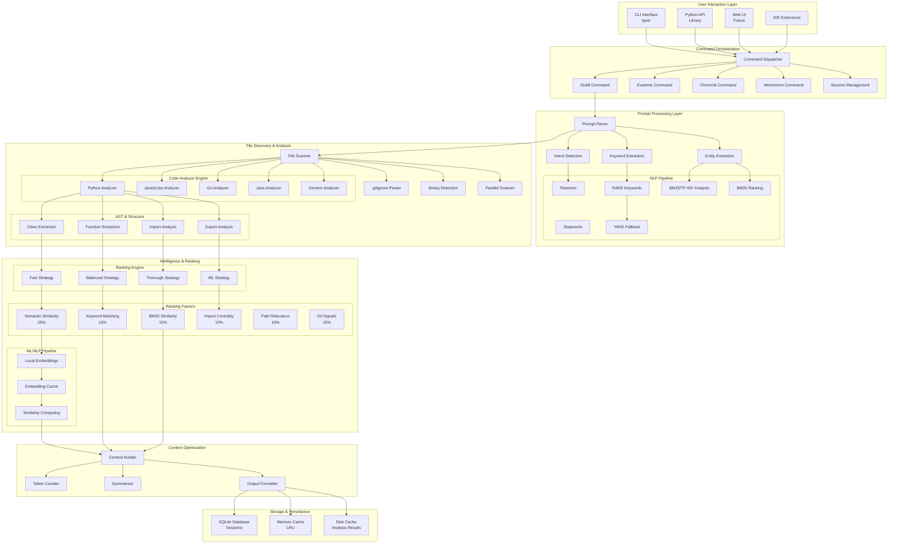

### System Component Overview

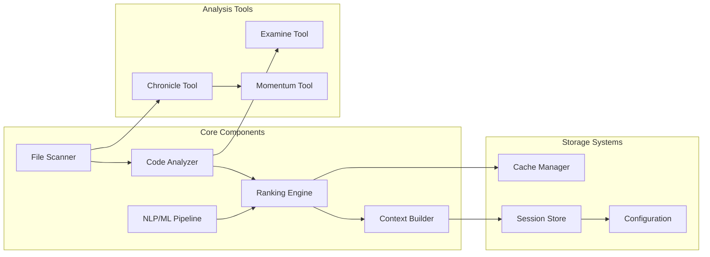

## NLP/ML Pipeline Architecture

### Centralized NLP Components

```
tenets/core/nlp/
├── __init__.py          # Main NLP API exports
├── similarity.py        # Centralized similarity computations
├── keyword_extractor.py # Unified keyword extraction with SimpleRAKE
├── tokenizer.py        # Code and text tokenization
├── stopwords.py        # Stopword management with fallbacks
├── embeddings.py       # Embedding generation (ML optional)
├── ml_utils.py         # ML utility functions
├── bm25.py            # BM25 ranking algorithm (primary)
└── tfidf.py           # TF-IDF calculations (optional alternative)
```

### Pipeline Component Flow

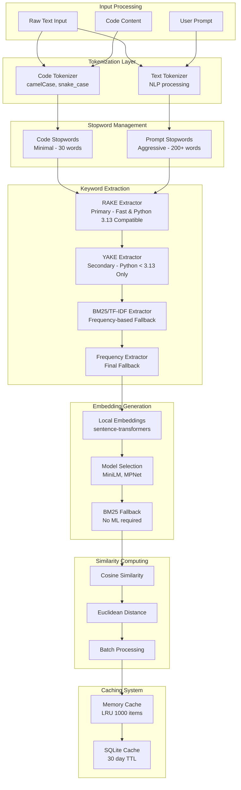

### Keyword Extraction Algorithms Comparison

| Algorithm | Speed | Quality | Memory | Python 3.13 | Best For | Limitations |
|-----------|-------|----------|---------|-------------|----------|-------------|
| **RAKE** | Fast | Good | Low | ✅ Yes | Technical docs, Multi-word phrases | No semantic understanding |
| **SimpleRAKE** | Fast | Good | Minimal | ✅ Yes | No NLTK dependencies, Built-in | Basic tokenization only |
| **YAKE** | Moderate | Very Good | Low | ❌ No | Statistical analysis, Capital aware | Python 3.13 bug |
| **BM25** | Fast | Excellent | High | ✅ Yes | Primary ranking, Length variation | Needs corpus |
| **TF-IDF** | Fast | Good | Medium | ✅ Yes | Alternative to BM25 | Less effective for varying lengths |
| **Frequency** | Very Fast | Basic | Minimal | ✅ Yes | Fallback option | Very basic |

### Embedding Model Architecture

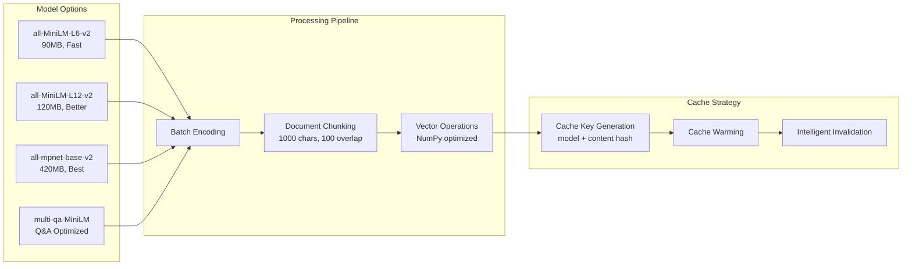

## File Discovery & Scanning System

### Scanner Architecture Flow

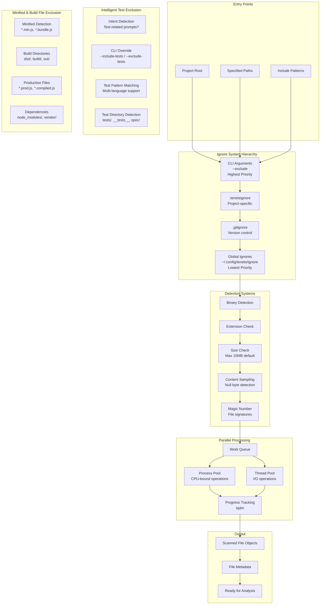

### Binary Detection Strategy

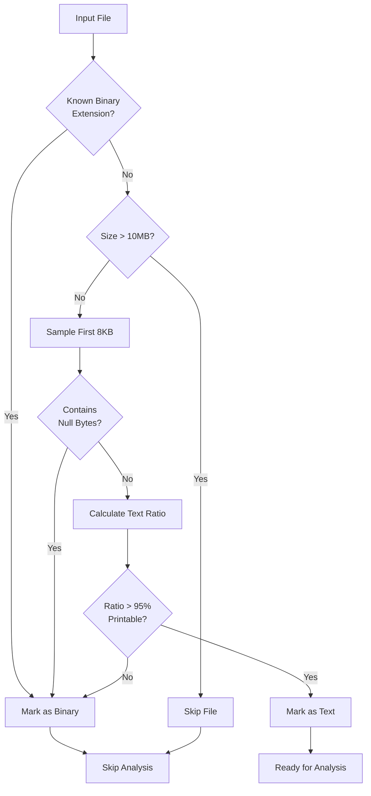

### Intelligent Test File Exclusion

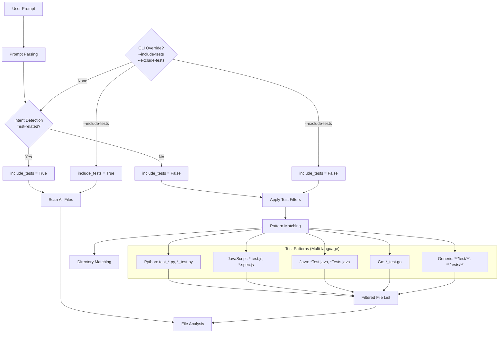

## Code Analysis Engine

### Language Analyzer Architecture

```mermaid
graph TB
    subgraph "Base Analyzer Interface"
        BASE[LanguageAnalyzer<br/>Abstract Base Class]
        EXTRACT_IMP[extract_imports()]
        EXTRACT_EXP[extract_exports()]
        EXTRACT_CLS[extract_classes()]
        EXTRACT_FN[extract_functions()]
        CALC_COMP[calculate_complexity()]
        TRACE_DEP[trace_dependencies()]
    end

    subgraph "Language-Specific Analyzers"
        PYTHON[Python Analyzer<br/>Full AST parsing]
        JAVASCRIPT[JavaScript Analyzer<br/>ES6+ support]
        GOLANG[Go Analyzer<br/>Package detection]
        JAVA[Java Analyzer<br/>OOP patterns]
        RUST[Rust Analyzer<br/>Ownership patterns]
        GENERIC[Generic Analyzer<br/>Pattern-based fallback]
    end

    subgraph "Analysis Features"
        AST[AST Parsing]
        IMPORTS[Import Resolution]
        TYPES[Type Extraction]
        DOCS[Documentation Parsing]
        PATTERNS[Code Patterns]
        COMPLEXITY[Complexity Metrics]
    end

    BASE --> EXTRACT_IMP
    BASE --> EXTRACT_EXP
    BASE --> EXTRACT_CLS
    BASE --> EXTRACT_FN
    BASE --> CALC_COMP
    BASE --> TRACE_DEP

    BASE --> PYTHON
    BASE --> JAVASCRIPT
    BASE --> GOLANG
    BASE --> JAVA
    BASE --> RUST
    BASE --> GENERIC

    PYTHON --> AST
    PYTHON --> IMPORTS
    PYTHON --> TYPES
    PYTHON --> DOCS

    JAVASCRIPT --> PATTERNS
    GOLANG --> PATTERNS
    JAVA --> COMPLEXITY
    RUST --> COMPLEXITY
    GENERIC --> PATTERNS
```

### Python Analyzer Detail

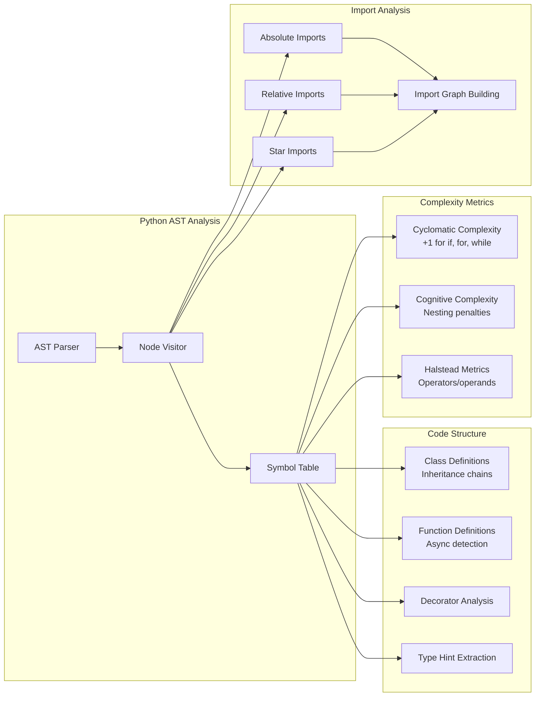

## Relevance Ranking System

### Unified Ranking Architecture

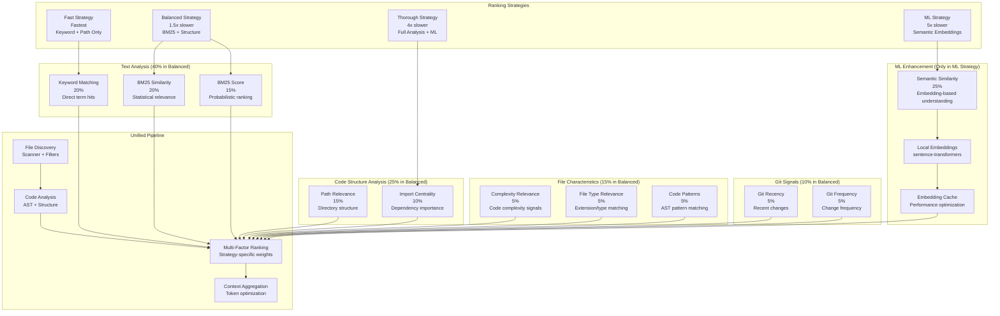

### Strategy Comparison

| Strategy | Speed | Accuracy | Use Cases | Factors Used |
|----------|-------|----------|-----------|--------------|
| **Fast** | Fastest | Basic | Quick file discovery | Keyword (60%), Path (30%), File type (10%) |
| **Balanced** | 1.5x slower | Good | **DEFAULT** Production usage | Keyword (20%), BM25 (35%), Structure (25%), Git (10%) |
| **Thorough** | 4x slower | High | Complex codebases | All balanced factors + enhanced analysis |
| **ML** | 5x slower | Highest | Semantic search | Embeddings (25%) + all thorough factors |

### Factor Calculation Details

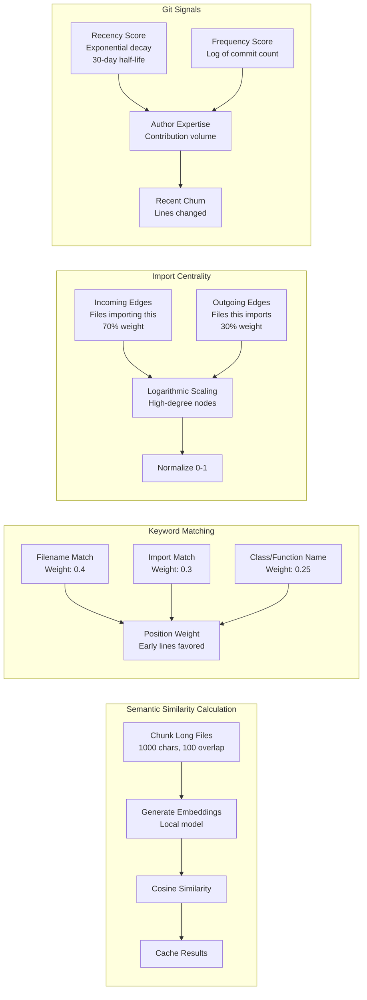

## Git Integration & Chronicle System

### Git Analysis Architecture

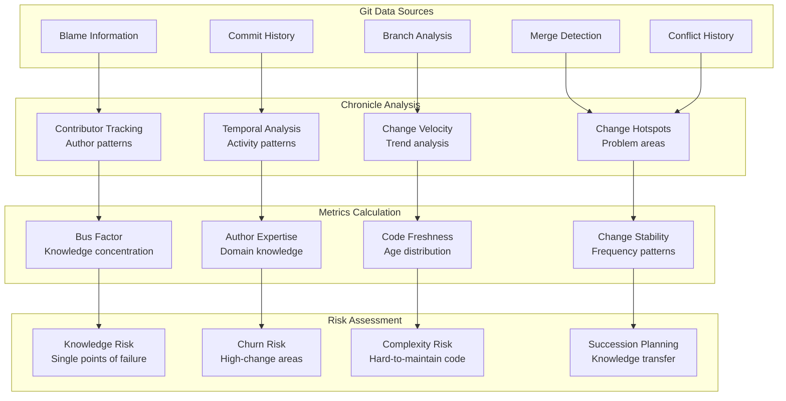

### Chronicle Report Structure

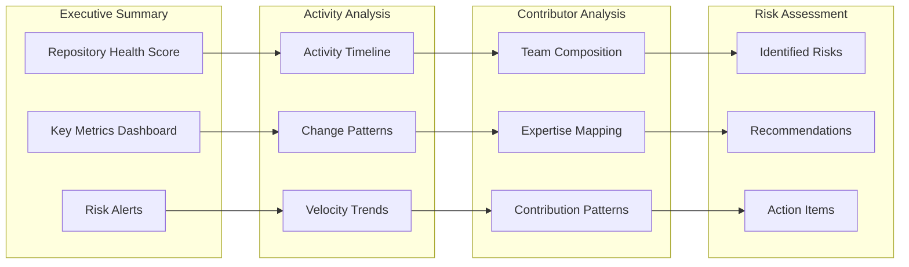

## Context Management & Optimization

### Context Building Pipeline

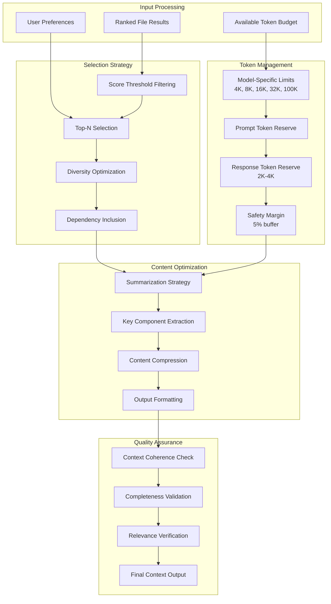

### Summarization Strategies

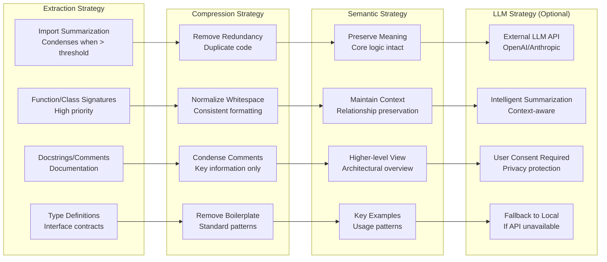

## Session Management Architecture

### Session Lifecycle Flow

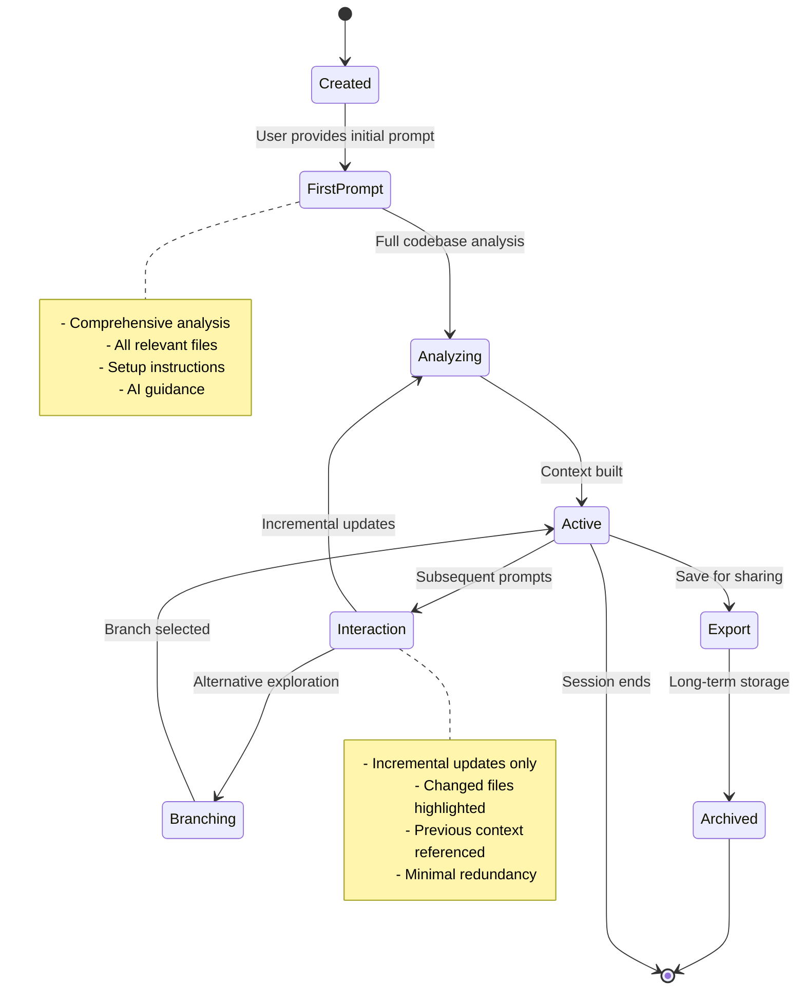

### Session Storage Architecture

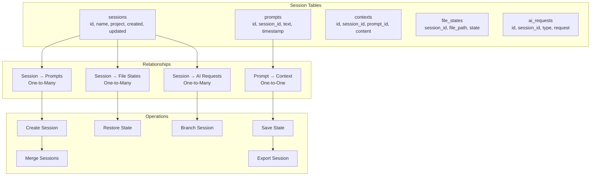

## Storage & Caching Architecture

### Storage Hierarchy

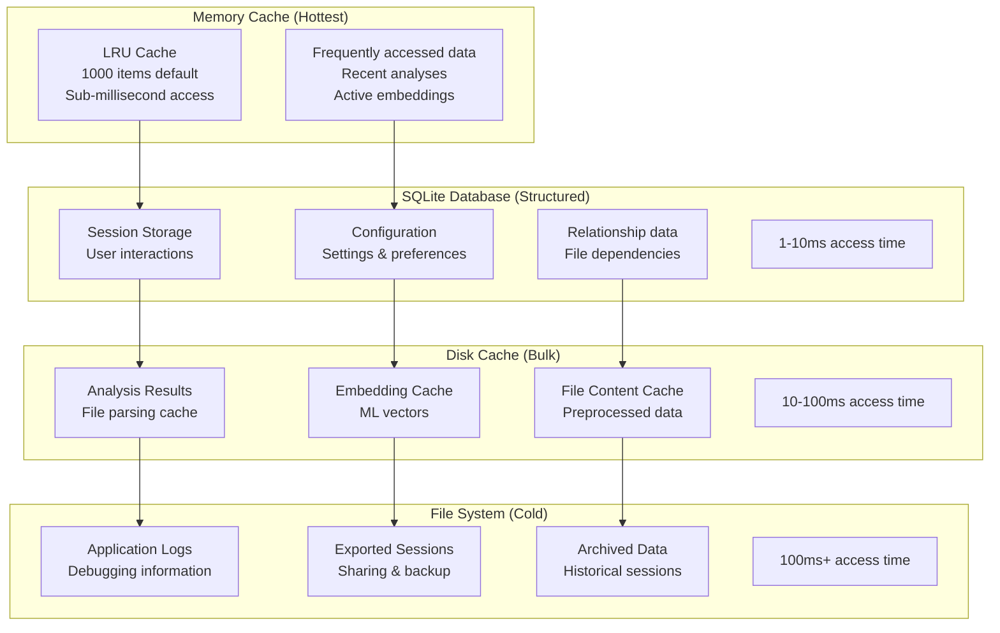

### Cache Invalidation Strategy

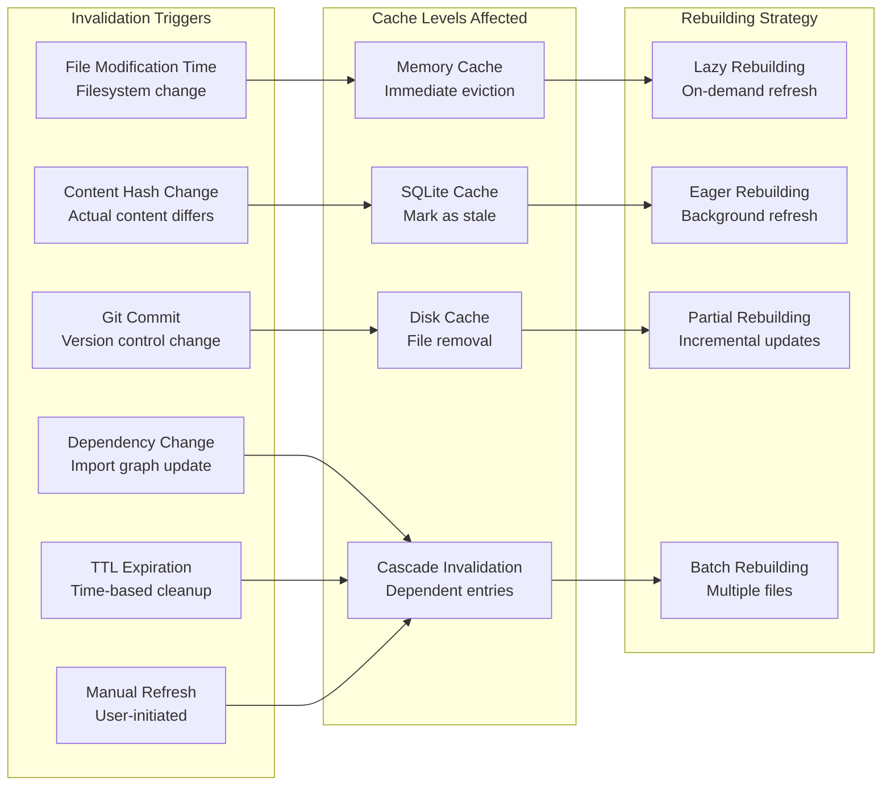

## Performance Architecture

### Optimization Strategy Overview

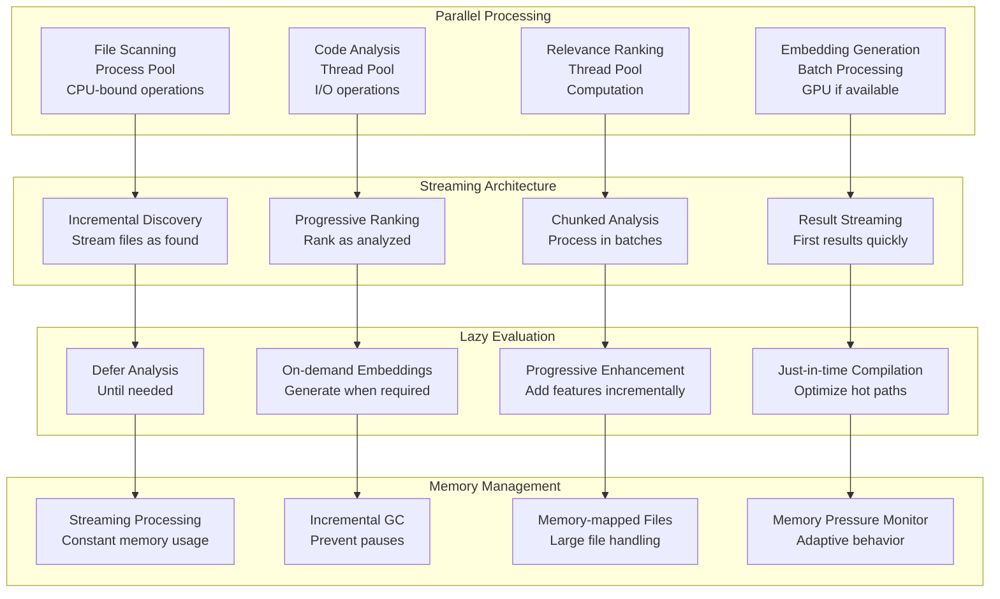

## Configuration System

### Configuration Hierarchy

```mermaid
graph TB
    subgraph "Configuration Sources (Priority Order)"
        CLI[Command-line Arguments<br/>Highest Priority<br/>--algorithm, --exclude]
        ENV[Environment Variables<br/>TENETS_ALGORITHM=ml]
        PROJECT[Project Configuration<br/>.tenets.yml in project root]
        USER[User Configuration<br/>~/.config/tenets/config.yml]
        SYSTEM[System Defaults<br/>Built-in fallbacks<br/>Lowest Priority]
    end

    subgraph "Configuration Categories"
        RANKING_CONFIG[Ranking Configuration<br/>Algorithms, weights, factors]
        NLP_CONFIG[NLP Configuration<br/>Tokenization, stopwords]
        ML_CONFIG[ML Configuration<br/>Models, caching, devices]
        CACHE_CONFIG[Cache Configuration<br/>TTL, size limits, storage]
        SCANNER_CONFIG[Scanner Configuration<br/>Ignore patterns, limits<br/>Minified exclusion]
        OUTPUT_CONFIG[Output Configuration<br/>Format, tokens, metadata]
    end

    subgraph "Dynamic Configuration"
        HOT_RELOAD[Hot Reload<br/>File change detection]
        API_UPDATE[Runtime API Updates<br/>Programmatic changes]
        VALIDATION[Configuration Validation<br/>Type checking, constraints]
        ROLLBACK[Error Rollback<br/>Revert on failure]
    end

    CLI --> RANKING_CONFIG
    ENV --> NLP_CONFIG
    PROJECT --> ML_CONFIG
    USER --> CACHE_CONFIG
    SYSTEM --> SCANNER_CONFIG

    RANKING_CONFIG --> HOT_RELOAD
    NLP_CONFIG --> API_UPDATE
    ML_CONFIG --> VALIDATION
    CACHE_CONFIG --> ROLLBACK
    SCANNER_CONFIG --> ROLLBACK
    OUTPUT_CONFIG --> ROLLBACK
```

### Complete Configuration Schema

```yaml
# .tenets.yml
version: 2

# Ranking configuration
ranking:
  algorithm: balanced  # fast|balanced|thorough|ml
  threshold: 0.1       # Minimum relevance score
  use_git: true        # Enable git signals
  use_ml: true         # Enable ML features

  # Factor weights (must sum to ~1.0)
  weights:
    semantic_similarity: 0.25
    keyword_match: 0.15
    bm25_similarity: 0.15
    import_centrality: 0.10
    path_relevance: 0.10
    git_recency: 0.05
    git_frequency: 0.05
    git_authors: 0.05
    file_type: 0.05
    code_patterns: 0.05

  # Performance
  workers: 8           # Parallel workers
  batch_size: 100      # Batch size for ML

# NLP configuration
nlp:
  use_stopwords: true
  stopword_set: minimal  # minimal|aggressive|custom
  tokenizer: code        # code|text
  keyword_extractor: rake # rake|yake|bm25|tfidf|frequency
  text_similarity: bm25   # bm25|tfidf

# ML configuration
ml:
  model: all-MiniLM-L6-v2
  device: auto         # auto|cpu|cuda
  cache_embeddings: true
  embedding_dim: 384

# Cache configuration
cache:
  enabled: true
  directory: ~/.tenets/cache
  max_size_mb: 1000
  ttl_days: 7

  # SQLite pragmas
  sqlite_pragmas:
    journal_mode: WAL
    synchronous: NORMAL
    cache_size: -64000
    temp_store: MEMORY

# File scanning
scanner:
  respect_gitignore: true
  include_hidden: false
  follow_symlinks: false
  max_file_size_mb: 10
  binary_detection: true
  exclude_minified: true
  exclude_tests: auto

  # Global ignores
  ignore_patterns:
    - "*.pyc"
    - "__pycache__"
    - "node_modules"
    - ".git"
    - ".venv"
    - "venv"
    - "*.egg-info"
    - "dist"
    - "build"

# Summarization configuration
summarizer:
  summarize_imports: true
  import_summary_threshold: 5
  docs_context_aware: true
  docs_show_in_place_context: true
  docs_context_search_depth: 2
  docs_context_min_confidence: 0.6
  docs_context_max_sections: 10
  docs_context_preserve_examples: true

# Output configuration
output:
  format: markdown     # markdown|json|xml|html
  max_tokens: 100000
  include_metadata: true
  include_instructions: true
  copy_on_distill: false

# Session configuration
session:
  auto_save: true
  history_limit: 100
  branch_on_conflict: true

# Examination configuration
examination:
  complexity_threshold: 10
  duplication_threshold: 0.1
  min_test_coverage: 0.8

# Chronicle configuration
chronicle:
  include_merges: false
  max_commits: 1000
  analyze_patterns: true

# Momentum configuration
momentum:
  sprint_duration: 14
  velocity_window: 6
  include_weekends: false

# Tenet configuration
tenet:
  auto_instill: true
  injection_frequency: adaptive
  max_per_context: 5
  system_instruction_enabled: true
```

## CLI & API Architecture

### Command Structure

```yaml
# Main Commands
tenets:
  distill:           # Build optimal context for prompts
    --copy           # Copy to clipboard
    --format         # Output format (markdown, xml, json, html)
    --max-tokens     # Token limit
    --exclude        # Exclude patterns
    --session        # Session name
    --algorithm      # Ranking algorithm

  examine:           # Code quality analysis
    --show-details   # Detailed metrics
    --hotspots       # Show maintenance hotspots
    --ownership      # Show code ownership
    --format         # Output format

  chronicle:         # Git history analysis
    --since          # Time range
    --author         # Filter by author
    --format         # Output format

  momentum:          # Velocity tracking (WIP)
    --team           # Team metrics
    --detailed       # Detailed breakdown

  session:           # Session management
    create           # Create new session
    list             # List sessions
    delete           # Delete session

  tenet:            # Manage guiding principles
    add             # Add new tenet
    list            # List tenets
    remove          # Remove tenet

  instill:          # Apply tenets and system instructions
    --dry-run       # Preview what would be applied
    --force         # Force application

  system-instruction: # Manage system instructions
    set             # Set instruction
    get             # Get current
    enable/disable  # Toggle
```

### Python API Design

```python
from tenets import Tenets

# Initialize
tenets = Tenets(path="./my-project")

# Simple usage
context = tenets.distill("implement OAuth2 authentication")

# Advanced usage
result = tenets.distill(
    prompt="refactor database layer",
    algorithm="ml",
    max_tokens=50000,
    filters=["*.py", "!test_*"]
)

# Session management
session = tenets.create_session("oauth-implementation")
context1 = session.distill("add OAuth2 support")
context2 = session.distill("add unit tests", incremental=True)

# Analysis tools
examination = tenets.examine()
chronicle = tenets.chronicle()
momentum = tenets.momentum()

# Configuration
tenets.configure(
    ranking_algorithm="thorough",
    use_ml=True,
    cache_ttl_days=30
)
```

## Security & Privacy Architecture

### Local-First Security Model

```mermaid
graph TB
    subgraph "Privacy Guarantees"
        LOCAL[All Processing Local<br/>No external API calls for analysis]
        NO_TELEMETRY[No Telemetry<br/>No usage tracking]
        NO_CLOUD[No Cloud Storage<br/>All data stays local]
        NO_PHONE_HOME[No Phone Home<br/>No automatic updates]
    end

    subgraph "Secret Detection"
        API_KEYS[API Key Detection<br/>Common patterns]
        PASSWORDS[Password Detection<br/>Credential patterns]
        TOKENS[Token Detection<br/>JWT, OAuth tokens]
        PRIVATE_KEYS[Private Key Detection<br/>RSA, SSH keys]
        CONNECTION_STRINGS[Connection Strings<br/>Database URLs]
        ENV_VARS[Environment Variables<br/>Sensitive values]
    end

    subgraph "Output Sanitization (Roadmap)"
        REDACT[Redact Secrets<br/>**WIP** - Coming soon]
        MASK_PII[Mask PII<br/>**WIP** - Planned feature]
        CLEAN_PATHS[Clean File Paths<br/>Remove sensitive paths]
        REMOVE_URLS[Remove Internal URLs<br/>**WIP** - Under development]
        ANONYMIZE[Anonymization<br/>**WIP** - Future release]
    end

    subgraph "Data Protection"
        ENCRYPTED_CACHE[Encrypted Cache<br/>Optional encryption at rest]
        SECURE_DELETE[Secure Deletion<br/>Overwrite sensitive data]
        ACCESS_CONTROL[File Access Control<br/>Respect permissions]
        AUDIT_LOG[Audit Logging<br/>Security events]
    end

    LOCAL --> API_KEYS
    NO_TELEMETRY --> PASSWORDS
    NO_CLOUD --> TOKENS
    NO_PHONE_HOME --> PRIVATE_KEYS

    API_KEYS --> REDACT
    PASSWORDS --> MASK_PII
    TOKENS --> CLEAN_PATHS
    PRIVATE_KEYS --> REMOVE_URLS
    CONNECTION_STRINGS --> ANONYMIZE
    ENV_VARS --> ANONYMIZE

    REDACT --> ENCRYPTED_CACHE
    MASK_PII --> SECURE_DELETE
    CLEAN_PATHS --> ACCESS_CONTROL
    REMOVE_URLS --> AUDIT_LOG
    ANONYMIZE --> AUDIT_LOG
```

### Secret Detection Patterns (Roadmap)

```mermaid
graph LR
    subgraph "Detection Methods"
        REGEX[Regex Patterns<br/>Known formats]
        ENTROPY[Entropy Analysis<br/>Random strings]
        CONTEXT[Context Analysis<br/>Variable names]
        KEYWORDS[Keyword Detection<br/>password, secret, key]
    end

    subgraph "Secret Types"
        AWS[AWS Access Keys<br/>AKIA...]
        GITHUB[GitHub Tokens<br/>ghp_, gho_]
        JWT[JWT Tokens<br/>eyJ pattern]
        RSA[RSA Private Keys<br/>-----BEGIN RSA]
        DATABASE[Database URLs<br/>postgres://, mysql://]
        GENERIC[Generic Secrets<br/>High entropy strings]
    end

    subgraph "Response Actions"
        FLAG[Flag for Review<br/>Warn user]
        REDACT_AUTO[Auto Redaction<br/>Replace with [REDACTED]]
        EXCLUDE[Exclude File<br/>Skip entirely]
        LOG[Security Log<br/>Record detection]
    end

    REGEX --> AWS
    ENTROPY --> GITHUB
    CONTEXT --> JWT
    KEYWORDS --> RSA

    AWS --> FLAG
    GITHUB --> REDACT_AUTO
    JWT --> EXCLUDE
    RSA --> LOG
    DATABASE --> LOG
    GENERIC --> FLAG
```

## Testing & Quality Assurance

### Test Architecture

```mermaid
graph TB
    subgraph "Test Categories"
        UNIT[Unit Tests<br/>Target: >90% coverage<br/>Fast, isolated]
        INTEGRATION[Integration Tests<br/>Component interaction<br/>Real workflows]
        E2E[End-to-End Tests<br/>Complete user journeys<br/>CLI to output]
        PERFORMANCE[Performance Tests<br/>Benchmark regression<br/>Memory usage]
    end

    subgraph "Test Structure"
        FIXTURES[Test Fixtures<br/>Sample codebases<br/>Known outputs]
        MOCKS[Mock Objects<br/>External dependencies<br/>Controlled behavior]
        HELPERS[Test Helpers<br/>Common operations<br/>Assertion utilities]
        FACTORIES[Data Factories<br/>Generate test data<br/>Realistic scenarios]
    end

    subgraph "Quality Metrics"
        COVERAGE[Code Coverage<br/>Line and branch coverage]
        COMPLEXITY[Complexity Limits<br/>Cyclomatic < 10]
        DUPLICATION[Duplication Check<br/>< 5% duplicate code]
        DOCUMENTATION[Documentation<br/>100% public API]
    end

    subgraph "Continuous Testing"
        PRE_COMMIT[Pre-commit Hooks<br/>Fast feedback]
        CI_PIPELINE[CI Pipeline<br/>Full test suite]
        NIGHTLY[Nightly Tests<br/>Extended scenarios]
        BENCHMARKS[Benchmark Tracking<br/>Performance trends]
    end

    UNIT --> FIXTURES
    INTEGRATION --> MOCKS
    E2E --> HELPERS
    PERFORMANCE --> FACTORIES

    FIXTURES --> COVERAGE
    MOCKS --> COMPLEXITY
    HELPERS --> DUPLICATION
    FACTORIES --> DOCUMENTATION

    COVERAGE --> PRE_COMMIT
    COMPLEXITY --> CI_PIPELINE
    DUPLICATION --> NIGHTLY
    DOCUMENTATION --> BENCHMARKS
```

### Test Coverage Requirements

```mermaid
graph LR
    subgraph "Coverage Targets"
        UNIT_COV[Unit Tests<br/>>90% coverage<br/>Critical paths 100%]
        INTEGRATION_COV[Integration Tests<br/>All major workflows<br/>Error scenarios]
        E2E_COV[E2E Tests<br/>Critical user journeys<br/>Happy paths]
        PERF_COV[Performance Tests<br/>Regression prevention<br/>Memory leak detection]
    end

    subgraph "Quality Gates"
        CODE_QUALITY[Code Quality<br/>Complexity < 10<br/>Function length < 50]
        DOCUMENTATION[Documentation<br/>100% public API<br/>Usage examples]
        SECURITY[Security Tests<br/>Secret detection<br/>Input validation]
        COMPATIBILITY[Compatibility<br/>Python 3.8+<br/>Multiple platforms]
    end

    UNIT_COV --> CODE_QUALITY
    INTEGRATION_COV --> DOCUMENTATION
    E2E_COV --> SECURITY
    PERF_COV --> COMPATIBILITY
```

## Guiding Principles (Tenets) System

### Overview

The Guiding Principles system provides persistent, context-aware instructions to maintain consistency across AI interactions and combat context drift.

### Injection Strategy

```mermaid
graph TD
    subgraph "Injection Decision Engine"
        ANALYZER[Content Analyzer<br/>Structure & complexity]
        STRATEGY[Strategy Selector<br/>Top, distributed, contextual]
        INJECTOR[Smart Injector<br/>Natural break detection]
    end

    subgraph "Priority System"
        CRITICAL[Critical Principles<br/>Security, data integrity]
        HIGH[High Priority<br/>Architecture, performance]
        MEDIUM[Medium Priority<br/>Style, conventions]
        LOW[Low Priority<br/>Preferences, suggestions]
    end

    subgraph "Reinforcement"
        TOP_INJECTION[Top of Context<br/>Most visible]
        DISTRIBUTED[Throughout Content<br/>Natural sections]
        END_SUMMARY[End Reinforcement<br/>Key reminders]
    end

    ANALYZER --> STRATEGY
    STRATEGY --> INJECTOR

    CRITICAL --> TOP_INJECTION
    HIGH --> DISTRIBUTED
    MEDIUM --> DISTRIBUTED
    LOW --> END_SUMMARY
```

### Output Formats

**Markdown:**
```markdown
**🎯 Key Guiding Principle:** Always validate user input before processing
**📌 Important Guiding Principle:** Use async/await for all I/O operations
**💡 Guiding Principle:** Prefer composition over inheritance
```

**XML (Recommended by OpenAI):**
```xml
<guiding_principle priority="high" category="security">
  Always validate and sanitize user input
</guiding_principle>

<guiding_principles>
  <guiding_principle priority="critical">Maintain backward compatibility</guiding_principle>
  <guiding_principle priority="medium">Use descriptive variable names</guiding_principle>
</guiding_principles>
```

### Configuration

```yaml
tenet:
  auto_instill: true
  max_per_context: 5
  injection_strategy: strategic
  injection_frequency: adaptive  # 'always', 'periodic', 'adaptive', 'manual'
  injection_interval: 3          # For periodic mode
  min_session_length: 1          # First injection always happens
  system_instruction: "Prefer small, safe diffs and add tests"
  system_instruction_enabled: true
```

## Output Generation & Visualization

### Output Formatting System

```mermaid
graph TB
    subgraph "Format Types"
        MARKDOWN[Markdown Format<br/>Human-readable]
        JSON[JSON Format<br/>Machine-parseable]
        XML[XML Format<br/>Structured data]
        HTML[HTML Format<br/>Interactive reports]
    end

    subgraph "HTML Report Features"
        INTERACTIVE[Interactive Elements<br/>Collapsible sections]
        VISUALS[Visualizations<br/>Charts & graphs]
        STYLING[Professional Styling<br/>Modern UI]
        RESPONSIVE[Responsive Design<br/>Mobile-friendly]
    end

    subgraph "Report Components"
        HEADER[Report Header<br/>Title & metadata]
        PROMPT_DISPLAY[Prompt Analysis<br/>Keywords & intent]
        STATS[Statistics Dashboard<br/>Metrics & KPIs]
        FILES[File Listings<br/>Code previews]
        GIT[Git Context<br/>Commits & contributors]
    end

    HTML --> INTERACTIVE
    HTML --> VISUALS
    HTML --> STYLING
    HTML --> RESPONSIVE

    INTERACTIVE --> HEADER
    VISUALS --> STATS
    STYLING --> FILES
    RESPONSIVE --> GIT
```

### Visualization Components

```mermaid
graph LR
    subgraph "Project Detection"
        DETECTOR[Project Detector<br/>Auto-detects type]
        LANGUAGES[Language Analysis<br/>% distribution]
        FRAMEWORKS[Framework Detection<br/>Django, React, etc]
        ENTRYPOINTS[Entry Points<br/>main.py, index.js]
    end

    subgraph "Graph Generation"
        GRAPHGEN[Graph Generator<br/>Multiple formats]
        NETWORKX[NetworkX<br/>Graph algorithms]
        GRAPHVIZ[Graphviz<br/>DOT rendering]
        PLOTLY[Plotly<br/>Interactive HTML]
        D3JS[D3.js<br/>Web visualization]
    end

    subgraph "Dependency Visualization"
        FILE_DEPS[File-level<br/>Individual files]
        MODULE_DEPS[Module-level<br/>Aggregated modules]
        PACKAGE_DEPS[Package-level<br/>Top-level packages]
        CLUSTERING[Clustering<br/>Group by criteria]
    end

    subgraph "Output Formats"
        ASCII[ASCII Tree<br/>Terminal output]
        SVG[SVG<br/>Vector graphics]
        PNG[PNG/PDF<br/>Static images]
        HTML_INT[Interactive HTML<br/>D3.js/Plotly]
        DOT[DOT Format<br/>Graphviz source]
        JSON_OUT[JSON<br/>Raw data]
    end

    subgraph "Layout Algorithms"
        HIERARCHICAL[Hierarchical<br/>Tree layout]
        CIRCULAR[Circular<br/>Radial layout]
        SHELL[Shell<br/>Concentric circles]
        KAMADA[Kamada-Kawai<br/>Force-directed]
    end

    DETECTOR --> LANGUAGES
    DETECTOR --> FRAMEWORKS
    DETECTOR --> ENTRYPOINTS

    GRAPHGEN --> NETWORKX
    GRAPHGEN --> GRAPHVIZ
    GRAPHGEN --> PLOTLY
    GRAPHGEN --> D3JS

    FILE_DEPS --> MODULE_DEPS
    MODULE_DEPS --> PACKAGE_DEPS
    PACKAGE_DEPS --> CLUSTERING

    GRAPHGEN --> ASCII
    GRAPHGEN --> SVG
    GRAPHGEN --> PNG
    GRAPHGEN --> HTML_INT
    GRAPHGEN --> DOT
    GRAPHGEN --> JSON_OUT
```

## Future Roadmap & Vision

### Near Term

```mermaid
graph TB
    subgraph "Core Improvements"
        INCREMENTAL[Incremental Indexing<br/>Real-time updates<br/>Watch file changes]
        FASTER_EMBED[Faster Embeddings<br/>Model quantization<br/>ONNX optimization]
        LANGUAGE_SUP[Better Language Support<br/>30+ languages<br/>Language-specific patterns]
        IDE_PLUGINS[IDE Plugin Ecosystem<br/>VS Code, IntelliJ, Vim]
        CROSS_REPO[Cross-repository Analysis<br/>Monorepo support<br/>Dependency tracking]
    end

    subgraph "ML Enhancements"
        NEWER_MODELS[Newer Embedding Models<br/>Code-specific transformers<br/>Better accuracy]
        FINE_TUNING[Fine-tuning Pipeline<br/>Domain-specific models<br/>Custom training]
        MULTIMODAL[Multi-modal Understanding<br/>Diagrams, images<br/>Architecture docs]
        CODE_TRANSFORMERS[Code-specific Models<br/>Programming language aware<br/>Syntax understanding]
    end

    INCREMENTAL --> NEWER_MODELS
    FASTER_EMBED --> FINE_TUNING
    LANGUAGE_SUP --> MULTIMODAL
    IDE_PLUGINS --> CODE_TRANSFORMERS
    CROSS_REPO --> CODE_TRANSFORMERS
```

### Medium Term

```mermaid
graph TB
    subgraph "Platform Features"
        WEB_UI[Web UI<br/>Real-time collaboration<br/>Team workspaces]
        SHARED_CONTEXT[Shared Context Libraries<br/>Team knowledge base<br/>Best practices]
        KNOWLEDGE_GRAPHS[Knowledge Graphs<br/>Code relationships<br/>Semantic connections]
        AI_AGENTS[AI Agent Integration<br/>Autonomous assistance<br/>Proactive suggestions]
    end

    subgraph "Enterprise Features"
        SSO[SSO/SAML Support<br/>Enterprise authentication<br/>Role-based access]
        AUDIT[Audit Logging<br/>Compliance tracking<br/>Usage monitoring]
        COMPLIANCE[Compliance Modes<br/>GDPR, SOX, HIPAA<br/>Data governance]
        AIR_GAPPED[Air-gapped Deployment<br/>Offline operation<br/>Secure environments]
        CUSTOM_ML[Custom ML Models<br/>Private model training<br/>Domain expertise]
    end

    WEB_UI --> SSO
    SHARED_CONTEXT --> AUDIT
    KNOWLEDGE_GRAPHS --> COMPLIANCE
    AI_AGENTS --> AIR_GAPPED
    AI_AGENTS --> CUSTOM_ML
```

### Long Term Vision

```mermaid
graph TB
    subgraph "Vision Goals"
        AUTONOMOUS[Autonomous Code Understanding<br/>Self-improving analysis<br/>Minimal human input]
        PREDICTIVE[Predictive Development<br/>Anticipate needs<br/>Suggest improvements]
        UNIVERSAL[Universal Code Intelligence<br/>Any language, any domain<br/>Contextual understanding]
        INDUSTRY_STANDARD[Industry Standard<br/>AI pair programming<br/>Developer toolchain]
    end

    subgraph "Research Areas"
        GRAPH_NEURAL[Graph Neural Networks<br/>Code structure understanding<br/>Relationship modeling]
        REINFORCEMENT[Reinforcement Learning<br/>Ranking optimization<br/>Adaptive behavior]
        FEW_SHOT[Few-shot Learning<br/>New language support<br/>Rapid adaptation]
        EXPLAINABLE[Explainable AI<br/>Ranking transparency<br/>Decision reasoning]
        FEDERATED[Federated Learning<br/>Team knowledge sharing<br/>Privacy-preserving]
    end

    AUTONOMOUS --> GRAPH_NEURAL
    PREDICTIVE --> REINFORCEMENT
    UNIVERSAL --> FEW_SHOT
    INDUSTRY_STANDARD --> EXPLAINABLE
    INDUSTRY_STANDARD --> FEDERATED
```

## Conclusion

Tenets combines sophisticated NLP/ML techniques with traditional code analysis, git mining, and intelligent caching to create a system that truly understands code in context. The architecture is designed for scalability, extensibility, and performance while maintaining complete privacy through local-first processing.

The future of code intelligence is local, intelligent, and developer-centric. Tenets embodies this vision while remaining practical and immediately useful for development teams of any size.