# Tenets Complete Architecture Documentation

## Table of Contents

1. [System Overview](#system-overview)
2. [Core Philosophy & Design Principles](#core-philosophy--design-principles)
3. [Complete System Architecture](#complete-system-architecture)
4. [NLP/ML Pipeline Architecture](#nlpml-pipeline-architecture)
5. [File Discovery & Scanning System](#file-discovery--scanning-system)
6. [Code Analysis Engine](#code-analysis-engine)
7. [Relevance Ranking System](#relevance-ranking-system)
8. [Git Integration & Chronicle System](#git-integration--chronicle-system)
9. [Examination & Quality Analysis](#examination--quality-analysis)
10. [Momentum & Velocity Tracking](#momentum--velocity-tracking)
11. [Context Management & Optimization](#context-management--optimization)
12. [Session Management Architecture](#session-management-architecture)
13. [Storage & Caching Architecture](#storage--caching-architecture)
14. [Prompt Parsing & Understanding](#prompt-parsing--understanding)
15. [Output Generation & Formatting](#output-generation--formatting)
16. [Performance Architecture](#performance-architecture)
17. [Configuration System](#configuration-system)
18. [CLI & API Architecture](#cli--api-architecture)
19. [Visualization & Reporting](#visualization--reporting)
20. [Security & Privacy Architecture](#security--privacy-architecture)
21. [Extensibility & Plugin System](#extensibility--plugin-system)
22. [Deployment Architecture](#deployment-architecture)
23. [Testing & Quality Assurance](#testing--quality-assurance)
24. [Future Roadmap & Vision](#future-roadmap--vision)

## System Overview

### What is Tenets?

Tenets is a sophisticated, local-first code intelligence platform that revolutionizes how developers interact with their codebases when working with AI assistants. Unlike traditional code search tools or simple context builders, Tenets employs advanced multi-stage analysis combining natural language processing, machine learning, static code analysis, git history mining, and intelligent ranking to build optimal context for any given task.

The system operates entirely locally, ensuring complete privacy and security while delivering state-of-the-art code understanding capabilities. Every component is designed with performance in mind, utilizing aggressive caching, parallel processing, and incremental computation to handle codebases ranging from small projects to massive monorepos with millions of files.

### Core Architecture Principles

1. **Local-First Processing**: All analysis, ranking, and context generation happens on the developer's machine. No code ever leaves the local environment. External API calls are only made for optional LLM-based summarization, and even then, only with explicit user consent.

2. **Progressive Enhancement**: The system provides value immediately with just Python installed, and scales up with optional dependencies. Core functionality works without any ML libraries, git integration works without any configuration, and advanced features gracefully degrade when dependencies are missing.

3. **Intelligent Caching**: Every expensive operation is cached at multiple levels - memory caches for hot data, SQLite for structured data, disk caches for analysis results, and specialized caches for embeddings. Cache invalidation is intelligent, using file modification times, git commits, and content hashes.

4. **Configurable Intelligence**: Every aspect of the ranking and analysis can be configured. Users can adjust factor weights, enable/disable features, add custom ranking functions, and tune performance parameters. The system adapts to different codebases and use cases.

5. **Streaming Architecture**: The system uses streaming and incremental processing wherever possible. Files are analyzed as they're discovered, rankings are computed in parallel, and results stream to the user as they become available.

## Complete System Architecture

### High-Level Data Flow

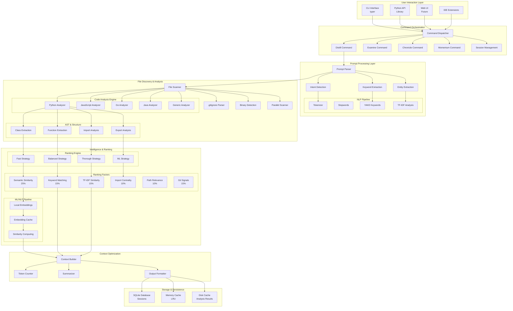

### System Component Overview

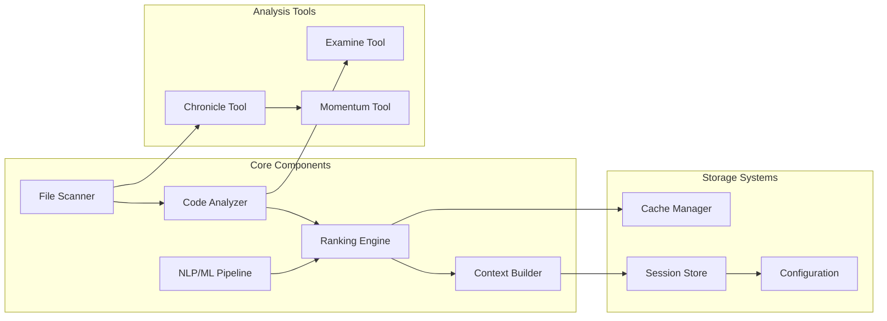

## NLP/ML Pipeline Architecture

### Pipeline Component Flow

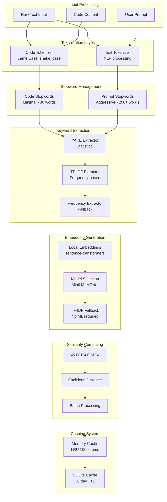

### Embedding Model Architecture

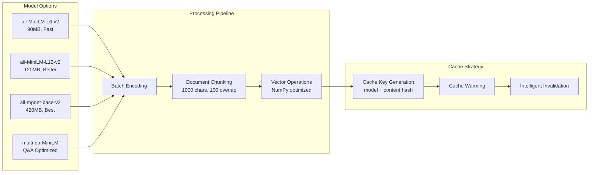

## File Discovery & Scanning System

### Scanner Architecture Flow

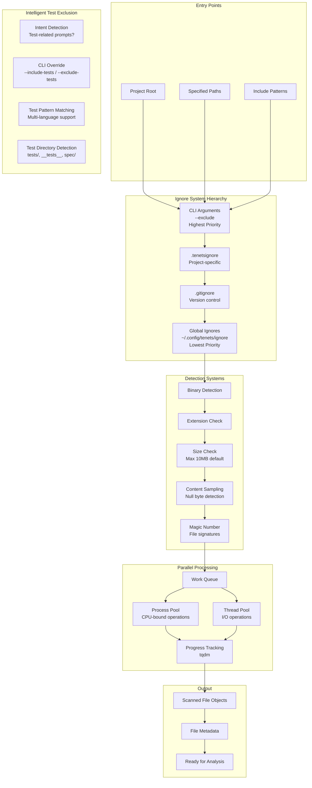

### Binary Detection Strategy

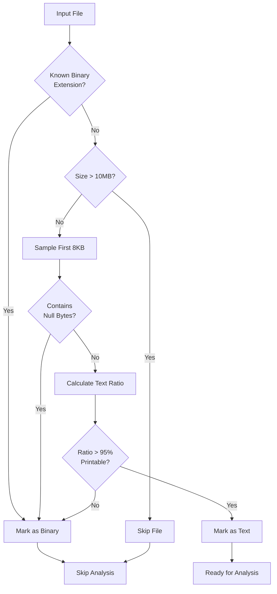

### Intelligent Test File Exclusion

Tenets implements intelligent test file handling to improve context relevance by automatically excluding or including test files based on the user's intent.

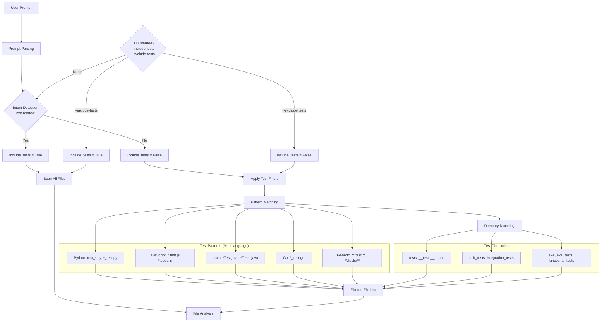

**Intent Detection Patterns:**
- Test-related keywords: `test`, `tests`, `testing`, `unit`, `integration`, `spec`, `coverage`
- Test actions: `write tests`, `fix tests`, `run tests`, `test coverage`, `mock`
- Test files: `test_auth.py`, `auth.test.js`, `*Test.java`
- Test frameworks: `pytest`, `jest`, `mocha`, `junit`, `rspec`

**Benefits:**
- **Improved Relevance**: Non-test prompts get cleaner production code context
- **Automatic Intelligence**: Test prompts automatically include test files
- **Manual Override**: CLI flags provide full control when needed
- **Multi-language Support**: Recognizes test patterns across languages
- **Configuration**: Customizable patterns for project-specific conventions

## Code Analysis Engine

### Language Analyzer Architecture

```mermaid
graph TB
    subgraph "Base Analyzer Interface"
        BASE[LanguageAnalyzer<br/>Abstract Base Class]
        EXTRACT_IMP[extract_imports()]
        EXTRACT_EXP[extract_exports()]
        EXTRACT_CLS[extract_classes()]
        EXTRACT_FN[extract_functions()]
        CALC_COMP[calculate_complexity()]
        TRACE_DEP[trace_dependencies()]
    end

    subgraph "Language-Specific Analyzers"
        PYTHON[Python Analyzer<br/>Full AST parsing]
        JAVASCRIPT[JavaScript Analyzer<br/>ES6+ support]
        GOLANG[Go Analyzer<br/>Package detection]
        JAVA[Java Analyzer<br/>OOP patterns]
        RUST[Rust Analyzer<br/>Ownership patterns]
        GENERIC[Generic Analyzer<br/>Pattern-based fallback]
    end

    subgraph "Analysis Features"
        AST[AST Parsing]
        IMPORTS[Import Resolution]
        TYPES[Type Extraction]
        DOCS[Documentation Parsing]
        PATTERNS[Code Patterns]
        COMPLEXITY[Complexity Metrics]
    end

    BASE --> EXTRACT_IMP
    BASE --> EXTRACT_EXP
    BASE --> EXTRACT_CLS
    BASE --> EXTRACT_FN
    BASE --> CALC_COMP
    BASE --> TRACE_DEP

    BASE --> PYTHON
    BASE --> JAVASCRIPT
    BASE --> GOLANG
    BASE --> JAVA
    BASE --> RUST
    BASE --> GENERIC

    PYTHON --> AST
    PYTHON --> IMPORTS
    PYTHON --> TYPES
    PYTHON --> DOCS

    JAVASCRIPT --> PATTERNS
    GOLANG --> PATTERNS
    JAVA --> COMPLEXITY
    RUST --> COMPLEXITY
    GENERIC --> PATTERNS
```

### Python Analyzer Detail

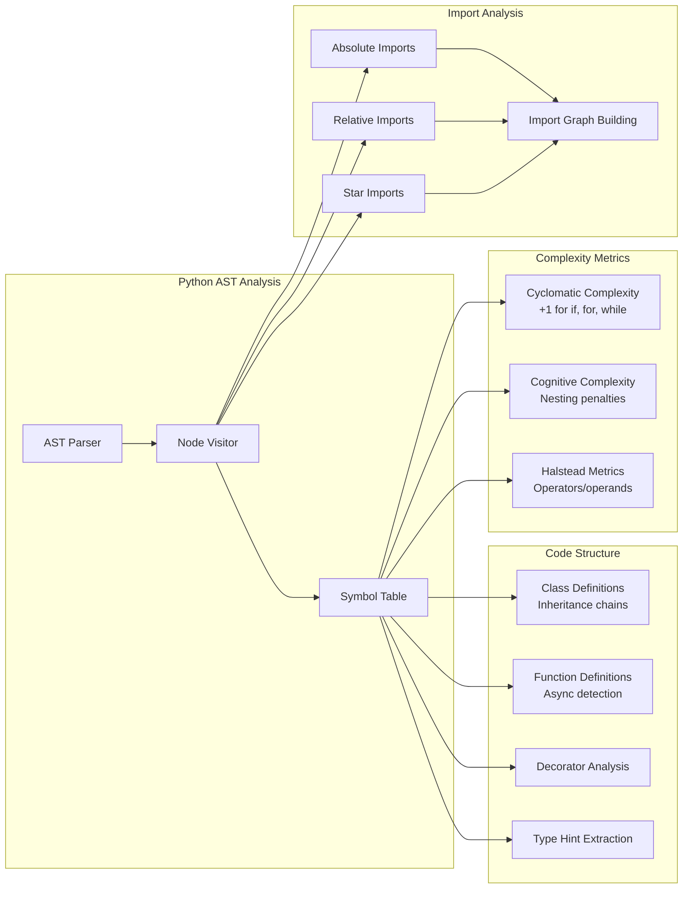

## Relevance Ranking System

### Multi-Factor Ranking Architecture

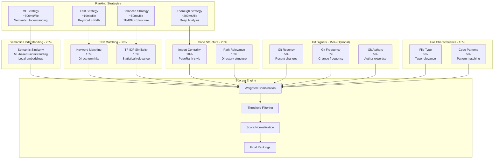

### Factor Calculation Details

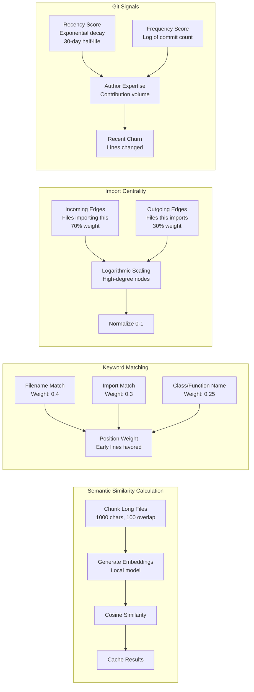

## Git Integration & Chronicle System

### Git Analysis Architecture

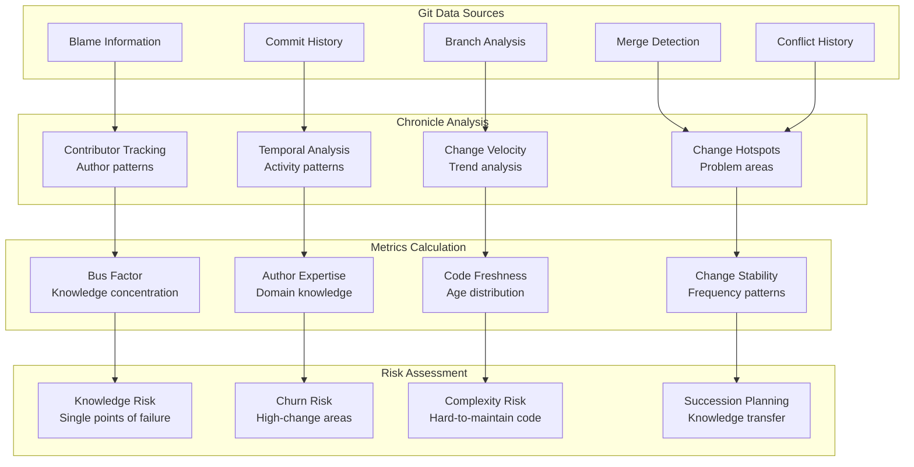

### Chronicle Report Structure

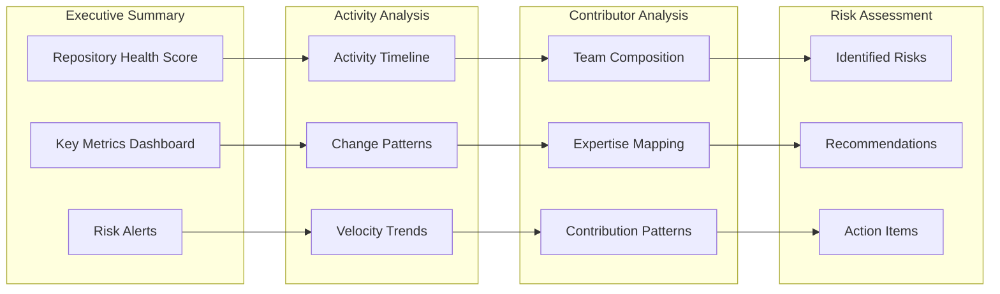

## Context Management & Optimization

### Context Building Pipeline

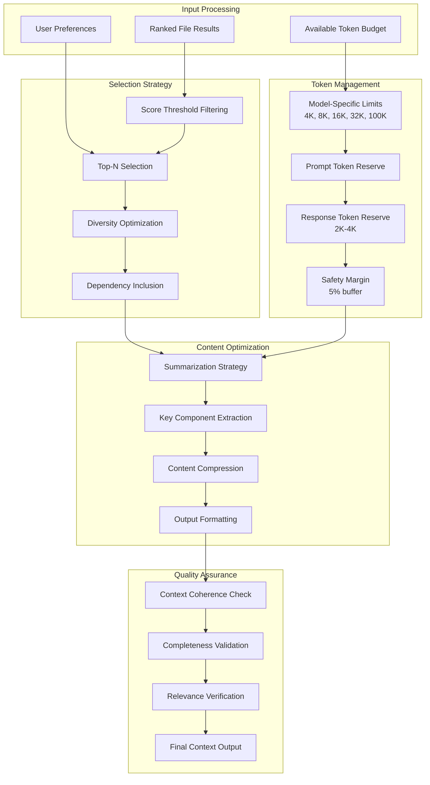

### Summarization Strategies

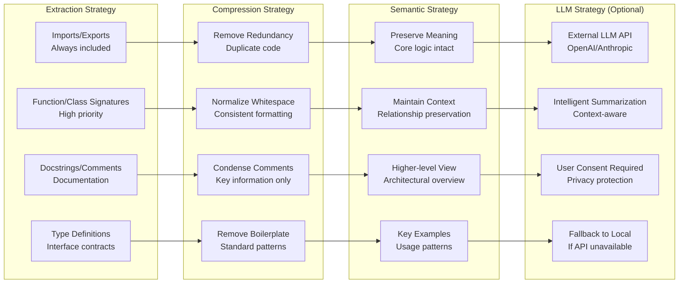

## Session Management Architecture

### Session Lifecycle Flow

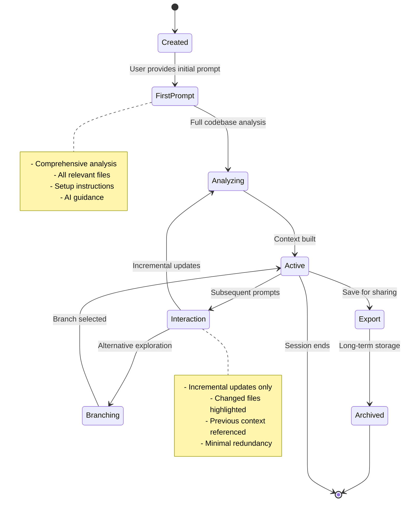

### Session Storage Architecture

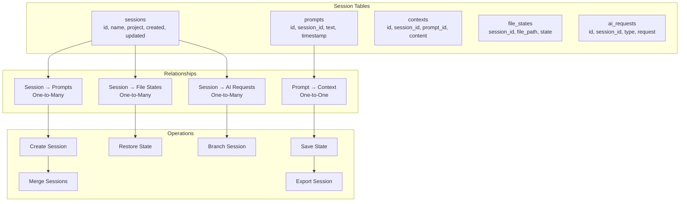

## Storage & Caching Architecture

### Storage Hierarchy

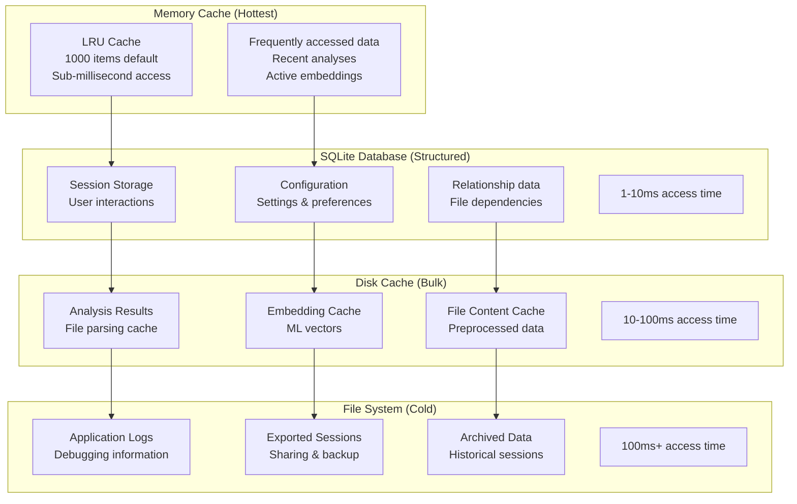

### Cache Invalidation Strategy

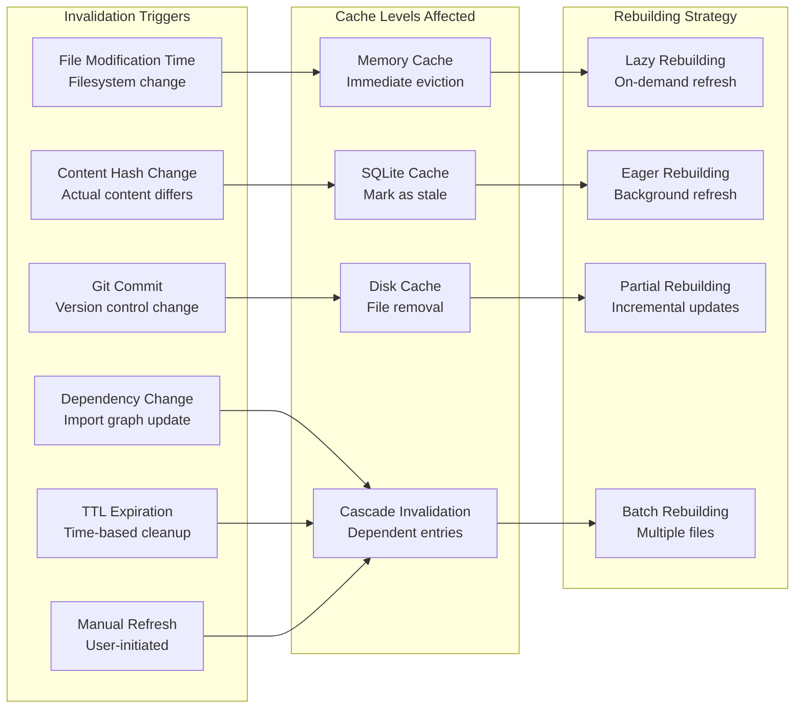

## Performance Architecture

### Optimization Strategy Overview

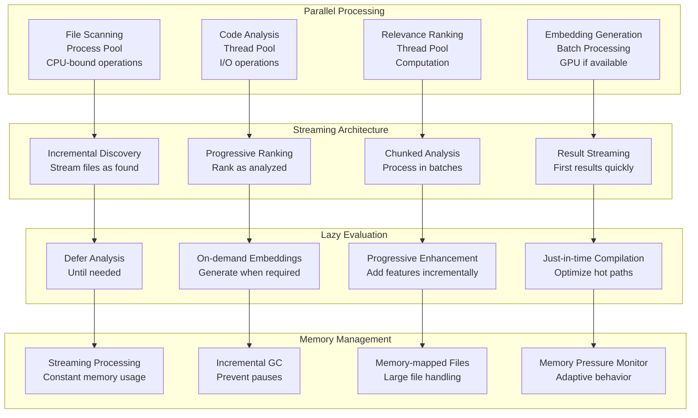

### Performance Benchmarks

#### File Analysis Performance

| Operation | Small (<10KB) | Medium (100KB) | Large (1MB) | Huge (10MB) |
|-----------|---------------|----------------|-------------|-------------|
| Read      | 0.5ms         | 2ms            | 10ms        | 100ms       |
| Tokenize  | 1ms           | 10ms           | 100ms       | 1s          |
| Parse AST | 5ms           | 50ms           | 500ms       | 5s          |
| Analyze   | 10ms          | 100ms          | 1s          | 10s         |
| Embed     | 50ms          | 100ms          | 200ms       | 500ms       |

#### System Performance

| Codebase | Files | Size | Full Analysis | Incremental | Memory |
|----------|-------|------|---------------|-------------|--------|
| Small    | 100   | 5MB  | 2s            | 100ms       | 50MB   |
| Medium   | 1K    | 50MB | 15s           | 500ms       | 200MB  |
| Large    | 10K   | 500MB| 2m            | 2s          | 800MB  |
| Huge     | 100K  | 5GB  | 20m           | 10s         | 3GB    |
| Monorepo | 1M    | 50GB | 3h            | 30s         | 8GB    |

## Configuration System

### Configuration Hierarchy

```mermaid
graph TB
    subgraph "Configuration Sources (Priority Order)"
        CLI[Command-line Arguments<br/>Highest Priority<br/>--algorithm, --exclude]
        ENV[Environment Variables<br/>TENETS_ALGORITHM=ml]
        PROJECT[Project Configuration<br/>.tenets.yml in project root]
        USER[User Configuration<br/>~/.config/tenets/config.yml]
        SYSTEM[System Defaults<br/>Built-in fallbacks<br/>Lowest Priority]
    end

    subgraph "Configuration Categories"
        RANKING_CONFIG[Ranking Configuration<br/>Algorithms, weights, factors]
        NLP_CONFIG[NLP Configuration<br/>Tokenization, stopwords]
        ML_CONFIG[ML Configuration<br/>Models, caching, devices]
        CACHE_CONFIG[Cache Configuration<br/>TTL, size limits, storage]
        SCANNER_CONFIG[Scanner Configuration<br/>Ignore patterns, limits]
        OUTPUT_CONFIG[Output Configuration<br/>Format, tokens, metadata]
    end

    subgraph "Dynamic Configuration"
        HOT_RELOAD[Hot Reload<br/>File change detection]
        API_UPDATE[Runtime API Updates<br/>Programmatic changes]
        VALIDATION[Configuration Validation<br/>Type checking, constraints]
        ROLLBACK[Error Rollback<br/>Revert on failure]
    end

    CLI --> RANKING_CONFIG
    ENV --> NLP_CONFIG
    PROJECT --> ML_CONFIG
    USER --> CACHE_CONFIG
    SYSTEM --> SCANNER_CONFIG

    RANKING_CONFIG --> HOT_RELOAD
    NLP_CONFIG --> API_UPDATE
    ML_CONFIG --> VALIDATION
    CACHE_CONFIG --> ROLLBACK
    SCANNER_CONFIG --> ROLLBACK
    OUTPUT_CONFIG --> ROLLBACK
```

### Complete Configuration Schema

```yaml
# .tenets.yml
version: 2

# Ranking configuration
ranking:
  algorithm: balanced  # fast|balanced|thorough|ml
  threshold: 0.1       # Minimum relevance score
  use_git: true        # Enable git signals
  use_ml: true         # Enable ML features

  # Factor weights (must sum to ~1.0)
  weights:
    semantic_similarity: 0.25
    keyword_match: 0.15
    tfidf_similarity: 0.15
    import_centrality: 0.10
    path_relevance: 0.10
    git_recency: 0.05
    git_frequency: 0.05
    git_authors: 0.05
    file_type: 0.05
    code_patterns: 0.05

  # Performance
  workers: 8           # Parallel workers
  batch_size: 100      # Batch size for ML

# NLP configuration
nlp:
  use_stopwords: true
  stopword_set: minimal  # minimal|aggressive|custom
  tokenizer: code        # code|text
  keyword_extractor: yake # yake|tfidf|frequency

# ML configuration
ml:
  model: all-MiniLM-L6-v2
  device: auto         # auto|cpu|cuda
  cache_embeddings: true
  embedding_dim: 384

# Cache configuration
cache:
  enabled: true
  directory: ~/.tenets/cache
  max_size_mb: 1000
  ttl_days: 7

  # SQLite pragmas
  sqlite_pragmas:
    journal_mode: WAL
    synchronous: NORMAL
    cache_size: -64000
    temp_store: MEMORY

# File scanning
scanner:
  respect_gitignore: true
  include_hidden: false
  follow_symlinks: false
  max_file_size_mb: 10
  binary_detection: true

  # Global ignores
  ignore_patterns:
    - "*.pyc"
    - "__pycache__"
    - "node_modules"
    - ".git"
    - ".venv"
    - "venv"
    - "*.egg-info"
    - "dist"
    - "build"

# Summarization configuration
summarizer:
  # Documentation context-aware summarization
  docs_context_aware: true           # Enable smart context-aware documentation summarization
  docs_show_in_place_context: true   # Preserve relevant context sections in-place within summaries
  docs_context_search_depth: 2       # 1=direct mentions, 2=semantic similarity, 3=deep analysis
  docs_context_min_confidence: 0.6   # Minimum confidence for context relevance (0.0-1.0)
  docs_context_max_sections: 10      # Maximum contextual sections to preserve per document
  docs_context_preserve_examples: true # Always preserve code examples and snippets

# Output configuration
output:
  format: markdown     # markdown|json|xml
  max_tokens: 100000
  include_metadata: true
  include_instructions: true
  copy_on_distill: false

# Session configuration
session:
  auto_save: true
  history_limit: 100
  branch_on_conflict: true

# Examination configuration
examination:
  complexity_threshold: 10
  duplication_threshold: 0.1
  min_test_coverage: 0.8

# Chronicle configuration
chronicle:
  include_merges: false
  max_commits: 1000
  analyze_patterns: true

# Momentum configuration
momentum:
  sprint_duration: 14
  velocity_window: 6
  include_weekends: false
```

## CLI & API Architecture

### Command Structure

```mermaid
graph TB
    subgraph "Main Commands"
        DISTILL[tenets distill<br/>Build optimal context]
        EXAMINE[tenets examine<br/>Code quality analysis]
        CHRONICLE[tenets chronicle<br/>Git history analysis]
        MOMENTUM[tenets momentum<br/>Velocity tracking]
        SESSION[tenets session<br/>Session management]
    end

    subgraph "Distill Options"
        PROMPT[--prompt TEXT<br/>Analysis prompt]
        ALGORITHM[--algorithm CHOICE<br/>fast|balanced|thorough|ml]
        MAX_TOKENS[--max-tokens INTEGER<br/>Token limit]
        FILTERS[--include/--exclude<br/>File patterns]
        SESSION_OPT[--session NAME<br/>Session context]
        COPY[--copy<br/>Copy to clipboard]
    end

    subgraph "Global Options"
        CONFIG[--config PATH<br/>Configuration file]
        VERBOSE[--verbose/-v<br/>Logging level]
        NO_CACHE[--no-cache<br/>Disable caching]
        WORKERS[--workers N<br/>Parallel processing]
    end

    subgraph "Output Formats"
        MARKDOWN[Markdown (default)<br/>Human-readable]
        JSON[JSON format<br/>Machine-readable]
        XML[XML format<br/>Structured data]
        RAW[Raw text<br/>Plain output]
    end

    DISTILL --> PROMPT
    DISTILL --> ALGORITHM
    DISTILL --> MAX_TOKENS
    DISTILL --> FILTERS
    DISTILL --> SESSION_OPT
    DISTILL --> COPY

    EXAMINE --> CONFIG
    CHRONICLE --> VERBOSE
    MOMENTUM --> NO_CACHE
    SESSION --> WORKERS

    COPY --> MARKDOWN
    SESSION_OPT --> JSON
    FILTERS --> XML
    WORKERS --> RAW
```

### Python API Design

```python
from tenets import Tenets

# Initialize
tenets = Tenets(path="./my-project")

# Simple usage
context = tenets.distill("implement OAuth2 authentication")

# Advanced usage
result = tenets.distill(
    prompt="refactor database layer",
    algorithm="ml",
    max_tokens=50000,
    filters=["*.py", "!test_*"]
)

# Session management
session = tenets.create_session("oauth-implementation")
context1 = session.distill("add OAuth2 support")
context2 = session.distill("add unit tests", incremental=True)

# Analysis tools
examination = tenets.examine()
chronicle = tenets.chronicle()
momentum = tenets.momentum()

# Configuration
tenets.configure(
    ranking_algorithm="thorough",
    use_ml=True,
    cache_ttl_days=30
)
```

## Security & Privacy Architecture

### Local-First Security Model

```mermaid
graph TB
    subgraph "Privacy Guarantees"
        LOCAL[All Processing Local<br/>No external API calls for analysis]
        NO_TELEMETRY[No Telemetry<br/>No usage tracking]
        NO_CLOUD[No Cloud Storage<br/>All data stays local]
        NO_PHONE_HOME[No Phone Home<br/>No automatic updates]
    end

    subgraph "Secret Detection"
        API_KEYS[API Key Detection<br/>Common patterns]
        PASSWORDS[Password Detection<br/>Credential patterns]
        TOKENS[Token Detection<br/>JWT, OAuth tokens]
        PRIVATE_KEYS[Private Key Detection<br/>RSA, SSH keys]
        CONNECTION_STRINGS[Connection Strings<br/>Database URLs]
        ENV_VARS[Environment Variables<br/>Sensitive values]
    end

    subgraph "Output Sanitization"
        REDACT[Redact Secrets<br/>Replace with placeholders]
        MASK_PII[Mask PII<br/>Personal information]
        CLEAN_PATHS[Clean File Paths<br/>Remove sensitive paths]
        REMOVE_URLS[Remove Internal URLs<br/>Private endpoints]
        ANONYMIZE[Anonymization Option<br/>Remove identifying info]
    end

    subgraph "Data Protection"
        ENCRYPTED_CACHE[Encrypted Cache<br/>Optional encryption at rest]
        SECURE_DELETE[Secure Deletion<br/>Overwrite sensitive data]
        ACCESS_CONTROL[File Access Control<br/>Respect permissions]
        AUDIT_LOG[Audit Logging<br/>Security events]
    end

    LOCAL --> API_KEYS
    NO_TELEMETRY --> PASSWORDS
    NO_CLOUD --> TOKENS
    NO_PHONE_HOME --> PRIVATE_KEYS

    API_KEYS --> REDACT
    PASSWORDS --> MASK_PII
    TOKENS --> CLEAN_PATHS
    PRIVATE_KEYS --> REMOVE_URLS
    CONNECTION_STRINGS --> ANONYMIZE
    ENV_VARS --> ANONYMIZE

    REDACT --> ENCRYPTED_CACHE
    MASK_PII --> SECURE_DELETE
    CLEAN_PATHS --> ACCESS_CONTROL
    REMOVE_URLS --> AUDIT_LOG
    ANONYMIZE --> AUDIT_LOG
```

### Secret Detection Patterns

```mermaid
graph LR
    subgraph "Detection Methods"
        REGEX[Regex Patterns<br/>Known formats]
        ENTROPY[Entropy Analysis<br/>Random strings]
        CONTEXT[Context Analysis<br/>Variable names]
        KEYWORDS[Keyword Detection<br/>password, secret, key]
    end

    subgraph "Secret Types"
        AWS[AWS Access Keys<br/>AKIA...]
        GITHUB[GitHub Tokens<br/>ghp_, gho_]
        JWT[JWT Tokens<br/>eyJ pattern]
        RSA[RSA Private Keys<br/>-----BEGIN RSA]
        DATABASE[Database URLs<br/>postgres://, mysql://]
        GENERIC[Generic Secrets<br/>High entropy strings]
    end

    subgraph "Response Actions"
        FLAG[Flag for Review<br/>Warn user]
        REDACT_AUTO[Auto Redaction<br/>Replace with [REDACTED]]
        EXCLUDE[Exclude File<br/>Skip entirely]
        LOG[Security Log<br/>Record detection]
    end

    REGEX --> AWS
    ENTROPY --> GITHUB
    CONTEXT --> JWT
    KEYWORDS --> RSA

    AWS --> FLAG
    GITHUB --> REDACT_AUTO
    JWT --> EXCLUDE
    RSA --> LOG
    DATABASE --> LOG
    GENERIC --> FLAG
```

## Testing & Quality Assurance

### Test Architecture

```mermaid
graph TB
    subgraph "Test Categories"
        UNIT[Unit Tests<br/>>90% coverage<br/>Fast, isolated]
        INTEGRATION[Integration Tests<br/>Component interaction<br/>Real workflows]
        E2E[End-to-End Tests<br/>Complete user journeys<br/>CLI to output]
        PERFORMANCE[Performance Tests<br/>Benchmark regression<br/>Memory usage]
    end

    subgraph "Test Structure"
        FIXTURES[Test Fixtures<br/>Sample codebases<br/>Known outputs]
        MOCKS[Mock Objects<br/>External dependencies<br/>Controlled behavior]
        HELPERS[Test Helpers<br/>Common operations<br/>Assertion utilities]
        FACTORIES[Data Factories<br/>Generate test data<br/>Realistic scenarios]
    end

    subgraph "Quality Metrics"
        COVERAGE[Code Coverage<br/>Line and branch coverage]
        COMPLEXITY[Complexity Limits<br/>Cyclomatic < 10]
        DUPLICATION[Duplication Check<br/>< 5% duplicate code]
        DOCUMENTATION[Documentation<br/>100% public API]
    end

    subgraph "Continuous Testing"
        PRE_COMMIT[Pre-commit Hooks<br/>Fast feedback]
        CI_PIPELINE[CI Pipeline<br/>Full test suite]
        NIGHTLY[Nightly Tests<br/>Extended scenarios]
        BENCHMARKS[Benchmark Tracking<br/>Performance trends]
    end

    UNIT --> FIXTURES
    INTEGRATION --> MOCKS
    E2E --> HELPERS
    PERFORMANCE --> FACTORIES

    FIXTURES --> COVERAGE
    MOCKS --> COMPLEXITY
    HELPERS --> DUPLICATION
    FACTORIES --> DOCUMENTATION

    COVERAGE --> PRE_COMMIT
    COMPLEXITY --> CI_PIPELINE
    DUPLICATION --> NIGHTLY
    DOCUMENTATION --> BENCHMARKS
```

### Test Coverage Requirements

```mermaid
graph LR
    subgraph "Coverage Targets"
        UNIT_COV[Unit Tests<br/>>90% coverage<br/>Critical paths 100%]
        INTEGRATION_COV[Integration Tests<br/>All major workflows<br/>Error scenarios]
        E2E_COV[E2E Tests<br/>Critical user journeys<br/>Happy paths]
        PERF_COV[Performance Tests<br/>Regression prevention<br/>Memory leak detection]
    end

    subgraph "Quality Gates"
        CODE_QUALITY[Code Quality<br/>Complexity < 10<br/>Function length < 50]
        DOCUMENTATION[Documentation<br/>100% public API<br/>Usage examples]
        SECURITY[Security Tests<br/>Secret detection<br/>Input validation]
        COMPATIBILITY[Compatibility<br/>Python 3.8+<br/>Multiple platforms]
    end

    UNIT_COV --> CODE_QUALITY
    INTEGRATION_COV --> DOCUMENTATION
    E2E_COV --> SECURITY
    PERF_COV --> COMPATIBILITY
```

## Future Roadmap & Vision

### Near Term (Q1 2025)

```mermaid
graph TB
    subgraph "Core Improvements"
        INCREMENTAL[Incremental Indexing<br/>Real-time updates<br/>Watch file changes]
        FASTER_EMBED[Faster Embeddings<br/>Model quantization<br/>ONNX optimization]
        LANGUAGE_SUP[Better Language Support<br/>30+ languages<br/>Language-specific patterns]
        IDE_PLUGINS[IDE Plugin Ecosystem<br/>VS Code, IntelliJ, Vim]
        CROSS_REPO[Cross-repository Analysis<br/>Monorepo support<br/>Dependency tracking]
    end

    subgraph "ML Enhancements"
        NEWER_MODELS[Newer Embedding Models<br/>Code-specific transformers<br/>Better accuracy]
        FINE_TUNING[Fine-tuning Pipeline<br/>Domain-specific models<br/>Custom training]
        MULTIMODAL[Multi-modal Understanding<br/>Diagrams, images<br/>Architecture docs]
        CODE_TRANSFORMERS[Code-specific Models<br/>Programming language aware<br/>Syntax understanding]
    end

    INCREMENTAL --> NEWER_MODELS
    FASTER_EMBED --> FINE_TUNING
    LANGUAGE_SUP --> MULTIMODAL
    IDE_PLUGINS --> CODE_TRANSFORMERS
    CROSS_REPO --> CODE_TRANSFORMERS
```

### Medium Term (Q2-Q3 2025)

```mermaid
graph TB
    subgraph "Platform Features"
        WEB_UI[Web UI<br/>Real-time collaboration<br/>Team workspaces]
        SHARED_CONTEXT[Shared Context Libraries<br/>Team knowledge base<br/>Best practices]
        KNOWLEDGE_GRAPHS[Knowledge Graphs<br/>Code relationships<br/>Semantic connections]
        AI_AGENTS[AI Agent Integration<br/>Autonomous assistance<br/>Proactive suggestions]
    end

    subgraph "Enterprise Features"
        SSO[SSO/SAML Support<br/>Enterprise authentication<br/>Role-based access]
        AUDIT[Audit Logging<br/>Compliance tracking<br/>Usage monitoring]
        COMPLIANCE[Compliance Modes<br/>GDPR, SOX, HIPAA<br/>Data governance]
        AIR_GAPPED[Air-gapped Deployment<br/>Offline operation<br/>Secure environments]
        CUSTOM_ML[Custom ML Models<br/>Private model training<br/>Domain expertise]
    end

    WEB_UI --> SSO
    SHARED_CONTEXT --> AUDIT
    KNOWLEDGE_GRAPHS --> COMPLIANCE
    AI_AGENTS --> AIR_GAPPED
    AI_AGENTS --> CUSTOM_ML
```

### Long Term (2026+)

```mermaid
graph TB
    subgraph "Vision Goals"
        AUTONOMOUS[Autonomous Code Understanding<br/>Self-improving analysis<br/>Minimal human input]
        PREDICTIVE[Predictive Development<br/>Anticipate needs<br/>Suggest improvements]
        UNIVERSAL[Universal Code Intelligence<br/>Any language, any domain<br/>Contextual understanding]
        INDUSTRY_STANDARD[Industry Standard<br/>AI pair programming<br/>Developer toolchain]
    end

    subgraph "Research Areas"
        GRAPH_NEURAL[Graph Neural Networks<br/>Code structure understanding<br/>Relationship modeling]
        REINFORCEMENT[Reinforcement Learning<br/>Ranking optimization<br/>Adaptive behavior]
        FEW_SHOT[Few-shot Learning<br/>New language support<br/>Rapid adaptation]
        EXPLAINABLE[Explainable AI<br/>Ranking transparency<br/>Decision reasoning]
        FEDERATED[Federated Learning<br/>Team knowledge sharing<br/>Privacy-preserving]
    end

    AUTONOMOUS --> GRAPH_NEURAL
    PREDICTIVE --> REINFORCEMENT
    UNIVERSAL --> FEW_SHOT
    INDUSTRY_STANDARD --> EXPLAINABLE
    INDUSTRY_STANDARD --> FEDERATED
```

### Technology Evolution

```mermaid
timeline
    title Tenets Technology Roadmap

    2025 Q1 : Core ML Pipeline
            : Local Embeddings
            : Multi-language Support
            : IDE Integrations

    2025 Q2 : Web Collaboration
            : Team Features
            : Enterprise Security
            : Performance Optimization

    2025 Q3 : Knowledge Graphs
            : AI Agent Integration
            : Custom Models
            : Advanced Analytics

    2026    : Autonomous Understanding
            : Predictive Intelligence
            : Graph Neural Networks
            : Industry Adoption

    2027+   : Universal Code Intelligence
            : Federated Learning
            : Next-gen AI Integration
            : Market Leadership
```

## Output Generation & Visualization

### Output Formatting System

The output formatting system in Tenets provides multiple format options to suit different use cases and integrations:

```mermaid
graph TB
    subgraph "Format Types"
        MARKDOWN[Markdown Format<br/>Human-readable]
        JSON[JSON Format<br/>Machine-parseable]
        XML[XML Format<br/>Structured data]
        HTML[HTML Format<br/>Interactive reports]
    end

    subgraph "HTML Report Features"
        INTERACTIVE[Interactive Elements<br/>Collapsible sections]
        VISUALS[Visualizations<br/>Charts & graphs]
        STYLING[Professional Styling<br/>Modern UI]
        RESPONSIVE[Responsive Design<br/>Mobile-friendly]
    end

    subgraph "Report Components"
        HEADER[Report Header<br/>Title & metadata]
        PROMPT_DISPLAY[Prompt Analysis<br/>Keywords & intent]
        STATS[Statistics Dashboard<br/>Metrics & KPIs]
        FILES[File Listings<br/>Code previews]
        GIT[Git Context<br/>Commits & contributors]
    end

    HTML --> INTERACTIVE
    HTML --> VISUALS
    HTML --> STYLING
    HTML --> RESPONSIVE

    INTERACTIVE --> HEADER
    VISUALS --> STATS
    STYLING --> FILES
    RESPONSIVE --> GIT
```

### HTML Report Generation

The HTML formatter leverages the reporting infrastructure to create rich, interactive reports:

#### Features:
- **Interactive Dashboard**: Collapsible sections, sortable tables, and filterable content
- **Visual Statistics**: Charts for file distribution, token usage, and relevance scores
- **Code Previews**: Syntax-highlighted code snippets with truncation for large files
- **Responsive Design**: Mobile-friendly layout that adapts to screen size
- **Professional Styling**: Modern UI with gradients, shadows, and animations
- **Git Integration**: Display of recent commits, contributors, and branch information

#### Architecture:

```python
class HTMLFormatter:
    """HTML report generation for distill command."""

    def format_html(self, aggregated, prompt_context, session):
        # Create HTML template with modern styling
        template = HTMLTemplate(theme="modern", include_charts=True)

        # Build report sections
        sections = [
            self._build_header(prompt_context, session),
            self._build_prompt_analysis(prompt_context),
            self._build_statistics(aggregated),
            self._build_file_cards(aggregated["included_files"]),
            self._build_git_context(aggregated.get("git_context"))
        ]

        # Generate final HTML with embedded styles and scripts
        return template.render(sections)
```

### Visualization Components

The visualization system provides rich visual representations of code analysis:

```mermaid
graph LR
    subgraph "Chart Types"
        BAR[Bar Charts<br/>File metrics]
        PIE[Pie Charts<br/>Language distribution]
        HEAT[Heatmaps<br/>Complexity visualization]
        GRAPH[Network Graphs<br/>Dependencies]
    end

    subgraph "Data Sources"
        METRICS[Code Metrics]
        RANKINGS[Relevance Rankings]
        TOKENS[Token Distribution]
        COVERAGE[Test Coverage]
    end

    METRICS --> BAR
    RANKINGS --> HEAT
    TOKENS --> PIE
    COVERAGE --> GRAPH
```

### Integration with Report Generator

The distill command now fully integrates with the report generation infrastructure:

1. **Shared Templates**: Uses the same HTML templates as the examine command
2. **Consistent Styling**: Unified visual design across all report types
3. **Reusable Components**: Shared visualization libraries and chart generators
4. **Export Options**: Support for PDF export via HTML rendering

### Usage Examples

```bash
# Generate HTML report for context
tenets distill "review API" --format html -o report.html

# Create interactive dashboard with verbose details
tenets distill "analyze security" --format html --verbose -o security_context.html

# Generate report with custom styling
tenets distill "refactor database" --format html --theme dark -o refactor.html
```

### Performance Optimizations

- **Lazy Loading**: Large code sections load on-demand
- **Virtual Scrolling**: Efficient rendering of long file lists
- **Minified Assets**: Compressed CSS and JavaScript
- **Inline Resources**: No external dependencies for offline viewing

## Conclusion

Tenets represents a fundamental shift in how developers interact with their codebases when working with AI. By combining sophisticated NLP/ML techniques with traditional code analysis, git mining, and intelligent caching, we've created a system that truly understands code in context.

The architecture is designed to be:

- **Performant**: Sub-second responses for most operations
- **Scalable**: From small projects to massive monorepos
- **Extensible**: Plugin system for custom logic
- **Private**: Everything runs locally
- **Intelligent**: State-of-the-art ML when available
- **Practical**: Works today, improves tomorrow

### Key Architectural Strengths

1. **Multi-Modal Intelligence**: Combines semantic understanding, structural analysis, and historical context
2. **Progressive Enhancement**: Works with minimal dependencies, scales with available resources
3. **Local-First Privacy**: Complete data sovereignty and security
4. **Configurable Ranking**: Every factor can be tuned for specific use cases
5. **Streaming Performance**: Results available as soon as possible
6. **Intelligent Caching**: Multiple cache levels with smart invalidation
7. **Extensible Design**: Plugin architecture for custom functionality

The future of code intelligence is local, intelligent, and developer-centric. Tenets embodies this vision while remaining practical and immediately useful for development teams of any size.
