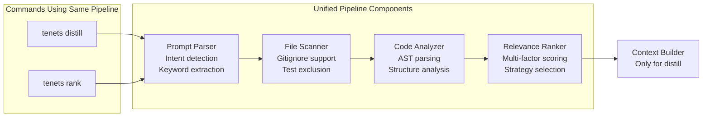

# Tenets Complete Architecture Documentation

## Table of Contents

1. [System Overview](#system-overview)
2. [Core Philosophy & Design Principles](#core-philosophy--design-principles)
3. [Complete System Architecture](#complete-system-architecture)
4. [NLP/ML Pipeline Architecture](#nlpml-pipeline-architecture)
5. [File Discovery & Scanning System](#file-discovery--scanning-system)
6. [Code Analysis Engine](#code-analysis-engine)
7. [Relevance Ranking System](#relevance-ranking-system)
8. [Git Integration & Chronicle System](#git-integration--chronicle-system)
9. [Examination & Quality Analysis](#examination--quality-analysis)
10. [Momentum & Velocity Tracking](#momentum--velocity-tracking)
11. [Context Management & Optimization](#context-management--optimization)
12. [Session Management Architecture](#session-management-architecture)
13. [Storage & Caching Architecture](#storage--caching-architecture)
14. [Prompt Parsing & Understanding](#prompt-parsing--understanding)
15. [Output Generation & Formatting](#output-generation--formatting)
16. [Performance Architecture](#performance-architecture)
17. [Configuration System](#configuration-system)
18. [CLI & API Architecture](#cli--api-architecture)
19. [Visualization & Reporting](#visualization--reporting)
20. [Security & Privacy Architecture](#security--privacy-architecture)
21. [Extensibility & Plugin System](#extensibility--plugin-system)
22. [Deployment Architecture](#deployment-architecture)
23. [Testing & Quality Assurance](#testing--quality-assurance)
24. [Future Roadmap & Vision](#future-roadmap--vision)

## System Overview

### What is Tenets?

Tenets is a sophisticated, local-first code intelligence platform that revolutionizes how developers interact with their codebases when working with AI assistants. Unlike traditional code search tools or simple context builders, Tenets employs advanced multi-stage analysis combining natural language processing, machine learning, static code analysis, git history mining, and intelligent ranking to build optimal context for any given task.

The system operates entirely locally, ensuring complete privacy and security while delivering advanced code understanding capabilities. Every component is designed with performance in mind, utilizing aggressive caching, parallel processing, and incremental computation to handle codebases ranging from small projects to massive monorepos with millions of files.

### Core Architecture Principles

1. **Local-First Processing**: All analysis, ranking, and context generation happens on the developer's machine. No code ever leaves the local environment. External API calls are only made for optional LLM-based summarization, and even then, only with explicit user consent.

2. **Progressive Enhancement**: The system provides value immediately with just Python installed, and scales up with optional dependencies. Core functionality works without any ML libraries, git integration works without any configuration, and advanced features gracefully degrade when dependencies are missing.

3. **Intelligent Caching**: Every expensive operation is cached at multiple levels - memory caches for hot data, SQLite for structured data, disk caches for analysis results, and specialized caches for embeddings. Cache invalidation is intelligent, using file modification times, git commits, and content hashes.

4. **Configurable Intelligence**: Every aspect of the ranking and analysis can be configured. Users can adjust factor weights, enable/disable features, add custom ranking functions, and tune performance parameters. The system adapts to different codebases and use cases.

5. **Streaming Architecture**: The system uses streaming and incremental processing wherever possible. Files are analyzed as they're discovered, rankings are computed in parallel, and results stream to the user as they become available.

## Complete System Architecture

### High-Level Data Flow


### System Component Overview


## NLP/ML Pipeline Architecture

### Centralized NLP Components (Updated)

Tenets uses a centralized NLP architecture to avoid code duplication and ensure consistency:

#### Core NLP Module Structure
```
tenets/core/nlp/
├── __init__.py          # Main NLP API exports
├── similarity.py        # Centralized similarity computations (NEW)
├── keyword_extractor.py # Unified keyword extraction with SimpleRAKE
├── tokenizer.py        # Code and text tokenization
├── stopwords.py        # Stopword management with fallbacks
├── embeddings.py       # Embedding generation (ML optional)
├── ml_utils.py         # ML utility functions
├── bm25.py            # BM25 ranking algorithm (primary)
└── tfidf.py           # TF-IDF calculations (optional alternative to BM25)
```

#### Similarity Computation Consolidation

All similarity calculations are now centralized in `similarity.py`:

**Unified API:**
```python
from tenets.core.nlp import (
    cosine_similarity,      # Dense or sparse vectors
    sparse_cosine_similarity,  # Dict-based sparse vectors
    euclidean_distance,     # L2 distance
    manhattan_distance,     # L1 distance
    SemanticSimilarity     # ML-based semantic similarity
)
```

**Key Features:**
- **Automatic Detection**: `cosine_similarity()` auto-detects sparse (dict) vs dense (list/array) vectors
- **Sparse Vector Support**: Efficient similarity for high-dimensional sparse vectors (BM25/TF-IDF)
- **No Duplication**: All modules import from central `similarity.py`
- **Graceful Fallback**: Works without NumPy using pure Python implementations

**Usage Examples:**
```python
# Dense vectors
sim = cosine_similarity([1, 0, 0], [0, 1, 0])  # → 0.0

# Sparse vectors (BM25/TF-IDF)
vec1 = {"python": 0.8, "code": 0.6}
vec2 = {"python": 0.7, "test": 0.5}
sim = sparse_cosine_similarity(vec1, vec2)  # → 0.76

# Semantic similarity (requires ML)
sem = SemanticSimilarity()
sim = sem.compute("OAuth authentication", "login system")  # → 0.82
```

### Pipeline Component Flow


### Keyword Extraction Algorithms Comparison

#### Algorithm Overview & Trade-offs

| Algorithm | Speed | Quality | Memory | Python 3.13 | Best For | Limitations |
|-----------|-------|----------|---------|-------------|----------|-------------|
| **RAKE** | Fast | Good | Low | ✅ Yes | • Technical docs<br/>• Multi-word phrases<br/>• Fast processing | • No semantic understanding<br/>• Language-dependent stopwords<br/>• May miss single important words |
| **SimpleRAKE** | Fast | Good | Minimal | ✅ Yes | • No NLTK dependencies<br/>• Built-in implementation<br/>• Fast processing | • No advanced NLP features<br/>• Basic tokenization only |
| **YAKE** | Moderate | Very Good | Low | ❌ No | • Statistical analysis<br/>• Language independent<br/>• Capital letter aware | • Python 3.13 bug<br/>• Can produce duplicates<br/>• No deep semantics |
| **BM25** | Fast | Excellent | High<br/>(handles length variation) | ✅ Yes | • Primary ranking algorithm<br/>• Better for code search<br/>• Handles file size variation | • Needs document corpus<br/>• Statistical only<br/>• No semantic understanding |
| **TF-IDF** | Fast | Good | Medium<br/>(corpus-dependent) | ✅ Yes | • Optional alternative to BM25<br/>• Document uniqueness<br/>• Simpler algorithm | • Less effective for varying lengths<br/>• No term saturation<br/>• Statistical only |
| **Frequency** | Very Fast | Basic | Minimal | ✅ Yes | • Fallback option<br/>• Simple analysis<br/>• Guaranteed to work | • Very basic<br/>• No context awareness<br/>• Misses importance |

#### Detailed Algorithm Analysis

##### **RAKE (Rapid Automatic Keyword Extraction)**
```
Primary method for Python 3.13+
```

**How it works:**
- Uses word frequency and co-occurrence to identify key phrases
- Builds a word co-occurrence graph
- Calculates word scores based on degree/frequency ratio

**Pros:**
- ✅ Extremely fast - can process thousands of documents per second
- ✅ Excellent at extracting multi-word technical phrases
- ✅ No training required - works immediately
- ✅ Python 3.13 compatible
- ✅ Good performance with technical documentation
- ✅ Low memory footprint

**Cons:**
- ❌ No semantic understanding of word relationships
- ❌ Dependent on stopword lists for quality
- ❌ May miss important single-word keywords
- ❌ Can struggle with very short texts

**Best Use Cases:**
- API documentation keyword extraction
- Technical specification analysis
- Code comment summarization
- Real-time keyword extraction

##### **YAKE (Yet Another Keyword Extractor)**
```
Secondary method for Python < 3.13
```

**How it works:**
- Uses statistical features from individual documents
- Considers word position, frequency, context
- Pays attention to capitalization and word casing

**Pros:**
- ✅ Language independent - works without language-specific resources
- ✅ No training corpus needed
- ✅ Good at identifying proper nouns and technical terms
- ✅ Considers word position and context
- ✅ Handles multiple languages well

**Cons:**
- ❌ **Critical: Infinite loop bug on Python 3.13**
- ❌ Can generate duplicate keywords with different cases
- ❌ No deep semantic understanding
- ❌ Slower than RAKE for large documents

**Best Use Cases:**
- Multi-language codebases
- Mixed content (code + documentation)
- When capitalization matters (class names, constants)

##### **BM25 (Best Matching 25)**
```
Primary text similarity algorithm - default for ranking
```

**How it works:**
- Probabilistic ranking function with term saturation (k1=1.2)
- Document length normalization (b=0.75) handles varying file sizes
- Prevents over-weighting of repeated terms
- Default ranking algorithm (better than TF-IDF for code search)

**Pros:**
- ✅ Superior ranking for varying document lengths
- ✅ Term saturation prevents keyword stuffing bias
- ✅ Industry standard for search engines
- ✅ Pure Python implementation
- ✅ Better for code files of different sizes

**Cons:**
- ❌ Requires a corpus of documents
- ❌ More complex than basic keyword matching
- ❌ Still statistical, no semantic understanding
- ❌ Memory usage grows with corpus size

**Best Use Cases:**
- Default text similarity for all ranking
- Code search across files of varying sizes
- Finding relevant files for prompts

##### **TF-IDF (Optional Alternative to BM25)**
```
Optional fallback method - configurable via text_similarity_algorithm
```

**How it works:**
- Calculates term importance based on frequency in document vs corpus
- Higher scores for terms that are frequent in document but rare in corpus
- Uses vector space model for similarity calculations

**Pros:**
- ✅ Always available - pure Python implementation
- ✅ Excellent for finding document-specific terms
- ✅ Good theoretical foundation
- ✅ Can identify unique technical terms
- ✅ Supports similarity calculations between documents

**Cons:**
- ❌ Requires a corpus of documents for comparison
- ❌ No phrase extraction (single words only)
- ❌ Memory usage grows with corpus size
- ❌ No understanding of word relationships

**Best Use Cases:**
- Finding unique terms in a file
- Document similarity calculations
- Corpus-wide keyword analysis
- Information retrieval tasks

##### **Frequency-based Extraction**
```
Final fallback - guaranteed to work
```

**How it works:**
- Simple word counting with basic filtering
- Extracts n-grams (bigrams, trigrams)
- Scores based on component frequency

**Pros:**
- ✅ Always works - no dependencies
- ✅ Minimal memory usage
- ✅ Very fast
- ✅ Predictable behavior
- ✅ Good for debugging

**Cons:**
- ❌ Very basic - no intelligence
- ❌ Misses context and importance
- ❌ Common words can dominate
- ❌ No semantic understanding

**Best Use Cases:**
- Emergency fallback
- Testing and debugging
- When other methods fail
- Very resource-constrained environments

#### Selection Strategy

```python
# Tenets automatic selection logic (simplified)
if python_version >= 3.13:
    if rake_available:
        use_rake()  # Primary choice
    else:
        use_bm25()  # Default (or use_tfidf() if configured)
else:  # Python < 3.13
    if rake_available:
        use_rake()  # Still preferred for speed
    elif yake_available:
        use_yake()  # Good alternative
    else:
        use_bm25()  # Default (or use_tfidf() if configured)

# Final fallback is always frequency-based
if all_methods_fail:
    use_frequency()
```

### Embedding Model Architecture


## File Discovery & Scanning System

### Scanner Architecture Flow


### Binary Detection Strategy


### Minified & Build File Exclusion

Tenets automatically excludes minified, compiled, and build output files by default to focus on source code only. This significantly improves analysis speed and context relevance.

#### Default Exclusion Patterns

```yaml
scanner:
  exclude_minified: true  # Default: exclude minified files
  minified_patterns:
    - '*.min.js'          # Minified JavaScript
    - '*.min.css'         # Minified CSS
    - '*.bundle.js'       # Webpack bundles
    - '*.bundle.css'      # CSS bundles
    - '*.production.js'   # Production builds
    - '*.prod.js'         # Production builds
    - '*.dist.js'         # Distribution files
    - '*.compiled.js'     # Compiled output
    - '*.minified.*'      # Any minified file
    - '*.uglified.*'      # UglifyJS output
  build_directory_patterns:
    - dist/               # Distribution folder
    - build/              # Build output
    - out/                # Output folder
    - output/             # Alternative output
    - public/             # Public assets
    - static/generated/   # Generated statics
    - .next/              # Next.js build
    - _next/              # Next.js build
    - node_modules/       # Dependencies
```

#### Configuration Options

1. **Disable minified exclusion** (include all files):
   ```yaml
   scanner:
     exclude_minified: false
   ```

2. **Custom patterns**:
   ```yaml
   scanner:
     minified_patterns:
       - '*.custom.min.js'
       - 'vendor/*.js'
   ```

3. **CLI override**:
   ```bash
   # Include minified files for this run
   tenets distill "analyze bundle" --include-minified

   # Exclude specific patterns
   tenets examine . --exclude "*.min.js,dist/"
   ```

### Intelligent Test File Exclusion

Tenets implements intelligent test file handling to improve context relevance by automatically excluding or including test files based on the user's intent.


**Intent Detection Patterns:**
- Test-related keywords: `test`, `tests`, `testing`, `unit`, `integration`, `spec`, `coverage`
- Test actions: `write tests`, `fix tests`, `run tests`, `test coverage`, `mock`
- Test files: `test_auth.py`, `auth.test.js`, `*Test.java`
- Test frameworks: `pytest`, `jest`, `mocha`, `junit`, `rspec`

**Benefits:**
- **Improved Relevance**: Non-test prompts get cleaner production code context
- **Automatic Intelligence**: Test prompts automatically include test files
- **Manual Override**: CLI flags provide full control when needed
- **Multi-language Support**: Recognizes test patterns across languages
- **Configuration**: Customizable patterns for project-specific conventions

## Code Analysis Engine

### Language Analyzer Architecture

```mermaid
graph TB
    subgraph "Base Analyzer Interface"
        BASE[LanguageAnalyzer<br/>Abstract Base Class]
        EXTRACT_IMP[extract_imports()]
        EXTRACT_EXP[extract_exports()]
        EXTRACT_CLS[extract_classes()]
        EXTRACT_FN[extract_functions()]
        CALC_COMP[calculate_complexity()]
        TRACE_DEP[trace_dependencies()]
    end

    subgraph "Language-Specific Analyzers"
        PYTHON[Python Analyzer<br/>Full AST parsing]
        JAVASCRIPT[JavaScript Analyzer<br/>ES6+ support]
        GOLANG[Go Analyzer<br/>Package detection]
        JAVA[Java Analyzer<br/>OOP patterns]
        RUST[Rust Analyzer<br/>Ownership patterns]
        GENERIC[Generic Analyzer<br/>Pattern-based fallback]
    end

    subgraph "Analysis Features"
        AST[AST Parsing]
        IMPORTS[Import Resolution]
        TYPES[Type Extraction]
        DOCS[Documentation Parsing]
        PATTERNS[Code Patterns]
        COMPLEXITY[Complexity Metrics]
    end

    BASE --> EXTRACT_IMP
    BASE --> EXTRACT_EXP
    BASE --> EXTRACT_CLS
    BASE --> EXTRACT_FN
    BASE --> CALC_COMP
    BASE --> TRACE_DEP

    BASE --> PYTHON
    BASE --> JAVASCRIPT
    BASE --> GOLANG
    BASE --> JAVA
    BASE --> RUST
    BASE --> GENERIC

    PYTHON --> AST
    PYTHON --> IMPORTS
    PYTHON --> TYPES
    PYTHON --> DOCS

    JAVASCRIPT --> PATTERNS
    GOLANG --> PATTERNS
    JAVA --> COMPLEXITY
    RUST --> COMPLEXITY
    GENERIC --> PATTERNS
```

### Python Analyzer Detail


## Relevance Ranking System

### Unified Ranking Architecture

**IMPORTANT**: The `rank` command now uses the EXACT SAME sophisticated ranking pipeline as the `distill` command. This ensures consistency and leverages the full power of the multi-factor ranking system.


### Strategy Comparison and Usage

| Strategy | Speed | Accuracy | Use Cases | Factors Used |
|----------|-------|----------|-----------|--------------|
| **Fast** | Fastest | Basic | • Quick file discovery<br/>• Keyword-based search<br/>• Interactive exploration | • Keyword matching (60%)<br/>• Path relevance (30%)<br/>• File type (10%) |
| **Balanced** | 1.5x slower | Good | • **DEFAULT for both rank and distill**<br/>• Production usage<br/>• Most common scenarios | • Keyword (20%), BM25 (35%)<br/>• Path (15%), Import centrality (10%)<br/>• Complexity (5%), File type (5%), Git (10%) |
| **Thorough** | 4x slower | High | • Complex codebases<br/>• Deep analysis needed<br/>• Research and investigation | • All balanced factors<br/>• Enhanced git analysis<br/>• Deeper structural analysis |
| **ML** | 5x slower | Highest | • Semantic understanding needed<br/>• Natural language queries<br/>• Advanced AI workflows | • All factors + semantic similarity (25%)<br/>• Local embedding models<br/>• Context-aware ranking |

### Modular Ranking Architecture

The ranking system is designed as a **fully modular component** that can be used independently or as part of the larger distillation pipeline.

#### Component Architecture

```python
# Core Components and Their Responsibilities
tenets/core/ranking/
├── __init__.py         # Public API exports
├── ranker.py           # RelevanceRanker class - main ranking engine
├── strategies.py       # Ranking strategies (Fast, Balanced, Thorough, ML)
└── factors.py          # Individual ranking factor calculations

# Integration Points
tenets/core/distiller/distiller.py
├── __init__: self.ranker = RelevanceRanker(config)  # Component instantiation
└── _rank_files(): return self.ranker.rank_files()   # Delegation to ranker

tenets/__init__.py (Tenets class)
├── rank_files(): Uses distiller._rank_files()       # Reuses same pipeline
└── distill(): Uses distiller._rank_files()          # Consistent ranking
```

#### Key Design Principles

1. **Single Source of Truth**: The `RelevanceRanker` class is the sole authority for ranking logic
2. **Strategy Pattern**: Different ranking strategies (fast/balanced/thorough) are encapsulated
3. **Dependency Injection**: Ranker is injected into Distiller, not hardcoded
4. **Interface Consistency**: Both `rank` and `distill` commands use identical ranking

#### Benefits of Modular Design

- **Consistency**: Same ranking behavior across all commands
- **Testability**: Ranker can be tested in isolation
- **Extensibility**: New ranking strategies can be added without changing core logic
- **Reusability**: Other tools can import and use the ranker independently
- **Maintainability**: Changes to ranking logic happen in one place
- Analyzes all discovered files (no artificial limits)
- Uses proper prompt parsing with `PromptParser`
- Leverages sophisticated `BalancedRankingStrategy` by default
- Proper keyword extraction with RAKE/YAKE fallbacks
- Same file discovery and filtering as `distill`

#### Pipeline Consistency



#### Why This Matters

1. **Consistency**: Both commands use identical logic for finding and ranking relevant files
2. **Performance**: Leverages sophisticated caching and optimization from the main pipeline
3. **Accuracy**: Uses proper NLP and multi-factor analysis instead of simple keyword matching
4. **Maintainability**: Single source of truth for ranking logic - no code duplication
5. **Feature Parity**: `rank` gets all improvements made to the `distill` ranking system

### Factor Calculation Details


## Git Integration & Chronicle System

### Git Analysis Architecture


### Chronicle Report Structure


## Context Management & Optimization

### Context Building Pipeline


### Summarization Strategies

#### Import Summarization (NEW)

Tenets now provides intelligent import condensing to reduce token usage while preserving context:

**How It Works:**
1. Detects import statements across multiple programming languages
2. Extracts library/package names from various import formats
3. Groups and counts imports (external vs local)
4. Produces human-readable summary when threshold exceeded

**Example Transformation:**
```python
# Original (15+ lines):
import os
import sys
from pathlib import Path
from typing import Dict, List, Optional
import numpy as np
import pandas as pd
from flask import Flask, request
# ... more imports

# Summarized (3 lines):
# Imports: 15 total
# Dependencies: flask, numpy, pandas, pathlib, typing
# Local imports: 2
```

**Configuration:**
```yaml
summarizer:
  summarize_imports: true  # Enable/disable
  import_summary_threshold: 5  # Minimum imports to trigger
```

**Supported Languages:**
- Python: `import X`, `from X import Y`
- JavaScript/TypeScript: `import`, `require()`
- Java: `import package.Class`
- C/C++: `#include <header>`
- Go: `import "package"`
- Rust: `use crate::module`


## Session Management Architecture

### Session Lifecycle Flow


### Session Storage Architecture


## Storage & Caching Architecture

### Storage Hierarchy


### Cache Invalidation Strategy


## Performance Architecture

### Optimization Strategy Overview

```mermaid
graph TD
    subgraph "Parallel Processing"
        FILE_SCAN[File Scanning<br/>Process Pool<br/>CPU-bound operations]
        ANALYSIS[Code Analysis<br/>Thread Pool<br/>I/O operations]
        RANKING[Relevance Ranking<br/>Thread Pool<br/>Computation]
        EMBEDDING[Embedding Generation<br/>Batch Processing<br/>GPU if available]
    end

    subgraph "Streaming Architecture"
        INCREMENTAL[Incremental Discovery<br/>Stream files as found]
        PROGRESSIVE[Progressive Ranking<br/>Rank as analyzed]
        CHUNKED[Chunked Analysis<br/>Process in batches]
        STREAMING[Result Streaming<br/>First results quickly]
    end

    subgraph "Lazy Evaluation"
        DEFER[Defer Analysis<br/>Until needed]
        ON_DEMAND[On-demand Embeddings<br/>Generate when required]
        PROGRESSIVE_ENH[Progressive Enhancement<br/>Add features incrementally]
        JIT[Just-in-time Compilation<br/>Optimize hot paths]
    end

    subgraph "Memory Management"
        STREAMING_PROC[Streaming Processing<br/>Constant memory usage]
        GC[Incremental GC<br/>Prevent pauses]
        MMAP[Memory-mapped Files<br/>Large file handling]
        PRESSURE[Memory Pressure Monitor<br/>Adaptive behavior]
    end

    FILE_SCAN --> INCREMENTAL
    ANALYSIS --> PROGRESSIVE
    RANKING --> CHUNKED
    EMBEDDING --> STREAMING

    INCREMENTAL --> DEFER
    PROGRESSIVE --> ON_DEMAND
    CHUNKED --> PROGRESSIVE_ENH
    STREAMING --> JIT

    DEFER --> STREAMING_PROC
    ON_DEMAND --> GC
    PROGRESSIVE_ENH --> MMAP
    JIT --> PRESSURE
```

### Performance Benchmarks

#### File Analysis Performance

**Performance benchmarks coming soon**

We're currently collecting comprehensive performance data across different file sizes and languages. Check back for detailed metrics.

#### System Performance

| Codebase | Files | Size | Analysis Speed | Memory Usage |
|----------|-------|------|----------------|--------------|
| Small    | <100  | <10MB | Fast | Low |
| Medium   | ~1K   | ~50MB | Fast | Low |
| Large    | ~10K  | ~500MB| Moderate | Moderate |
| Huge     | ~100K | ~5GB  | Slower | High |
| Monorepo | 1M+   | 50GB+ | Variable | High |

## Configuration System

### Configuration Hierarchy

```mermaid
graph TB
    subgraph "Configuration Sources (Priority Order)"
        CLI[Command-line Arguments<br/>Highest Priority<br/>--algorithm, --exclude]
        ENV[Environment Variables<br/>TENETS_ALGORITHM=ml]
        PROJECT[Project Configuration<br/>.tenets.yml in project root]
        USER[User Configuration<br/>~/.config/tenets/config.yml]
        SYSTEM[System Defaults<br/>Built-in fallbacks<br/>Lowest Priority]
    end

    subgraph "Configuration Categories"
        RANKING_CONFIG[Ranking Configuration<br/>Algorithms, weights, factors]
        NLP_CONFIG[NLP Configuration<br/>Tokenization, stopwords]
        ML_CONFIG[ML Configuration<br/>Models, caching, devices]
        CACHE_CONFIG[Cache Configuration<br/>TTL, size limits, storage]
        SCANNER_CONFIG[Scanner Configuration<br/>Ignore patterns, limits<br/>Minified exclusion]
        OUTPUT_CONFIG[Output Configuration<br/>Format, tokens, metadata]
    end

    subgraph "Dynamic Configuration"
        HOT_RELOAD[Hot Reload<br/>File change detection]
        API_UPDATE[Runtime API Updates<br/>Programmatic changes]
        VALIDATION[Configuration Validation<br/>Type checking, constraints]
        ROLLBACK[Error Rollback<br/>Revert on failure]
    end

    CLI --> RANKING_CONFIG
    ENV --> NLP_CONFIG
    PROJECT --> ML_CONFIG
    USER --> CACHE_CONFIG
    SYSTEM --> SCANNER_CONFIG

    RANKING_CONFIG --> HOT_RELOAD
    NLP_CONFIG --> API_UPDATE
    ML_CONFIG --> VALIDATION
    CACHE_CONFIG --> ROLLBACK
    SCANNER_CONFIG --> ROLLBACK
    OUTPUT_CONFIG --> ROLLBACK
```

### Complete Configuration Schema

```yaml
# .tenets.yml
version: 2

# Ranking configuration
ranking:
  algorithm: balanced  # fast|balanced|thorough|ml
  threshold: 0.1       # Minimum relevance score
  use_git: true        # Enable git signals
  use_ml: true         # Enable ML features

  # Factor weights (must sum to ~1.0)
  weights:
    semantic_similarity: 0.25
    keyword_match: 0.15
    bm25_similarity: 0.15
    import_centrality: 0.10
    path_relevance: 0.10
    git_recency: 0.05
    git_frequency: 0.05
    git_authors: 0.05
    file_type: 0.05
    code_patterns: 0.05

  # Performance
  workers: 8           # Parallel workers
  batch_size: 100      # Batch size for ML

# NLP configuration
nlp:
  use_stopwords: true
  stopword_set: minimal  # minimal|aggressive|custom
  tokenizer: code        # code|text
  keyword_extractor: rake # rake|yake|bm25|tfidf|frequency (rake is default for Python 3.13+)

# ML configuration
ml:
  model: all-MiniLM-L6-v2
  device: auto         # auto|cpu|cuda
  cache_embeddings: true
  embedding_dim: 384

# Cache configuration
cache:
  enabled: true
  directory: ~/.tenets/cache
  max_size_mb: 1000
  ttl_days: 7

  # SQLite pragmas
  sqlite_pragmas:
    journal_mode: WAL
    synchronous: NORMAL
    cache_size: -64000
    temp_store: MEMORY

# File scanning
scanner:
  respect_gitignore: true
  include_hidden: false
  follow_symlinks: false
  max_file_size_mb: 10
  binary_detection: true

  # Global ignores
  ignore_patterns:
    - "*.pyc"
    - "__pycache__"
    - "node_modules"
    - ".git"
    - ".venv"
    - "venv"
    - "*.egg-info"
    - "dist"
    - "build"

# Summarization configuration
summarizer:
  # Documentation context-aware summarization
  docs_context_aware: true           # Enable smart context-aware documentation summarization
  docs_show_in_place_context: true   # Preserve relevant context sections in-place within summaries
  docs_context_search_depth: 2       # 1=direct mentions, 2=semantic similarity, 3=deep analysis
  docs_context_min_confidence: 0.6   # Minimum confidence for context relevance (0.0-1.0)
  docs_context_max_sections: 10      # Maximum contextual sections to preserve per document
  docs_context_preserve_examples: true # Always preserve code examples and snippets

# Output configuration
output:
  format: markdown     # markdown|json|xml
  max_tokens: 100000
  include_metadata: true
  include_instructions: true
  copy_on_distill: false

# Session configuration
session:
  auto_save: true
  history_limit: 100
  branch_on_conflict: true

# Examination configuration
examination:
  complexity_threshold: 10
  duplication_threshold: 0.1
  min_test_coverage: 0.8

# Chronicle configuration
chronicle:
  include_merges: false
  max_commits: 1000
  analyze_patterns: true

# Momentum configuration
momentum:
  sprint_duration: 14
  velocity_window: 6
  include_weekends: false
```

## CLI & API Architecture

### Command Structure

```yaml
# Main Commands
tenets:
  distill:           # Build optimal context for prompts
    --copy           # Copy to clipboard
    --format         # Output format (markdown, xml, json)
    --max-tokens     # Token limit
    --exclude        # Exclude patterns
    --session        # Session name

  examine:           # Code quality analysis
    --show-details   # Detailed metrics
    --hotspots       # Show maintenance hotspots
    --ownership      # Show code ownership
    --format         # Output format

  chronicle:         # Git history analysis
    --since          # Time range
    --author         # Filter by author
    --format         # Output format

  momentum:          # Velocity tracking (WIP)
    --team           # Team metrics
    --detailed       # Detailed breakdown

  session:           # Session management
    create           # Create new session
    list             # List sessions
    delete           # Delete session

  tenet:            # Manage guiding principles
    add             # Add new tenet
    list            # List tenets
    remove          # Remove tenet

  instill:          # Apply tenets and system instructions
    --dry-run       # Preview what would be applied
    --force         # Force application

  system-instruction: # Manage system instructions
    set             # Set instruction
    get             # Get current
    enable/disable  # Toggle
```

### Python API Design

```python
from tenets import Tenets

# Initialize
tenets = Tenets(path="./my-project")

# Simple usage
context = tenets.distill("implement OAuth2 authentication")

# Advanced usage
result = tenets.distill(
    prompt="refactor database layer",
    algorithm="ml",
    max_tokens=50000,
    filters=["*.py", "!test_*"]
)

# Session management
session = tenets.create_session("oauth-implementation")
context1 = session.distill("add OAuth2 support")
context2 = session.distill("add unit tests", incremental=True)

# Analysis tools
examination = tenets.examine()
chronicle = tenets.chronicle()
momentum = tenets.momentum()

# Configuration
tenets.configure(
    ranking_algorithm="thorough",
    use_ml=True,
    cache_ttl_days=30
)
```

## Security & Privacy Architecture

### Local-First Security Model

```mermaid
graph TB
    subgraph "Privacy Guarantees"
        LOCAL[All Processing Local<br/>No external API calls for analysis]
        NO_TELEMETRY[No Telemetry<br/>No usage tracking]
        NO_CLOUD[No Cloud Storage<br/>All data stays local]
        NO_PHONE_HOME[No Phone Home<br/>No automatic updates]
    end

    subgraph "Secret Detection"
        API_KEYS[API Key Detection<br/>Common patterns]
        PASSWORDS[Password Detection<br/>Credential patterns]
        TOKENS[Token Detection<br/>JWT, OAuth tokens]
        PRIVATE_KEYS[Private Key Detection<br/>RSA, SSH keys]
        CONNECTION_STRINGS[Connection Strings<br/>Database URLs]
        ENV_VARS[Environment Variables<br/>Sensitive values]
    end

    subgraph "Output Sanitization (Roadmap)"
        REDACT[Redact Secrets<br/>**WIP** - Coming soon]
        MASK_PII[Mask PII<br/>**WIP** - Planned feature]
        CLEAN_PATHS[Clean File Paths<br/>Remove sensitive paths]
        REMOVE_URLS[Remove Internal URLs<br/>**WIP** - Under development]
        ANONYMIZE[Anonymization<br/>**WIP** - Future release]
    end

    subgraph "Data Protection"
        ENCRYPTED_CACHE[Encrypted Cache<br/>Optional encryption at rest]
        SECURE_DELETE[Secure Deletion<br/>Overwrite sensitive data]
        ACCESS_CONTROL[File Access Control<br/>Respect permissions]
        AUDIT_LOG[Audit Logging<br/>Security events]
    end

    LOCAL --> API_KEYS
    NO_TELEMETRY --> PASSWORDS
    NO_CLOUD --> TOKENS
    NO_PHONE_HOME --> PRIVATE_KEYS

    API_KEYS --> REDACT
    PASSWORDS --> MASK_PII
    TOKENS --> CLEAN_PATHS
    PRIVATE_KEYS --> REMOVE_URLS
    CONNECTION_STRINGS --> ANONYMIZE
    ENV_VARS --> ANONYMIZE

    REDACT --> ENCRYPTED_CACHE
    MASK_PII --> SECURE_DELETE
    CLEAN_PATHS --> ACCESS_CONTROL
    REMOVE_URLS --> AUDIT_LOG
    ANONYMIZE --> AUDIT_LOG
```

### Secret Detection Patterns (Roadmap)

**Note: Secret detection and redaction is a planned feature for future releases.**

The following architecture represents the planned implementation:

```mermaid
graph LR
    subgraph "Detection Methods"
        REGEX[Regex Patterns<br/>Known formats]
        ENTROPY[Entropy Analysis<br/>Random strings]
        CONTEXT[Context Analysis<br/>Variable names]
        KEYWORDS[Keyword Detection<br/>password, secret, key]
    end

    subgraph "Secret Types"
        AWS[AWS Access Keys<br/>AKIA...]
        GITHUB[GitHub Tokens<br/>ghp_, gho_]
        JWT[JWT Tokens<br/>eyJ pattern]
        RSA[RSA Private Keys<br/>-----BEGIN RSA]
        DATABASE[Database URLs<br/>postgres://, mysql://]
        GENERIC[Generic Secrets<br/>High entropy strings]
    end

    subgraph "Response Actions"
        FLAG[Flag for Review<br/>Warn user]
        REDACT_AUTO[Auto Redaction<br/>Replace with [REDACTED]]
        EXCLUDE[Exclude File<br/>Skip entirely]
        LOG[Security Log<br/>Record detection]
    end

    REGEX --> AWS
    ENTROPY --> GITHUB
    CONTEXT --> JWT
    KEYWORDS --> RSA

    AWS --> FLAG
    GITHUB --> REDACT_AUTO
    JWT --> EXCLUDE
    RSA --> LOG
    DATABASE --> LOG
    GENERIC --> FLAG
```

## Testing & Quality Assurance

### Test Architecture

```mermaid
graph TB
    subgraph "Test Categories"
        UNIT[Unit Tests<br/>Target: High coverage<br/>Fast, isolated]
        INTEGRATION[Integration Tests<br/>Component interaction<br/>Real workflows]
        E2E[End-to-End Tests<br/>Complete user journeys<br/>CLI to output]
        PERFORMANCE[Performance Tests<br/>Benchmark regression<br/>Memory usage]
    end

    subgraph "Test Structure"
        FIXTURES[Test Fixtures<br/>Sample codebases<br/>Known outputs]
        MOCKS[Mock Objects<br/>External dependencies<br/>Controlled behavior]
        HELPERS[Test Helpers<br/>Common operations<br/>Assertion utilities]
        FACTORIES[Data Factories<br/>Generate test data<br/>Realistic scenarios]
    end

    subgraph "Quality Metrics"
        COVERAGE[Code Coverage<br/>Line and branch coverage]
        COMPLEXITY[Complexity Limits<br/>Cyclomatic < 10]
        DUPLICATION[Duplication Check<br/>< 5% duplicate code]
        DOCUMENTATION[Documentation<br/>100% public API]
    end

    subgraph "Continuous Testing"
        PRE_COMMIT[Pre-commit Hooks<br/>Fast feedback]
        CI_PIPELINE[CI Pipeline<br/>Full test suite]
        NIGHTLY[Nightly Tests<br/>Extended scenarios]
        BENCHMARKS[Benchmark Tracking<br/>Performance trends]
    end

    UNIT --> FIXTURES
    INTEGRATION --> MOCKS
    E2E --> HELPERS
    PERFORMANCE --> FACTORIES

    FIXTURES --> COVERAGE
    MOCKS --> COMPLEXITY
    HELPERS --> DUPLICATION
    FACTORIES --> DOCUMENTATION

    COVERAGE --> PRE_COMMIT
    COMPLEXITY --> CI_PIPELINE
    DUPLICATION --> NIGHTLY
    DOCUMENTATION --> BENCHMARKS
```

### Test Coverage Requirements

```mermaid
graph LR
    subgraph "Coverage Targets"
        UNIT_COV[Unit Tests<br/>>90% coverage<br/>Critical paths 100%]
        INTEGRATION_COV[Integration Tests<br/>All major workflows<br/>Error scenarios]
        E2E_COV[E2E Tests<br/>Critical user journeys<br/>Happy paths]
        PERF_COV[Performance Tests<br/>Regression prevention<br/>Memory leak detection]
    end

    subgraph "Quality Gates"
        CODE_QUALITY[Code Quality<br/>Complexity < 10<br/>Function length < 50]
        DOCUMENTATION[Documentation<br/>100% public API<br/>Usage examples]
        SECURITY[Security Tests<br/>Secret detection<br/>Input validation]
        COMPATIBILITY[Compatibility<br/>Python 3.8+<br/>Multiple platforms]
    end

    UNIT_COV --> CODE_QUALITY
    INTEGRATION_COV --> DOCUMENTATION
    E2E_COV --> SECURITY
    PERF_COV --> COMPATIBILITY
```

## Guiding Principles (Tenets) System

### Overview

The Guiding Principles system (internally called "Tenets") provides a way to inject persistent, context-aware instructions into generated code context. These principles help maintain consistency across AI interactions and combat context drift by ensuring important architectural decisions, coding standards, and project-specific requirements are consistently reinforced.

### Output Format Conventions

Following OpenAI's recommendations for structured output, tenets are formatted as "guiding principles" in human-readable formats:

#### Markdown Format
```markdown
**🎯 Key Guiding Principle:** Always validate user input before processing
**📌 Important Guiding Principle:** Use async/await for all I/O operations
**💡 Guiding Principle:** Prefer composition over inheritance
```

#### XML Format (Recommended by OpenAI)
```xml
<guiding_principle priority="high" category="security">
  Always validate and sanitize user input
</guiding_principle>

<guiding_principles>
  <guiding_principle priority="critical">Maintain backward compatibility</guiding_principle>
  <guiding_principle priority="medium">Use descriptive variable names</guiding_principle>
</guiding_principles>
```

#### JSON Format
```json
/* GUIDING PRINCIPLE: Follow REST API conventions for all endpoints */
```

### Injection Strategy

The system uses intelligent injection strategies to place guiding principles where they'll be most effective:

```mermaid
graph TD
    subgraph "Injection Decision Engine"
        ANALYZER[Content Analyzer<br/>Structure & complexity]
        STRATEGY[Strategy Selector<br/>Top, distributed, contextual]
        INJECTOR[Smart Injector<br/>Natural break detection]
    end

    subgraph "Priority System"
        CRITICAL[Critical Principles<br/>Security, data integrity]
        HIGH[High Priority<br/>Architecture, performance]
        MEDIUM[Medium Priority<br/>Style, conventions]
        LOW[Low Priority<br/>Preferences, suggestions]
    end

    subgraph "Reinforcement"
        TOP_INJECTION[Top of Context<br/>Most visible]
        DISTRIBUTED[Throughout Content<br/>Natural sections]
        END_SUMMARY[End Reinforcement<br/>Key reminders]
    end

    ANALYZER --> STRATEGY
    STRATEGY --> INJECTOR

    CRITICAL --> TOP_INJECTION
    HIGH --> DISTRIBUTED
    MEDIUM --> DISTRIBUTED
    LOW --> END_SUMMARY
```

### Injection Behavior

The system ensures guiding principles are present when needed:

#### Session-Based Injection
- **First Output Rule**: Guiding principles are ALWAYS injected on the first distill in any session
- **Named Sessions**: After first injection, follows configured frequency (adaptive/periodic/always)
- **Unnamed Sessions**: Treated as important contexts that always receive guiding principles
- **No Delay**: Previously required 5 operations before first injection; now immediate

#### Configuration

```yaml
tenet:
  auto_instill: true
  max_per_context: 5
  injection_strategy: strategic
  injection_frequency: adaptive  # 'always', 'periodic', 'adaptive', 'manual'
  injection_interval: 3          # For periodic mode
  min_session_length: 1          # Now 1 (was 5) - first injection always happens
  system_instruction: "Prefer small, safe diffs and add tests"
  system_instruction_enabled: true
```

#### Injection Frequencies
- **always**: Inject on every distill operation
- **periodic**: Inject every N operations (set by `injection_interval`)
- **adaptive**: Smart injection based on context complexity and session state
- **manual**: Only inject when explicitly requested

### Integration with Distill Command

When using the `distill` command, guiding principles are automatically injected based on configuration.

**Note:** System instructions are excluded from HTML reports (which are meant for human consumption) but included in formats intended for AI consumption (markdown, XML, JSON).

## Future Roadmap & Vision

```mermaid
graph TB
    subgraph "Core Improvements"
        INCREMENTAL[Incremental Indexing<br/>Real-time updates<br/>Watch file changes]
        FASTER_EMBED[Faster Embeddings<br/>Model quantization<br/>ONNX optimization]
        LANGUAGE_SUP[Better Language Support<br/>30+ languages<br/>Language-specific patterns]
        IDE_PLUGINS[IDE Plugin Ecosystem<br/>VS Code, IntelliJ, Vim]
        CROSS_REPO[Cross-repository Analysis<br/>Monorepo support<br/>Dependency tracking]
    end

    subgraph "ML Enhancements"
        NEWER_MODELS[Newer Embedding Models<br/>Code-specific transformers<br/>Better accuracy]
        FINE_TUNING[Fine-tuning Pipeline<br/>Domain-specific models<br/>Custom training]
        MULTIMODAL[Multi-modal Understanding<br/>Diagrams, images<br/>Architecture docs]
        CODE_TRANSFORMERS[Code-specific Models<br/>Programming language aware<br/>Syntax understanding]
    end

    INCREMENTAL --> NEWER_MODELS
    FASTER_EMBED --> FINE_TUNING
    LANGUAGE_SUP --> MULTIMODAL
    IDE_PLUGINS --> CODE_TRANSFORMERS
    CROSS_REPO --> CODE_TRANSFORMERS
```

### Medium Term

```mermaid
graph TB
    subgraph "Platform Features"
        WEB_UI[Web UI<br/>Real-time collaboration<br/>Team workspaces]
        SHARED_CONTEXT[Shared Context Libraries<br/>Team knowledge base<br/>Best practices]
        KNOWLEDGE_GRAPHS[Knowledge Graphs<br/>Code relationships<br/>Semantic connections]
        AI_AGENTS[AI Agent Integration<br/>Autonomous assistance<br/>Proactive suggestions]
    end

    subgraph "Enterprise Features"
        SSO[SSO/SAML Support<br/>Enterprise authentication<br/>Role-based access]
        AUDIT[Audit Logging<br/>Compliance tracking<br/>Usage monitoring]
        COMPLIANCE[Compliance Modes<br/>GDPR, SOX, HIPAA<br/>Data governance]
        AIR_GAPPED[Air-gapped Deployment<br/>Offline operation<br/>Secure environments]
        CUSTOM_ML[Custom ML Models<br/>Private model training<br/>Domain expertise]
    end

    WEB_UI --> SSO
    SHARED_CONTEXT --> AUDIT
    KNOWLEDGE_GRAPHS --> COMPLIANCE
    AI_AGENTS --> AIR_GAPPED
    AI_AGENTS --> CUSTOM_ML
```

### Long Term

```mermaid
graph TB
    subgraph "Vision Goals"
        AUTONOMOUS[Autonomous Code Understanding<br/>Self-improving analysis<br/>Minimal human input]
        PREDICTIVE[Predictive Development<br/>Anticipate needs<br/>Suggest improvements]
        UNIVERSAL[Universal Code Intelligence<br/>Any language, any domain<br/>Contextual understanding]
        INDUSTRY_STANDARD[Industry Standard<br/>AI pair programming<br/>Developer toolchain]
    end

    subgraph "Research Areas"
        GRAPH_NEURAL[Graph Neural Networks<br/>Code structure understanding<br/>Relationship modeling]
        REINFORCEMENT[Reinforcement Learning<br/>Ranking optimization<br/>Adaptive behavior]
        FEW_SHOT[Few-shot Learning<br/>New language support<br/>Rapid adaptation]
        EXPLAINABLE[Explainable AI<br/>Ranking transparency<br/>Decision reasoning]
        FEDERATED[Federated Learning<br/>Team knowledge sharing<br/>Privacy-preserving]
    end

    AUTONOMOUS --> GRAPH_NEURAL
    PREDICTIVE --> REINFORCEMENT
    UNIVERSAL --> FEW_SHOT
    INDUSTRY_STANDARD --> EXPLAINABLE
    INDUSTRY_STANDARD --> FEDERATED
```

## Output Generation & Visualization

### Output Formatting System

The output formatting system in Tenets provides multiple format options to suit different use cases and integrations:

```mermaid
graph TB
    subgraph "Format Types"
        MARKDOWN[Markdown Format<br/>Human-readable]
        JSON[JSON Format<br/>Machine-parseable]
        XML[XML Format<br/>Structured data]
        HTML[HTML Format<br/>Interactive reports]
    end

    subgraph "HTML Report Features"
        INTERACTIVE[Interactive Elements<br/>Collapsible sections]
        VISUALS[Visualizations<br/>Charts & graphs]
        STYLING[Professional Styling<br/>Modern UI]
        RESPONSIVE[Responsive Design<br/>Mobile-friendly]
    end

    subgraph "Report Components"
        HEADER[Report Header<br/>Title & metadata]
        PROMPT_DISPLAY[Prompt Analysis<br/>Keywords & intent]
        STATS[Statistics Dashboard<br/>Metrics & KPIs]
        FILES[File Listings<br/>Code previews]
        GIT[Git Context<br/>Commits & contributors]
    end

    HTML --> INTERACTIVE
    HTML --> VISUALS
    HTML --> STYLING
    HTML --> RESPONSIVE

    INTERACTIVE --> HEADER
    VISUALS --> STATS
    STYLING --> FILES
    RESPONSIVE --> GIT
```

### HTML Report Generation

The HTML formatter leverages the reporting infrastructure to create rich, interactive reports:

#### Features:
- **Interactive Dashboard**: Collapsible sections, sortable tables, and filterable content
- **Visual Statistics**: Charts for file distribution, token usage, and relevance scores
- **Code Previews**: Syntax-highlighted code snippets with truncation for large files
- **Responsive Design**: Mobile-friendly layout that adapts to screen size
- **Professional Styling**: Modern UI with gradients, shadows, and animations
- **Git Integration**: Display of recent commits, contributors, and branch information

#### Architecture:

```python
class HTMLFormatter:
    """HTML report generation for distill command."""

    def format_html(self, aggregated, prompt_context, session):
        # Create HTML template with modern styling
        template = HTMLTemplate(theme="modern", include_charts=True)

        # Build report sections
        sections = [
            self._build_header(prompt_context, session),
            self._build_prompt_analysis(prompt_context),
            self._build_statistics(aggregated),
            self._build_file_cards(aggregated["included_files"]),
            self._build_git_context(aggregated.get("git_context"))
        ]

        # Generate final HTML with embedded styles and scripts
        return template.render(sections)
```

### Visualization Components

The visualization system provides rich visual representations of code analysis with intelligent project detection:

```mermaid
graph LR
    subgraph "Project Detection"
        DETECTOR[Project Detector<br/>Auto-detects type]
        LANGUAGES[Language Analysis<br/>% distribution]
        FRAMEWORKS[Framework Detection<br/>Django, React, etc]
        ENTRYPOINTS[Entry Points<br/>main.py, index.js]
    end

    subgraph "Graph Generation"
        GRAPHGEN[Graph Generator<br/>Multiple formats]
        NETWORKX[NetworkX<br/>Graph algorithms]
        GRAPHVIZ[Graphviz<br/>DOT rendering]
        PLOTLY[Plotly<br/>Interactive HTML]
        D3JS[D3.js<br/>Web visualization]
    end

    subgraph "Dependency Visualization"
        FILE_DEPS[File-level<br/>Individual files]
        MODULE_DEPS[Module-level<br/>Aggregated modules]
        PACKAGE_DEPS[Package-level<br/>Top-level packages]
        CLUSTERING[Clustering<br/>Group by criteria]
    end

    subgraph "Output Formats"
        ASCII[ASCII Tree<br/>Terminal output]
        SVG[SVG<br/>Vector graphics]
        PNG[PNG/PDF<br/>Static images]
        HTML_INT[Interactive HTML<br/>D3.js/Plotly]
        DOT[DOT Format<br/>Graphviz source]
        JSON_OUT[JSON<br/>Raw data]
    end

    subgraph "Layout Algorithms"
        HIERARCHICAL[Hierarchical<br/>Tree layout]
        CIRCULAR[Circular<br/>Radial layout]
        SHELL[Shell<br/>Concentric circles]
        KAMADA[Kamada-Kawai<br/>Force-directed]
    end

    DETECTOR --> LANGUAGES
    DETECTOR --> FRAMEWORKS
    DETECTOR --> ENTRYPOINTS

    GRAPHGEN --> NETWORKX
    GRAPHGEN --> GRAPHVIZ
    GRAPHGEN --> PLOTLY
    GRAPHGEN --> D3JS

    FILE_DEPS --> MODULE_DEPS
    MODULE_DEPS --> PACKAGE_DEPS
    PACKAGE_DEPS --> CLUSTERING

    GRAPHGEN --> ASCII
    GRAPHGEN --> SVG
    GRAPHGEN --> PNG
    GRAPHGEN --> HTML_INT
    GRAPHGEN --> DOT
    GRAPHGEN --> JSON_OUT
```

#### Project Detection System

The new ProjectDetector automatically identifies:
- **Project Type**: Python package, Node.js app, Django project, React app, etc.
- **Language Distribution**: Percentages of each language in the codebase
- **Frameworks**: Detects Django, Flask, React, Vue, Spring, Rails, etc.
- **Entry Points**: Finds main.py, index.js, package.json main field, etc.
- **Project Structure**: Identifies src/, tests/, docs/ directories

#### Dependency Visualization Modes

Three levels of dependency aggregation:
1. **File-level**: Shows individual file dependencies (detailed view)
2. **Module-level**: Aggregates to module/directory level (balanced view)
3. **Package-level**: Shows only top-level package dependencies (high-level view)

#### Graph Generation Features

- **Multiple Formats**: SVG, PNG, PDF, HTML, DOT, JSON
- **Pure Python**: All dependencies installable via pip (no system deps)
- **Interactive HTML**: D3.js or Plotly-based interactive visualizations
- **Clustering**: Group nodes by directory, module, or package
- **Layout Algorithms**: Hierarchical, circular, shell, force-directed
- **Node Limiting**: Handle large graphs with --max-nodes option

### Usage Examples

```bash
# Generate HTML report for context
tenets distill "review API" --format html -o report.html

# Create interactive dashboard with verbose details
tenets distill "analyze security" --format html --verbose -o security_context.html

# Generate report with custom styling
tenets distill "refactor database" --format html --theme dark -o refactor.html

# Dependency visualization with auto-detection
tenets viz deps  # Auto-detects project type and generates ASCII tree
tenets viz deps --output deps.svg  # Generate SVG dependency graph
tenets viz deps --format html --output interactive.html  # Interactive visualization

# Different aggregation levels
tenets viz deps --level file  # Show all file dependencies (detailed)
tenets viz deps --level module  # Aggregate by module (balanced)
tenets viz deps --level package  # Show package architecture (high-level)

# Advanced visualization options
tenets viz deps --cluster-by directory --layout circular  # Circular with clustering
tenets viz deps --max-nodes 100 --format png  # Limit to top 100 nodes
tenets viz deps src/ --include "*.py" --exclude "*test*"  # Filter files

# Export formats
tenets viz deps --format dot --output graph.dot  # Graphviz DOT for further processing
tenets viz deps --format json --output data.json  # Raw JSON for custom tools
```

### Performance Optimizations

- **Lazy Loading**: Large code sections load on-demand
- **Virtual Scrolling**: Efficient rendering of long file lists
- **Minified Assets**: Compressed CSS and JavaScript
- **Inline Resources**: No external dependencies for offline viewing

## Conclusion

By combining sophisticated NLP/ML techniques with traditional code analysis, git mining, and intelligent caching, we've created a system that truly understands code in context.

The architecture is designed to be:

- **Performant**: Sub-second responses for most operations
- **Scalable**: From small projects to massive monorepos
- **Extensible**: Plugin system for custom logic
- **Private**: Everything runs locally
- **Intelligent**: Advanced ML when available
- **Practical**: Works today, improves tomorrow

### Key Architectural Strengths

1. **Multi-Modal Intelligence**: Combines semantic understanding, structural analysis, and historical context
2. **Progressive Enhancement**: Works with minimal dependencies, scales with available resources
3. **Local-First Privacy**: Complete data sovereignty and security
4. **Configurable Ranking**: Every factor can be tuned for specific use cases
5. **Streaming Performance**: Results available as soon as possible
6. **Intelligent Caching**: Multiple cache levels with smart invalidation
7. **Extensible Design**: Plugin architecture for custom functionality

The future of code intelligence is local, intelligent, and developer-centric. Tenets embodies this vision while remaining practical and immediately useful for development teams of any size.
