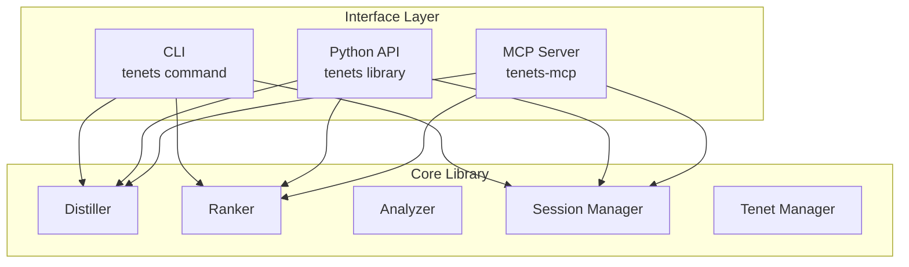

# CLI, API & MCP Architecture

Tenets provides three interfaces to access its functionality, all sharing the same core library:



## CLI Command Structure

```yaml
# Main Commands
tenets:
  distill:           # Build optimal context for prompts
    --copy           # Copy to clipboard
    --format         # Output format (markdown, xml, json, html)
    --max-tokens     # Token limit
    --exclude        # Exclude patterns
    --session        # Session name
    --algorithm      # Ranking algorithm

  rank:              # Rank files without content
    --top            # Number of files to show
    --factors        # Show ranking factors
    --tree           # Tree view output

  examine:           # Code quality analysis
    --show-details   # Detailed metrics
    --hotspots       # Show maintenance hotspots
    --ownership      # Show code ownership
    --format         # Output format

  chronicle:         # Git history analysis
    --since          # Time range
    --author         # Filter by author
    --format         # Output format

  momentum:          # Velocity tracking
    --team           # Team metrics
    --detailed       # Detailed breakdown

  session:           # Session management
    create           # Create new session
    list             # List sessions
    delete           # Delete session

  tenet:            # Manage guiding principles
    add             # Add new tenet
    list            # List tenets
    remove          # Remove tenet

  instill:          # Apply tenets and system instructions
    --dry-run       # Preview what would be applied
    --force         # Force application

  system-instruction: # Manage system instructions
    set             # Set instruction
    get             # Get current
    enable/disable  # Toggle

  viz:              # Visualizations
    deps            # Dependency graph
    hotspots        # Hotspot visualization
```

## Python API Design

```python
from tenets import Tenets

# Initialize
tenets = Tenets(path="./my-project")

# Simple usage
context = tenets.distill("implement OAuth2 authentication")

# Advanced usage
result = tenets.distill(
    prompt="refactor database layer",
    mode="thorough",
    max_tokens=50000,
    include_patterns=["*.py"],
    exclude_patterns=["test_*"]
)

# File ranking (preview without content)
ranked = tenets.rank_files("authentication logic")
for file in ranked.files[:10]:
    print(f"{file.path}: {file.score:.3f}")

# Session management
tenets.add_file_to_session("src/auth.py", session="oauth-feature")
result = tenets.distill("add OAuth2", session_name="oauth-feature")

# Tenet management
tenets.add_tenet("Always validate inputs", priority="high")
tenets.instill_tenets()

# Analysis tools
examination = tenets.examine()
chronicle = tenets.track_changes(since="1 week")
momentum = tenets.momentum()

# System instructions
tenets.set_system_instruction("You are a security-focused reviewer.")
```

## MCP Server Architecture

The MCP server exposes tenets functionality via the Model Context Protocol for AI assistant integration.

### Starting the Server

```bash
# Default: stdio transport for local IDE integration
tenets-mcp

# SSE transport for web clients
tenets-mcp --transport sse --port 8080

# HTTP transport for remote deployment
tenets-mcp --transport http --port 8080
```

### MCP Tools

| Tool | CLI Equivalent | Description |
|------|---------------|-------------|
| `distill` | `tenets distill` | Build ranked context |
| `rank_files` | `tenets rank` | Preview file relevance |
| `examine` | `tenets examine` | Codebase analysis |
| `chronicle` | `tenets chronicle` | Git history |
| `momentum` | `tenets momentum` | Velocity tracking |
| `session_create` | `tenets session create` | Create session |
| `session_list` | `tenets session list` | List sessions |
| `session_pin_file` | `tenets instill --add-file` | Pin file |
| `session_pin_folder` | `tenets instill --add-folder` | Pin folder |
| `tenet_add` | `tenets tenet add` | Add tenet |
| `tenet_list` | `tenets tenet list` | List tenets |
| `tenet_instill` | `tenets instill` | Activate tenets |
| `set_system_instruction` | `tenets system-instruction set` | Set instruction |

### MCP Resources

| Resource URI | Description |
|--------------|-------------|
| `tenets://sessions/list` | All development sessions |
| `tenets://sessions/{name}/state` | Specific session state |
| `tenets://tenets/list` | All guiding principles |
| `tenets://config/current` | Current configuration |

### MCP Prompts

| Prompt | Description |
|--------|-------------|
| `build_context_for_task` | Build context for a task |
| `code_review_context` | Prepare for code review |
| `understand_codebase` | Generate codebase overview |

### Programmatic MCP Usage

```python
from tenets.mcp import create_server, TenetsMCP

# Quick start
server = create_server()
server.run(transport="stdio")

# With custom configuration
from tenets.config import TenetsConfig

config = TenetsConfig(max_tokens=150000)
server = TenetsMCP(name="my-tenets", config=config)
server.run(transport="http", port=8080)
```

## Interface Comparison

| Feature | CLI | Python API | MCP |
|---------|-----|------------|-----|
| Interactive use | ✅ | ❌ | ✅ |
| Scripting | ✅ | ✅ | ❌ |
| AI Assistant integration | ❌ | ❌ | ✅ |
| Programmatic access | ❌ | ✅ | ✅ |
| Remote deployment | ❌ | ❌ | ✅ |
| Session state | ✅ | ✅ | ✅ |
| All transports | N/A | N/A | ✅ |

## Configuration

All interfaces share the same configuration system:

```yaml
# .tenets.yml
ranking:
  algorithm: balanced
  threshold: 0.1
  use_git: true

context:
  max_tokens: 100000

output:
  format: markdown
  copy_on_distill: true

# MCP-specific settings
mcp:
  enabled: true
  transports:
    stdio: true
    sse: false
    http: false
```

Environment variables work across all interfaces:

```bash
export TENETS_MAX_TOKENS=150000
export TENETS_RANKING_ALGORITHM=thorough
```