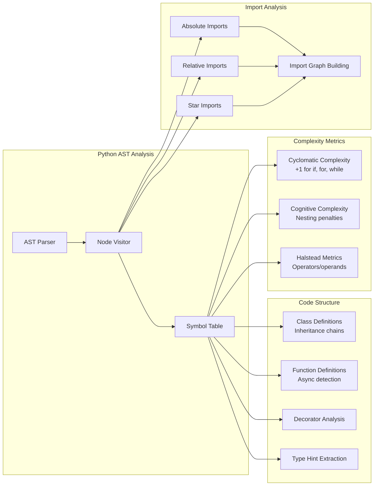

# Code Analysis Engine

## Language Analyzer Architecture

```mermaid
graph TB
    subgraph "Base Analyzer Interface"
        BASE[LanguageAnalyzer<br/>Abstract Base Class]
        EXTRACT_IMP[extract_imports()]
        EXTRACT_EXP[extract_exports()]
        EXTRACT_CLS[extract_classes()]
        EXTRACT_FN[extract_functions()]
        CALC_COMP[calculate_complexity()]
        TRACE_DEP[trace_dependencies()]
    end

    subgraph "Language-Specific Analyzers"
        PYTHON[Python Analyzer<br/>Full AST parsing]
        JAVASCRIPT[JavaScript Analyzer<br/>ES6+ support]
        GOLANG[Go Analyzer<br/>Package detection]
        JAVA[Java Analyzer<br/>OOP patterns]
        RUST[Rust Analyzer<br/>Ownership patterns]
        GENERIC[Generic Analyzer<br/>Pattern-based fallback]
    end

    subgraph "Analysis Features"
        AST[AST Parsing]
        IMPORTS[Import Resolution]
        TYPES[Type Extraction]
        DOCS[Documentation Parsing]
        PATTERNS[Code Patterns]
        COMPLEXITY[Complexity Metrics]
    end

    BASE --> EXTRACT_IMP
    BASE --> EXTRACT_EXP
    BASE --> EXTRACT_CLS
    BASE --> EXTRACT_FN
    BASE --> CALC_COMP
    BASE --> TRACE_DEP

    BASE --> PYTHON
    BASE --> JAVASCRIPT
    BASE --> GOLANG
    BASE --> JAVA
    BASE --> RUST
    BASE --> GENERIC

    PYTHON --> AST
    PYTHON --> IMPORTS
    PYTHON --> TYPES
    PYTHON --> DOCS

    JAVASCRIPT --> PATTERNS
    GOLANG --> PATTERNS
    JAVA --> COMPLEXITY
    RUST --> COMPLEXITY
    GENERIC --> PATTERNS
```

## Python Analyzer Detail

