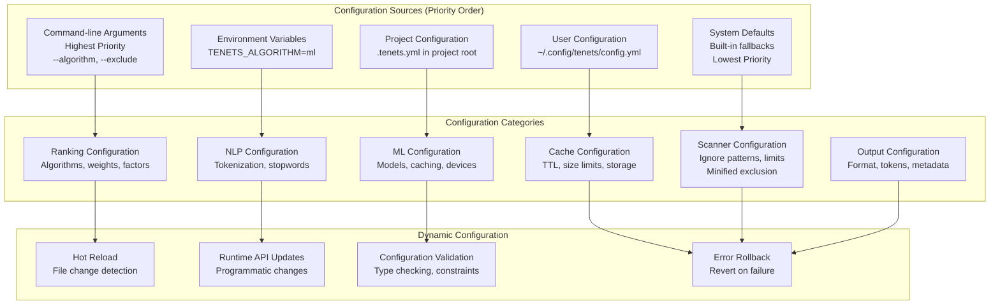

# Configuration System

## Configuration Hierarchy



## Complete Configuration Schema

```yaml
# .tenets.yml
version: 2

# Ranking configuration
ranking:
  algorithm: balanced  # fast|balanced|thorough|ml
  threshold: 0.1       # Minimum relevance score
  use_git: true        # Enable git signals
  use_ml: true         # Enable ML features

  # Factor weights (must sum to ~1.0)
  weights:
    semantic_similarity: 0.25
    keyword_match: 0.15
    bm25_similarity: 0.15
    import_centrality: 0.10
    path_relevance: 0.10
    git_recency: 0.05
    git_frequency: 0.05
    git_authors: 0.05
    file_type: 0.05
    code_patterns: 0.05

  # Performance
  workers: 8           # Parallel workers
  batch_size: 100      # Batch size for ML

# NLP configuration
nlp:
  use_stopwords: true
  stopword_set: minimal  # minimal|aggressive|custom
  tokenizer: code        # code|text
  keyword_extractor: rake # rake|yake|bm25|tfidf|frequency
  text_similarity: bm25   # bm25|tfidf

# ML configuration
ml:
  model: all-MiniLM-L6-v2
  device: auto         # auto|cpu|cuda
  cache_embeddings: true
  embedding_dim: 384

# Cache configuration
cache:
  enabled: true
  directory: ~/.tenets/cache
  max_size_mb: 1000
  ttl_days: 7

  # SQLite pragmas
  sqlite_pragmas:
    journal_mode: WAL
    synchronous: NORMAL
    cache_size: -64000
    temp_store: MEMORY

# File scanning
scanner:
  respect_gitignore: true
  include_hidden: false
  follow_symlinks: false
  max_file_size_mb: 10
  binary_detection: true
  exclude_minified: true
  exclude_tests: auto

  # Global ignores
  ignore_patterns:
    - "*.pyc"
    - "__pycache__"
    - "node_modules"
    - ".git"
    - ".venv"
    - "venv"
    - "*.egg-info"
    - "dist"
    - "build"

# Summarization configuration
summarizer:
  summarize_imports: true
  import_summary_threshold: 5
  docs_context_aware: true
  docs_show_in_place_context: true
  docs_context_search_depth: 2
  docs_context_min_confidence: 0.6
  docs_context_max_sections: 10
  docs_context_preserve_examples: true

# Output configuration
output:
  format: markdown     # markdown|json|xml|html
  max_tokens: 100000
  include_metadata: true
  include_instructions: true
  copy_on_distill: false

# Session configuration
session:
  auto_save: true
  history_limit: 100
  branch_on_conflict: true

# Examination configuration
examination:
  complexity_threshold: 10
  duplication_threshold: 0.1
  min_test_coverage: 0.8

# Chronicle configuration
chronicle:
  include_merges: false
  max_commits: 1000
  analyze_patterns: true

# Momentum configuration
momentum:
  sprint_duration: 14
  velocity_window: 6
  include_weekends: false

# Tenet configuration
tenet:
  auto_instill: true
  injection_frequency: adaptive
  max_per_context: 5
  system_instruction_enabled: true
```