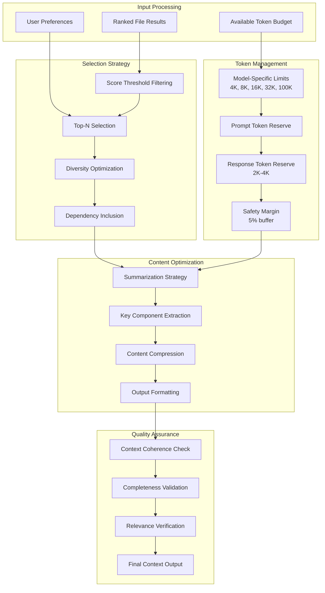
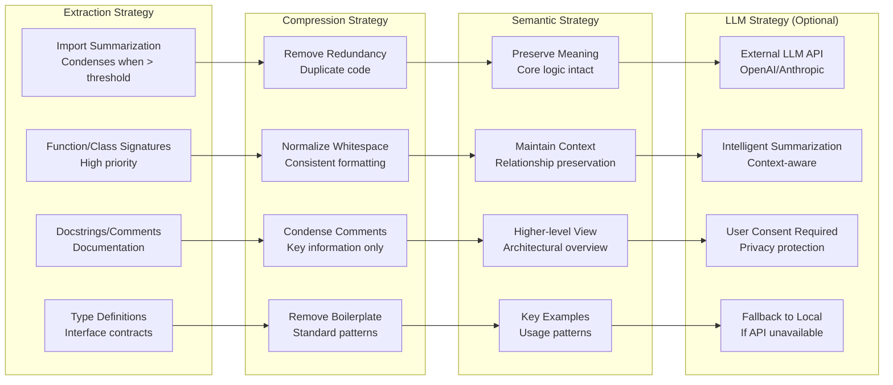

# Context Management & Optimization

## Context Building Pipeline

```mermaid
graph TD
    subgraph "Input Processing"
        RANKED_FILES[Ranked File Results]
        TOKEN_BUDGET[Available Token Budget]
        USER_PREFS[User Preferences]
    end

    subgraph "Selection Strategy"
        THRESHOLD[Score Threshold Filtering]
        TOP_N[Top-N Selection]
        DIVERSITY[Diversity Optimization]
        DEPENDENCIES[Dependency Inclusion]
    end

    subgraph "Token Management"
        MODEL_LIMITS[Model-Specific Limits<br/>4K, 8K, 16K, 32K, 100K]
        PROMPT_RESERVE[Prompt Token Reserve]
        RESPONSE_RESERVE[Response Token Reserve<br/>2K-4K]
        SAFETY_MARGIN[Safety Margin<br/>5% buffer]
    end

    subgraph "Content Optimization"
        SUMMARIZATION[Summarization Strategy]
        EXTRACTION[Key Component Extraction]
        COMPRESSION[Content Compression]
        FORMATTING[Output Formatting]
    end

    subgraph "Quality Assurance"
        COHERENCE[Context Coherence Check]
        COMPLETENESS[Completeness Validation]
        RELEVANCE[Relevance Verification]
        FINAL_OUTPUT[Final Context Output]
    end

    RANKED_FILES --> THRESHOLD
    TOKEN_BUDGET --> MODEL_LIMITS
    USER_PREFS --> TOP_N

    THRESHOLD --> TOP_N
    TOP_N --> DIVERSITY
    DIVERSITY --> DEPENDENCIES

    MODEL_LIMITS --> PROMPT_RESERVE
    PROMPT_RESERVE --> RESPONSE_RESERVE
    RESPONSE_RESERVE --> SAFETY_MARGIN

    DEPENDENCIES --> SUMMARIZATION
    SAFETY_MARGIN --> SUMMARIZATION
    SUMMARIZATION --> EXTRACTION
    EXTRACTION --> COMPRESSION
    COMPRESSION --> FORMATTING

    FORMATTING --> COHERENCE
    COHERENCE --> COMPLETENESS
    COMPLETENESS --> RELEVANCE
    RELEVANCE --> FINAL_OUTPUT
```

## Summarization Strategies

```mermaid
graph LR
    subgraph "Extraction Strategy"
        IMPORTS_EX[Import Summarization<br/>Condenses when > threshold]
        SIGNATURES[Function/Class Signatures<br/>High priority]
        DOCSTRINGS[Docstrings/Comments<br/>Documentation]
        TYPES[Type Definitions<br/>Interface contracts]
    end

    subgraph "Compression Strategy"
        REDUNDANCY[Remove Redundancy<br/>Duplicate code]
        WHITESPACE[Normalize Whitespace<br/>Consistent formatting]
        COMMENTS[Condense Comments<br/>Key information only]
        BOILERPLATE[Remove Boilerplate<br/>Standard patterns]
    end

    subgraph "Semantic Strategy"
        MEANING[Preserve Meaning<br/>Core logic intact]
        CONTEXT[Maintain Context<br/>Relationship preservation]
        ABSTRACTIONS[Higher-level View<br/>Architectural overview]
        EXAMPLES[Key Examples<br/>Usage patterns]
    end

    subgraph "LLM Strategy (Optional)"
        EXTERNAL_API[External LLM API<br/>OpenAI/Anthropic]
        INTELLIGENT[Intelligent Summarization<br/>Context-aware]
        CONSENT[User Consent Required<br/>Privacy protection]
        FALLBACK[Fallback to Local<br/>If API unavailable]
    end

    IMPORTS_EX --> REDUNDANCY
    SIGNATURES --> WHITESPACE
    DOCSTRINGS --> COMMENTS
    TYPES --> BOILERPLATE

    REDUNDANCY --> MEANING
    WHITESPACE --> CONTEXT
    COMMENTS --> ABSTRACTIONS
    BOILERPLATE --> EXAMPLES

    MEANING --> EXTERNAL_API
    CONTEXT --> INTELLIGENT
    ABSTRACTIONS --> CONSENT
    EXAMPLES --> FALLBACK
```