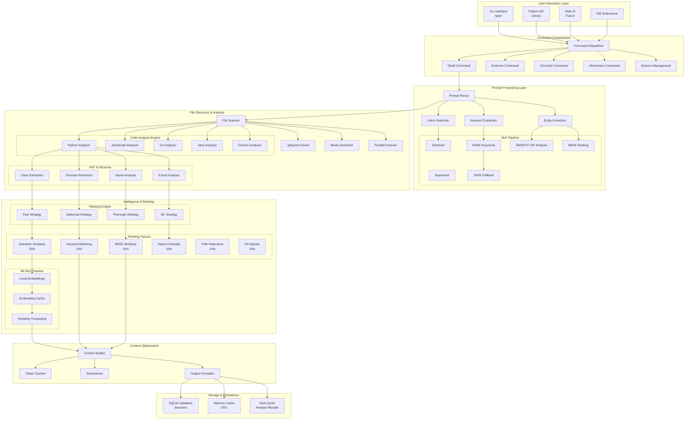
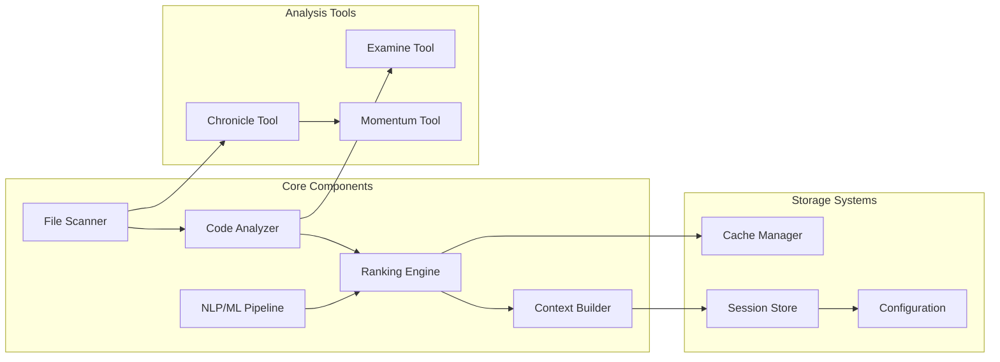

# Complete System Architecture

## High-Level Data Flow

```mermaid
graph TB
    subgraph "User Interaction Layer"
        CLI[CLI Interface<br/>typer]
        API[Python API<br/>Library]
        WebUI[Web UI<br/>Future]
        IDE[IDE Extensions]
    end

    subgraph "Command Orchestration"
        DISPATCHER[Command Dispatcher]
        DISTILL[Distill Command]
        EXAMINE[Examine Command]
        CHRONICLE[Chronicle Command]
        MOMENTUM[Momentum Command]
        SESSION[Session Management]
    end

    subgraph "Prompt Processing Layer"
        PARSER[Prompt Parser]
        INTENT[Intent Detection]
        KEYWORDS[Keyword Extraction]
        ENTITIES[Entity Extraction]

        subgraph "NLP Pipeline"
            TOKENIZER[Tokenizer]
            STOPWORDS[Stopwords]
            RAKE[RAKE Keywords]
            YAKE[YAKE Fallback]
            TFIDF[BM25/TF-IDF Analysis]
            BM25[BM25 Ranking]
        end
    end

    subgraph "File Discovery & Analysis"
        SCANNER[File Scanner]
        GITIGNORE[.gitignore Parser]
        BINARY[Binary Detection]
        PARALLEL[Parallel Scanner]

        subgraph "Code Analysis Engine"
            PYTHON_ANALYZER[Python Analyzer]
            JS_ANALYZER[JavaScript Analyzer]
            GO_ANALYZER[Go Analyzer]
            JAVA_ANALYZER[Java Analyzer]
            GENERIC_ANALYZER[Generic Analyzer]
        end

        subgraph "AST & Structure"
            CLASSES[Class Extraction]
            FUNCTIONS[Function Extraction]
            IMPORTS[Import Analysis]
            EXPORTS[Export Analysis]
        end
    end

    subgraph "Intelligence & Ranking"
        subgraph "Ranking Engine"
            FAST[Fast Strategy]
            BALANCED[Balanced Strategy]
            THOROUGH[Thorough Strategy]
            ML[ML Strategy]
        end

        subgraph "Ranking Factors"
            SEMANTIC[Semantic Similarity<br/>25%]
            KEYWORD_MATCH[Keyword Matching<br/>15%]
            BM25_SIM[BM25 Similarity<br/>15%]
            IMPORT_CENT[Import Centrality<br/>10%]
            PATH_REL[Path Relevance<br/>10%]
            GIT_SIG[Git Signals<br/>15%]
        end

        subgraph "ML/NLP Pipeline"
            EMBEDDINGS[Local Embeddings]
            EMBED_CACHE[Embedding Cache]
            SIMILARITY[Similarity Computing]
        end
    end

    subgraph "Context Optimization"
        CONTEXT_BUILDER[Context Builder]
        TOKEN_COUNTER[Token Counter]
        SUMMARIZER[Summarizer]
        FORMATTER[Output Formatter]
    end

    subgraph "Storage & Persistence"
        SQLITE[SQLite Database<br/>Sessions]
        MEMORY[Memory Cache<br/>LRU]
        DISK[Disk Cache<br/>Analysis Results]
    end

    CLI --> DISPATCHER
    API --> DISPATCHER
    WebUI --> DISPATCHER
    IDE --> DISPATCHER

    DISPATCHER --> DISTILL
    DISPATCHER --> EXAMINE
    DISPATCHER --> CHRONICLE
    DISPATCHER --> MOMENTUM
    DISPATCHER --> SESSION

    DISTILL --> PARSER
    PARSER --> INTENT
    PARSER --> KEYWORDS
    PARSER --> ENTITIES

    INTENT --> TOKENIZER
    KEYWORDS --> RAKE
    RAKE --> YAKE
    ENTITIES --> TFIDF
    ENTITIES --> BM25

    PARSER --> SCANNER
    SCANNER --> GITIGNORE
    SCANNER --> BINARY
    SCANNER --> PARALLEL

    SCANNER --> PYTHON_ANALYZER
    SCANNER --> JS_ANALYZER
    SCANNER --> GO_ANALYZER
    SCANNER --> JAVA_ANALYZER
    SCANNER --> GENERIC_ANALYZER

    PYTHON_ANALYZER --> CLASSES
    PYTHON_ANALYZER --> FUNCTIONS
    PYTHON_ANALYZER --> IMPORTS
    PYTHON_ANALYZER --> EXPORTS

    CLASSES --> FAST
    FUNCTIONS --> BALANCED
    IMPORTS --> THOROUGH
    EXPORTS --> ML

    FAST --> SEMANTIC
    BALANCED --> KEYWORD_MATCH
    THOROUGH --> BM25_SIM
    ML --> IMPORT_CENT

    SEMANTIC --> EMBEDDINGS
    EMBEDDINGS --> EMBED_CACHE
    EMBED_CACHE --> SIMILARITY

    SIMILARITY --> CONTEXT_BUILDER
    KEYWORD_MATCH --> CONTEXT_BUILDER
    BM25_SIM --> CONTEXT_BUILDER

    CONTEXT_BUILDER --> TOKEN_COUNTER
    CONTEXT_BUILDER --> SUMMARIZER
    CONTEXT_BUILDER --> FORMATTER

    FORMATTER --> SQLITE
    FORMATTER --> MEMORY
    FORMATTER --> DISK
```

## System Component Overview

```mermaid
graph LR
    subgraph "Core Components"
        NLP[NLP/ML Pipeline]
        SCAN[File Scanner]
        ANALYZE[Code Analyzer]
        RANK[Ranking Engine]
        CONTEXT[Context Builder]
    end

    subgraph "Analysis Tools"
        EXAMINE[Examine Tool]
        CHRONICLE[Chronicle Tool]
        MOMENTUM[Momentum Tool]
    end

    subgraph "Storage Systems"
        CACHE[Cache Manager]
        SESSION[Session Store]
        CONFIG[Configuration]
    end

    NLP --> RANK
    SCAN --> ANALYZE
    ANALYZE --> RANK
    RANK --> CONTEXT

    ANALYZE --> EXAMINE
    SCAN --> CHRONICLE
    CHRONICLE --> MOMENTUM

    RANK --> CACHE
    CONTEXT --> SESSION
    SESSION --> CONFIG
```