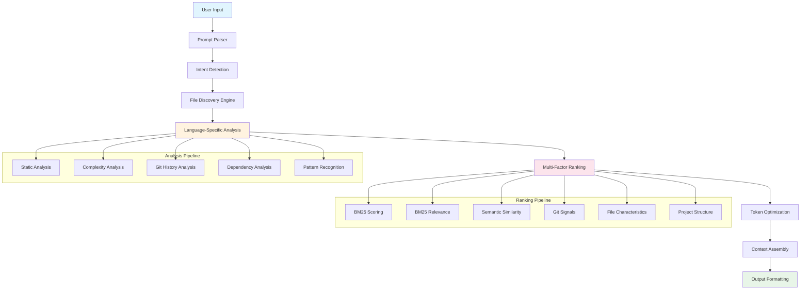
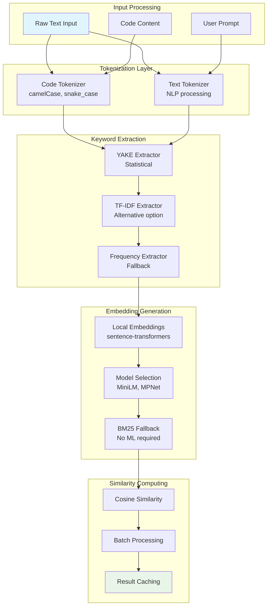
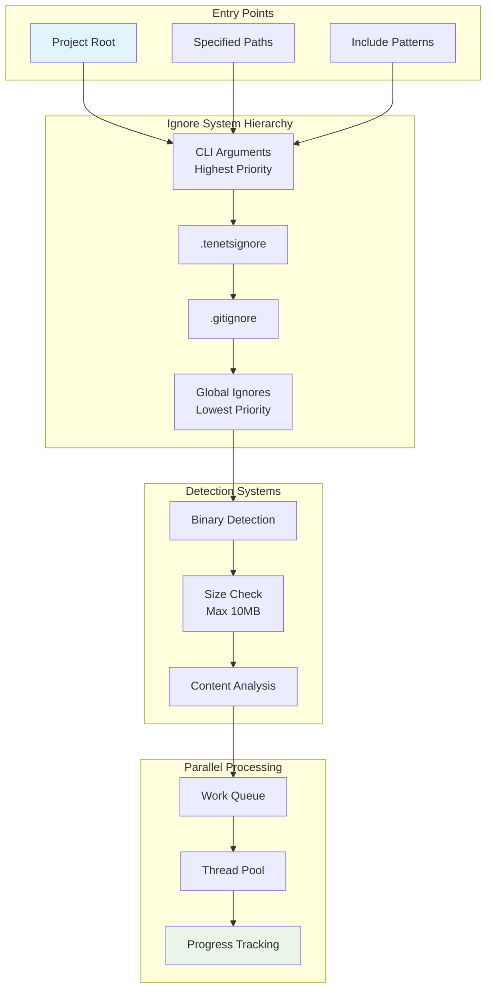
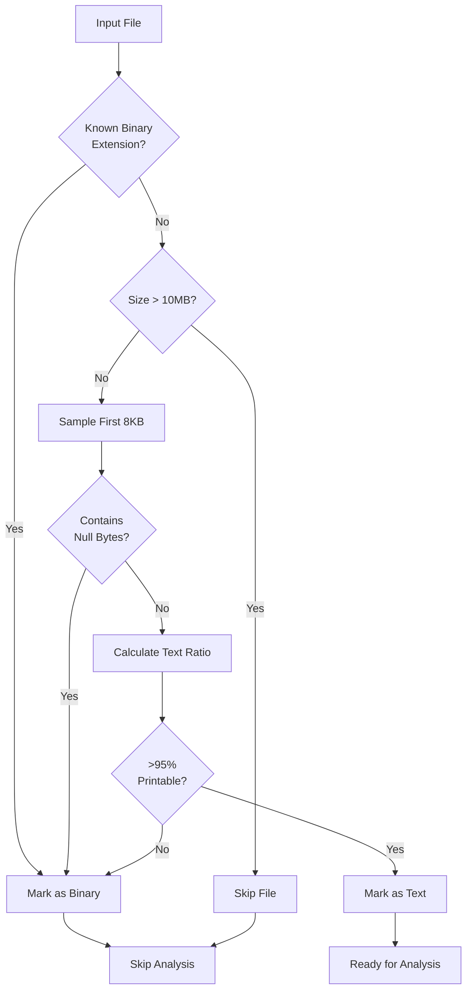
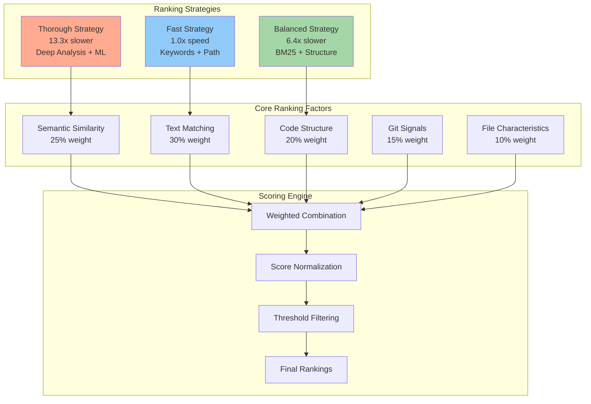
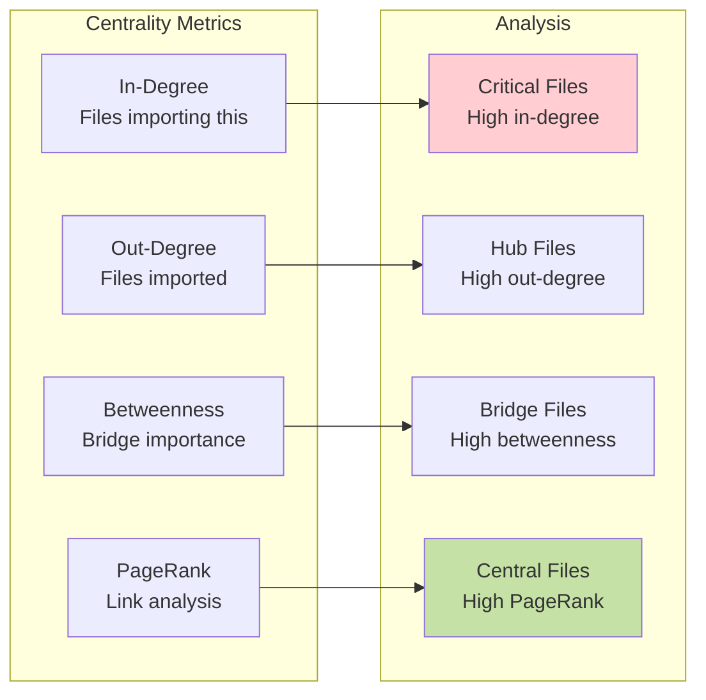
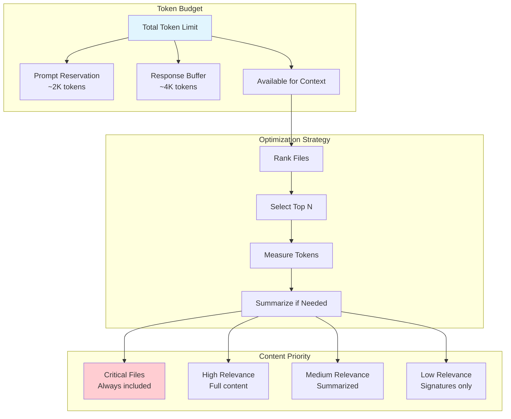
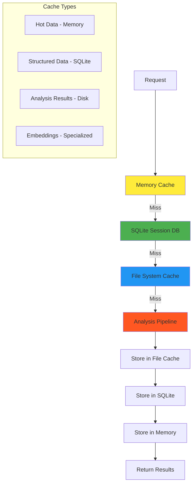
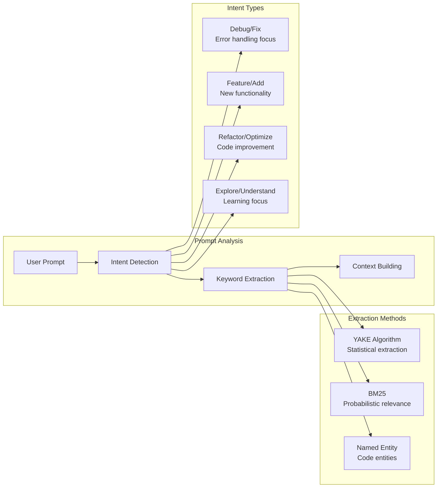
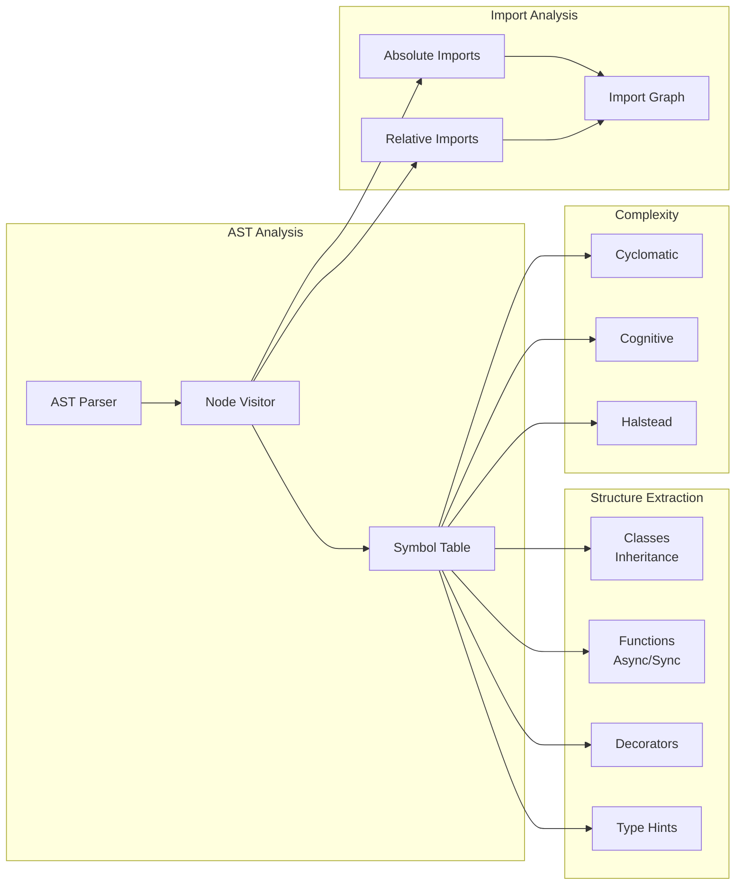

# Core Systems Architecture

## Overview

Tenets is built around a sophisticated, multi-layered architecture that transforms raw code into intelligent, contextual insights. At its heart, the system uses advanced ranking algorithms, comprehensive code analysis, and intelligent caching to provide developers with exactly the right context at exactly the right time.

## System Flow & Pipeline

The entire Tenets system follows a carefully orchestrated pipeline:



## NLP/ML Pipeline Architecture

The NLP/ML pipeline powers Tenets' semantic understanding capabilities, enabling intelligent keyword extraction, similarity matching, and context-aware ranking.

### Pipeline Component Flow



### Tokenization Strategy

Tenets uses specialized tokenizers for different content types:

#### Code Tokenizer
```python
class CodeTokenizer:
    """Handles programming language tokens."""

    def tokenize(self, text: str) -> List[str]:
        # Split on camelCase: 'getUserName' → ['get', 'User', 'Name']
        # Split on snake_case: 'get_user_name' → ['get', 'user', 'name']
        # Split on kebab-case: 'get-user-name' → ['get', 'user', 'name']
        # Preserve special tokens: '__init__', 'UTF-8'
        # Handle operators: '++', '==', '!='
```

#### Stopword Management
- **Code Stopwords**: Minimal set (~30 words) - 'function', 'class', 'return'
- **Prompt Stopwords**: Aggressive filtering (~200+ words) - common English words
- **Context-Aware**: Different stopword sets for different operations

### Embedding Models

| Model | Size | Speed | Quality | Use Case |
|-------|------|-------|---------|----------|
| **all-MiniLM-L6-v2** | 90MB | Fastest | Good | Default, quick searches |
| **all-MiniLM-L12-v2** | 120MB | Fast | Better | Balanced performance |
| **all-mpnet-base-v2** | 420MB | Moderate | Best | Thorough mode |
| **multi-qa-MiniLM** | 90MB | Fast | Specialized | Q&A optimized tasks |

The system automatically selects models based on:
- Available memory
- Task complexity
- User configuration
- Performance requirements

## File Discovery & Scanning System

The file discovery system efficiently traverses codebases of any size, applying intelligent filtering and parallel processing.

### Scanner Architecture



### Binary Detection Strategy



## 1. Ranking System Deep Dive

The ranking system (`tenets.core.ranking`) is the intelligence core of Tenets, using multiple sophisticated algorithms to determine file relevance.

### Ranking Algorithms

#### Fast Algorithm (`FastRankingStrategy`)
- **Use Case**: Quick exploration, CI/CD, large codebases
- **Speed**: Sub-second on most projects (1.0x baseline)
- **Performance**: Baseline for all comparisons
- **Factors**: Keyword matching, path analysis, file size heuristics
- **Accuracy**: Good for obvious relevance matches

```python
# Fast algorithm priorities:
1. Exact keyword matches in filename/path
2. File extension relevance to prompt
3. Directory importance (src/ > tests/)
4. Recent modification time
5. File size (prefer moderate sizes)
```

#### Balanced Algorithm (`BalancedRankingStrategy`) - **Default**
- **Use Case**: Daily development, general context building
- **Speed**: 1-3 seconds on typical projects (~6.4x slower than Fast)
- **Performance**: 540% slower than Fast mode
- **Factors**: BM25, keywords, basic git signals, structural analysis
- **Accuracy**: High for most development tasks

```python
# Balanced algorithm combines:
- BM25 relevance scoring (35% weight)
- BM25 document ranking (30% weight)
- Git activity signals (15% weight)
- File structure analysis (15% weight)
```

#### Thorough Algorithm (`ThoroughRankingStrategy`)
- **Use Case**: Complex refactoring, architecture reviews, debugging
- **Speed**: 3-10 seconds depending on codebase (~13.3x slower than Fast, ~2.1x slower than Balanced)
- **Performance**: 1230% slower than Fast mode
- **Factors**: ML semantic similarity, dependency graphs, pattern analysis
- **Accuracy**: Highest, finds subtle relevance connections

```python
# Thorough algorithm includes:
- Semantic similarity via embeddings
- Complex dependency analysis
- Code pattern recognition
- Cross-reference analysis
- Advanced git history mining
```

### Multi-Factor Ranking Architecture

The ranking system combines multiple signals to determine file relevance:



### Ranking Factors Explained

#### 1. **BM25 (Best Matching 25) - Primary Ranking Algorithm**
```python
class BM25Calculator:
    def score(self, query, document):
        """
        BM25 is the primary probabilistic ranking function used
        throughout Tenets for document relevance scoring.

        Key features:
        - Document length normalization (parameter b)
        - Term frequency saturation (parameter k1)
        - Significantly faster than alternatives
        - Industry standard in search engines
        """
```

**Use Case**: Primary ranking algorithm with 35% weight in balanced mode, handling varying document lengths and preventing term repetition over-weighting.

#### 2. **TF-IDF (Term Frequency-Inverse Document Frequency) - Optional**
```python
class TFIDFCalculator:
    def calculate_relevance(self, document, query_terms, corpus):
        """
        TF-IDF is available as an alternative ranking method
        for experimentation. Not recommended for production use.

        TF = (term frequency in doc) / (total terms in doc)
        IDF = log(total docs / docs containing term)
        TF-IDF = TF × IDF

        Note: BM25 provides superior performance and accuracy.
        """
```

**Status**: Available for experimentation but not recommended. Use BM25 for production workloads.

#### 3. **Git Activity Signals**
```python
class GitRankingFactor:
    def calculate_git_signals(self, file_path):
        return {
            'recent_commits': recent_commit_count,      # Files changed recently
            'commit_frequency': historical_changes,     # Frequently modified files
            'author_diversity': unique_contributors,    # Files many people work on
            'recency_score': days_since_last_change,   # How fresh is the file
            'blame_distribution': line_ownership,      # Code ownership patterns
        }
```

**Why This Matters**: Recently changed files are more likely relevant to current work. Files with many contributors often contain core logic.

#### 4. **Structural Analysis Factors**
```python
class StructuralRankingFactor:
    def analyze_structure(self, file_analysis):
        return {
            'complexity_score': cyclomatic_complexity,   # Code complexity
            'import_centrality': incoming_references,    # How many files import this
            'export_richness': outgoing_dependencies,    # What this file provides
            'directory_importance': path_significance,    # /src vs /tests importance
            'file_role': detected_file_type,            # Config, model, util, etc.
        }
```

### Ranking Strategy Selection

The system intelligently selects strategies based on context:

```python
def select_strategy(self, context: PromptContext, config: TenetsConfig) -> RankingStrategy:
    """
    Auto-select the best strategy based on:
    - Codebase size
    - Available dependencies
    - User preferences
    - Time constraints
    """
    if config.ranking.algorithm == "auto":
        if file_count > 10000:
            return FastRankingStrategy()
        elif has_ml_dependencies and context.complexity_level == "high":
            return ThoroughRankingStrategy()
        else:
            return BalancedRankingStrategy()
```

## 2. Analysis Engine Architecture

The analysis engine (`tenets.core.analysis`) provides deep code understanding through language-specific parsers and cross-language analysis.

### Language Analyzer System

#### Analyzer Architecture
```python
class LanguageAnalyzer(ABC):
    """Base class for all language-specific analyzers"""

    @abstractmethod
    def analyze_structure(self, content: str) -> CodeStructure:
        """Extract functions, classes, imports, etc."""

    @abstractmethod
    def calculate_complexity(self, content: str) -> ComplexityMetrics:
        """Calculate cyclomatic complexity, maintainability index"""

    @abstractmethod
    def extract_dependencies(self, content: str) -> List[ImportInfo]:
        """Find imports, requires, includes"""
```

#### Supported Languages & Features

| Language | Parser | Complexity | Dependencies | AST Analysis | Special Features |
|----------|--------|------------|--------------|--------------|------------------|
| **Python** | Full AST | ✅ CC, MI | ✅ imports, from | ✅ Full | Decorators, async/await |
| **JavaScript/TypeScript** | Full AST | ✅ CC, MI | ✅ import/require | ✅ Full | React components, Node.js |
| **Java** | Full AST | ✅ CC, MI | ✅ import, package | ✅ Full | Annotations, Spring |
| **C#** | Full AST | ✅ CC, MI | ✅ using, namespace | ✅ Full | Attributes, LINQ |
| **Go** | Full AST | ✅ CC, MI | ✅ import, package | ✅ Full | Goroutines, interfaces |
| **Rust** | Full AST | ✅ CC, MI | ✅ use, extern | ✅ Full | Traits, lifetimes |
| **C++** | Regex+ | ✅ Basic | ✅ #include | Partial | Headers, namespaces |
| **Ruby** | Full AST | ✅ CC, MI | ✅ require, gem | ✅ Full | Gems, Rails detection |
| **PHP** | Full AST | ✅ CC, MI | ✅ require, use | ✅ Full | Composer, namespaces |
| **Kotlin** | Full AST | ✅ CC, MI | ✅ import, package | ✅ Full | Coroutines, DSLs |

*CC = Cyclomatic Complexity, MI = Maintainability Index*

### Complexity Analysis Deep Dive

#### Cyclomatic Complexity
```python
def calculate_cyclomatic_complexity(self, node):
    """
    Measures the number of linearly independent paths through code.

    Decision points that increase complexity:
    - if/elif statements
    - for/while loops
    - try/catch blocks
    - switch/case statements
    - logical operators (&&, ||)
    - ternary operators
    """
    complexity = 1  # Base complexity
    for child in ast.walk(node):
        if isinstance(child, (ast.If, ast.For, ast.While, ast.ExceptHandler)):
            complexity += 1
        elif isinstance(child, ast.BoolOp):
            complexity += len(child.values) - 1
    return complexity
```

**Complexity Levels:**
- 1-10: Simple, low risk
- 11-20: Moderate complexity
- 21-50: High complexity, refactor recommended
- 50+: Very high risk, immediate attention needed

#### Maintainability Index
```python
def calculate_maintainability_index(self, metrics):
    """
    MI = 171 - 5.2 * ln(HV) - 0.23 * CC - 16.2 * ln(LOC)

    Where:
    - HV = Halstead Volume (operators + operands)
    - CC = Cyclomatic Complexity
    - LOC = Lines of Code

    Scale: 0-100 (higher is more maintainable)
    """
```

**MI Interpretation:**
- 85-100: Excellent maintainability
- 70-85: Good maintainability
- 50-70: Moderate maintainability
- 25-50: Below average, needs attention
- 0-25: Difficult to maintain

### Ranking Factor Details

| Factor Category | Weight | Components | Description |
|-----------------|--------|------------|-------------|
| **Semantic Similarity** | 25% | Embedding cosine similarity, contextual relevance | ML-based understanding of semantic meaning |
| **Text Matching** | 35% | Keyword matches (20%), BM25 (15%) | Direct term matching and probabilistic relevance |
| **Code Structure** | 20% | Import centrality (10%), path relevance (10%) | File importance in codebase architecture |
| **Git Signals** | 15% | Recency (5%), frequency (5%), authors (5%) | Version control activity indicators |
| **File Characteristics** | 10% | File type (5%), code patterns (5%) | Language and pattern-based relevance |

### Dependency Analysis

#### Import Graph Construction
```python
class DependencyAnalyzer:
    def build_dependency_graph(self, project_files):
        """
        Builds a directed graph of file dependencies:

        1. Extract all imports/includes from each file
        2. Resolve import paths to actual files
        3. Create edges between dependent files
        4. Calculate centrality metrics
        5. Identify circular dependencies
        """

        graph = nx.DiGraph()

        for file in project_files:
            imports = self.extract_imports(file)
            for imp in imports:
                target = self.resolve_import_path(imp, file)
                if target:
                    graph.add_edge(file.path, target.path)

        return self.calculate_centrality_metrics(graph)
```

#### Dependency Metrics

The system calculates various centrality metrics to understand file importance:



- **In-Degree**: Number of files that import this file (dependency count)
- **Out-Degree**: Number of files this file imports (dependency scope)
- **Betweenness**: How often this file appears in shortest paths between other files
- **PageRank**: Importance based on the importance of files that import it
- **Clustering Coefficient**: How connected this file's dependencies are to each other

## 3. Summarization System

When files exceed token limits, Tenets uses intelligent summarization to preserve the most important content.

### Summarization Strategies

#### 1. **Structural Preservation**
```python
class StructuralSummarizer:
    def summarize(self, content, target_size):
        """
        Preserves code structure while reducing content:

        Priority Order:
        1. Function/class signatures (always keep)
        2. Public API definitions
        3. Complex logic blocks
        4. Important comments/docstrings
        5. Configuration/constants
        6. Simple variable assignments (truncate)
        7. Repetitive code (remove)
        """
```

#### 2. **Semantic Summarization** (ML mode)
```python
class SemanticSummarizer:
    def summarize(self, content, context, target_size):
        """
        Uses ML to understand semantic importance:

        1. Split content into logical segments
        2. Generate embeddings for each segment
        3. Calculate relevance to user prompt
        4. Rank segments by importance
        5. Select top segments that fit token budget
        6. Maintain code coherence
        """
```

#### 3. **Contextual Summarization**
```python
class ContextualSummarizer:
    def summarize_for_prompt(self, file_content, prompt_context):
        """
        Tailors summarization to specific prompt needs:

        - "debug bug": Keep error handling, logging
        - "add feature": Keep interfaces, extension points
        - "refactor": Keep complex logic, dependencies
        - "security": Keep authentication, validation
        """
```

## 4. Context Optimization & Token Management

Tenets intelligently manages token budgets to maximize relevant context while staying within model limits.

### Token Budget Allocation



## 5. Caching & Performance Architecture

Tenets uses sophisticated multi-level caching to provide instant responses after initial analysis.

### Cache Hierarchy



### Cache Invalidation Strategy

```python
class CacheManager:
    def should_invalidate(self, file_path, cache_entry):
        """
        Smart cache invalidation based on:

        1. File modification time (mtime)
        2. Content hash changes (for accuracy)
        3. Git commit changes (for git-based signals)
        4. Configuration changes (for ranking params)
        5. Dependency changes (for import analysis)
        """

        reasons = []

        if file_path.stat().st_mtime > cache_entry.mtime:
            reasons.append("file_modified")

        if self.calculate_content_hash(file_path) != cache_entry.content_hash:
            reasons.append("content_changed")

        if self.get_git_commit_hash() != cache_entry.git_hash:
            reasons.append("git_changed")

        return len(reasons) > 0, reasons
```

### Prompt Parsing & Understanding



### Performance Optimizations

#### Parallel Processing
```python
def analyze_files_parallel(self, files, max_workers=None):
    """
    Parallel analysis with intelligent work distribution:

    - Small files: Batch process in single thread
    - Large files: Individual threads
    - I/O bound: Higher thread count
    - CPU bound: Thread count = CPU cores
    """

    with ThreadPoolExecutor(max_workers=self.optimal_worker_count()) as executor:
        future_to_file = {
            executor.submit(self.analyze_file, f): f
            for f in files
        }
```

#### Memory Management
```python
class MemoryManager:
    def manage_analysis_memory(self):
        """
        Prevents memory bloat during large project analysis:

        1. Stream file processing (don't load all at once)
        2. Release analysis objects after ranking
        3. Use generators for large result sets
        4. Monitor memory usage and trigger cleanup
        """
```

## 5. Session Management & State

Sessions provide persistent context and configuration for project work.

### Session Architecture
```python
class SessionManager:
    def create_session(self, name, project_path):
        """
        Session contains:
        - Pinned files (guaranteed inclusion)
        - Custom ranking weights
        - Project-specific configuration
        - Analysis cache keys
        - Tenet definitions (guiding principles)
        """

    def merge_contexts(self, session_name, new_context):
        """
        Intelligently merge new analysis with existing session:

        1. Preserve pinned files
        2. Update file rankings
        3. Maintain tenet priorities
        4. Merge analysis results
        5. Update cache references
        """
```

### Tenets System
```python
class TenetManager:
    """
    Manages 'tenets' - persistent principles that guide context generation

    Examples:
    - "Always include error handling examples"
    - "Prioritize async/await patterns"
    - "Include security considerations"
    - "Focus on performance implications"
    """

    def apply_tenets(self, context_result, active_tenets):
        """
        Inject tenets into generated context:

        1. Analyze context for tenet relevance
        2. Select most applicable tenets
        3. Format tenets appropriately
        4. Insert at strategic positions
        5. Ensure token budget compliance
        """
```

## Integration & Extension Points

### Custom Analyzers
```python
class MyCustomAnalyzer(LanguageAnalyzer):
    def analyze_structure(self, content: str) -> CodeStructure:
        # Implement custom parsing logic
        pass

    def get_language_patterns(self) -> Dict[str, str]:
        return {
            'function_def': r'def\s+(\w+)\s*\(',
            'class_def': r'class\s+(\w+)',
            'import': r'import\s+(.+)',
        }
```

### Custom Ranking Factors
```python
class MyRankingFactor(RankingFactor):
    def calculate(self, file_analysis, prompt_context):
        """
        Add custom ranking logic:
        - Domain-specific patterns
        - Company coding standards
        - Architecture preferences
        - Performance considerations
        """
        return relevance_score
```

### Plugin System
```python
class TenetsPlugin:
    def register_analyzer(self, language: str, analyzer_class):
        """Register custom language analyzer"""

    def register_ranking_factor(self, factor_name: str, factor_class):
        """Register custom ranking factor"""

    def register_output_formatter(self, format_name: str, formatter_class):
        """Register custom output format"""
```

## Performance Characteristics

### Typical Performance (on modern hardware)

| Operation | Small Project (<1K files) | Medium Project (1K-10K files) | Large Project (10K+ files) |
|-----------|---------------------------|-------------------------------|----------------------------|
| **Fast Mode** | <1s (1.0x baseline) | 1-3s | 3-8s |
| **Balanced Mode** | 1-2s (~6.4x slower) | 3-8s | 10-30s |
| **Thorough Mode** | 2-5s (~13.3x slower) | 8-20s | 30s-2m |
| **Cache Hit** | <100ms | <200ms | <500ms |

### Relative Performance

| Mode | Speed Multiplier | Percentage Slower |
|------|-----------------|-------------------|
| **Fast** | 1.0x | 0% (baseline) |
| **Balanced** | 6.4x | 540% |
| **Thorough** | 13.3x | 1230% |

### Memory Usage

```python
# Typical memory footprint:
base_memory = 50_000_000      # ~50MB base
per_file_overhead = 5_000     # ~5KB per analyzed file
embedding_cache = 200_000_000 # ~200MB for ML embeddings (when used)
```

### Scalability Limits

- **Files**: Tested up to 100K+ files
- **File Size**: Handles up to 10MB individual files
- **Concurrency**: Scales to available CPU cores
- **Memory**: Degrades gracefully with limited RAM

## Language Analyzer Architecture

Tenets provides specialized analyzers for each programming language, extracting structure, complexity, and relationships.

### Analyzer System Overview

```mermaid
graph TB
    subgraph "Base Analyzer Interface"
        BASE[LanguageAnalyzer<br/>Abstract Base]
        EXTRACT[extract_structure()]
        COMPLEX[calculate_complexity()]
        DEPS[trace_dependencies()]
    end

    subgraph "Language-Specific Analyzers"
        PYTHON[Python<br/>Full AST]
        JS[JavaScript<br/>ES6+ support]
        GO[Go<br/>Package detection]
        JAVA[Java<br/>OOP patterns]
        RUST[Rust<br/>Ownership]
        GENERIC[Generic<br/>Pattern-based]
    end

    subgraph "Analysis Output"
        CLASSES[Classes & Methods]
        FUNCTIONS[Functions & Signatures]
        IMPORTS[Import Graph]
        METRICS[Complexity Metrics]
    end

    BASE --> EXTRACT
    BASE --> COMPLEX
    BASE --> DEPS

    BASE --> PYTHON
    BASE --> JS
    BASE --> GO
    BASE --> JAVA
    BASE --> RUST
    BASE --> GENERIC

    PYTHON --> CLASSES
    PYTHON --> FUNCTIONS
    PYTHON --> IMPORTS
    PYTHON --> METRICS

    style BASE fill:#e1f5fe
    style METRICS fill:#e8f5e8
```

### Python Analyzer Deep Dive



### Language Support Matrix

| Language | AST Support | Complexity Analysis | Import Resolution | Special Features |
|----------|------------|-------------------|-------------------|------------------|
| **Python** | ✅ Full | ✅ CC, MI, Halstead | ✅ Complete | Decorators, async/await, type hints |
| **JavaScript/TypeScript** | ✅ Full | ✅ CC, MI | ✅ ES6+ modules | React components, JSX, Node.js |
| **Java** | ✅ Full | ✅ CC, MI | ✅ Package/class | Annotations, Spring framework |
| **C#** | ✅ Full | ✅ CC, MI | ✅ Namespace/using | Attributes, LINQ, async |
| **Go** | ✅ Full | ✅ CC, MI | ✅ Package/import | Goroutines, interfaces |
| **Rust** | ✅ Full | ✅ CC, MI | ✅ Use/extern | Traits, lifetimes, macros |
| **Ruby** | ✅ Full | ✅ CC, MI | ✅ Require/gem | Gems, Rails detection |
| **PHP** | ✅ Full | ✅ CC, MI | ✅ Require/use | Composer, namespaces |
| **C/C++** | 🟨 Regex+ | ✅ Basic | ✅ #include | Headers, templates |
| **Others** | 🟨 Pattern | 🟨 Basic | 🟨 Pattern-based | Extensible patterns |

*CC = Cyclomatic Complexity, MI = Maintainability Index*

This architecture provides the foundation for intelligent, fast, and scalable code intelligence that adapts to any project size and developer workflow.
