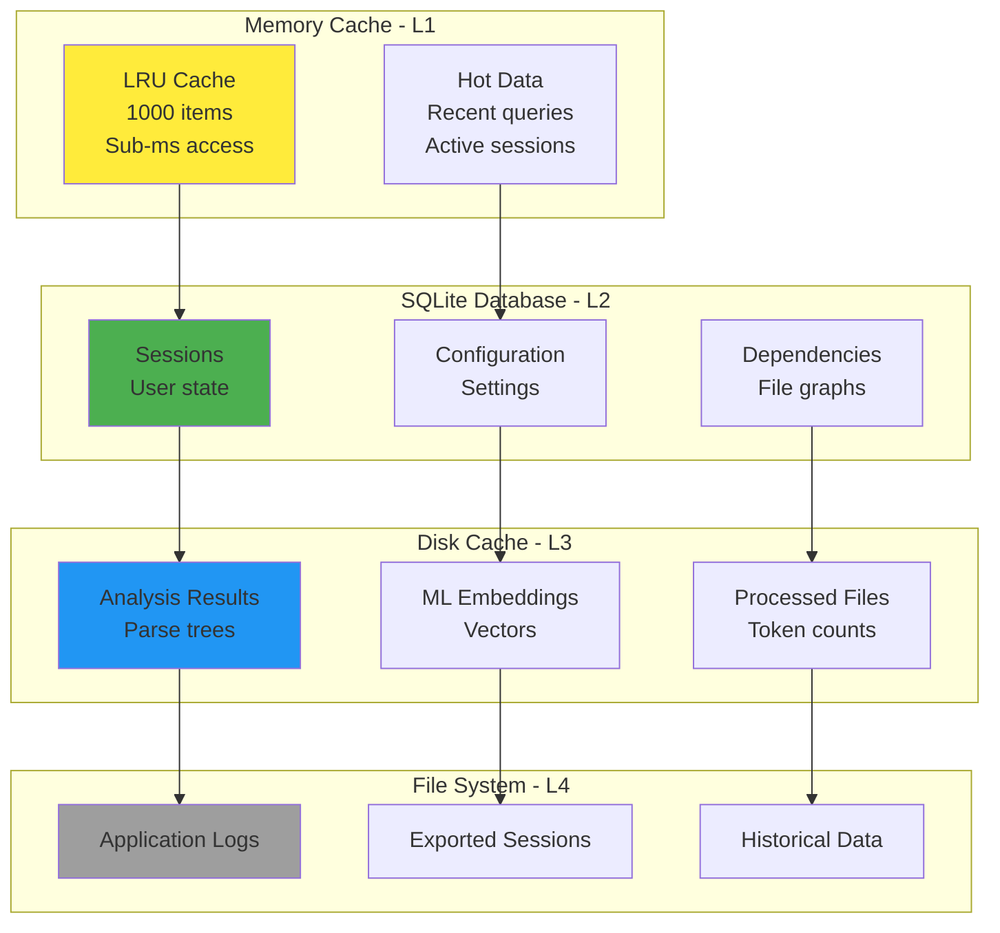
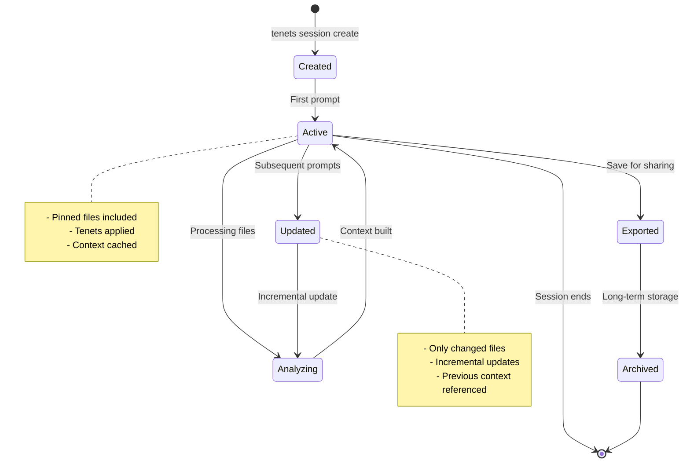
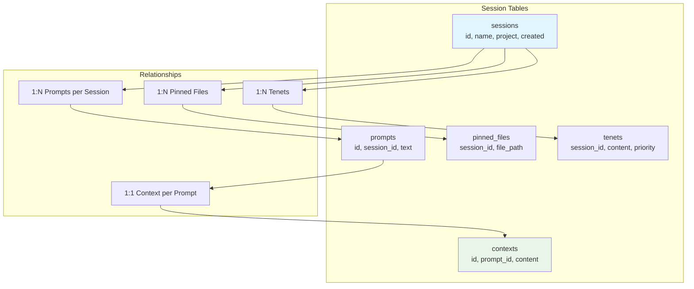
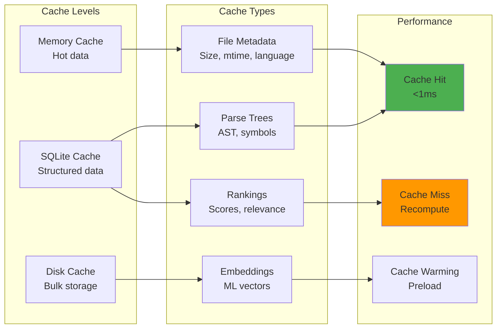
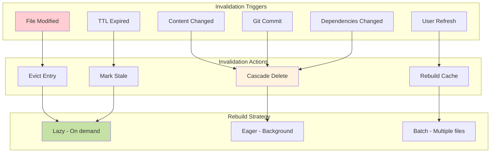

# Data & Storage Architecture

## Overview

Tenets uses a layered storage architecture to manage configuration, sessions, cache, and temporary data efficiently.

## Storage Architecture Overview



## Storage Hierarchy

### 1. Configuration Storage

**Location**: Project root or user home directory

```
.tenets.yml          # Project configuration
~/.tenets/config     # Global user configuration
```

**Contents:**
- Ranking algorithms settings
- Output format preferences
- Ignore patterns
- Token limits

### 2. Session Storage

**Location**: `.tenets/sessions/` in project root

```
.tenets/
  sessions/
    default.json
    feature-auth.json
    bug-fix-123.json
```

**Session Data Structure:**
```json
{
  "id": "feature-auth",
  "created_at": "2024-01-15T10:00:00Z",
  "updated_at": "2024-01-15T14:30:00Z",
  "pinned_files": [
    "src/auth/oauth.py",
    "src/auth/jwt.py"
  ],
  "tenets": [
    {
      "content": "Always validate JWT tokens",
      "priority": "critical"
    }
  ],
  "context": {
    "last_prompt": "implement OAuth2",
    "last_files": ["src/auth/*.py"]
  }
}
```

### 3. Cache Management

**Location**: `.tenets/cache/` or system temp directory

#### Cache Layers

1. **File Metadata Cache**
   - File sizes
   - Modification times
   - Language detection
   - Complexity scores

2. **Parse Tree Cache**
   - AST representations
   - Import graphs
   - Symbol tables
   - Documentation blocks

3. **Git History Cache**
   - Commit information
   - Author statistics
   - File change frequency
   - Branch information

4. **Ranking Cache**
   - Computed relevance scores
   - TF-IDF vectors
   - Semantic embeddings
   - Factor calculations

### 4. Temporary Storage

**Location**: System temp directory

Used for:
- Processing large files
- Intermediate computations
- Export generation
- Visualization rendering

## Session Management Architecture

### Session Lifecycle



### Session Storage Schema



## Data Models

### FileInfo Model

```python
class FileInfo:
    path: str
    size: int
    language: str
    modified: datetime
    complexity: float
    imports: List[str]
    exports: List[str]
    relevance_score: float
```

### Context Model

```python
class Context:
    prompt: str
    files: List[FileInfo]
    token_count: int
    timestamp: datetime
    session_id: Optional[str]
    tenets: List[Tenet]
```

### Session Model

```python
class Session:
    id: str
    created_at: datetime
    updated_at: datetime
    pinned_files: List[str]
    tenets: List[Tenet]
    history: List[Context]
    config_overrides: Dict
```

## Persistence Strategies

### 1. Lazy Loading

- Load file contents only when needed
- Stream large files instead of loading entirely
- Defer expensive computations

### 2. Incremental Updates

- Update only changed files in cache
- Recompute scores only for affected files
- Maintain dirty flags for cache invalidation

### 3. Compression

- Compress cached parse trees
- Use efficient serialization formats
- Apply content deduplication

## Multi-Level Cache System

### Cache Architecture



### Cache Key Generation

```python
class CacheKeyGenerator:
    """Generate cache keys for different data types."""

    def file_metadata_key(self, path: str) -> str:
        return f"meta:{path}:{mtime}"

    def analysis_key(self, path: str, analyzer: str) -> str:
        return f"analysis:{analyzer}:{path}:{content_hash}"

    def ranking_key(self, prompt: str, algorithm: str) -> str:
        return f"rank:{algorithm}:{prompt_hash}:{git_commit}"

    def embedding_key(self, content: str, model: str) -> str:
        return f"embed:{model}:{content_hash}"
```

## Cache Invalidation

### Triggers

1. **File System Changes**
   - File modification
   - File deletion
   - New file creation

2. **Git Operations**
   - New commits
   - Branch switches
   - Merge operations

3. **Configuration Changes**
   - Algorithm updates
   - Threshold adjustments
   - Pattern modifications

4. **Time-based**
   - TTL expiration
   - Scheduled cleanup
   - Age-based eviction

### Invalidation Strategies



### Cache Strategy Comparison

| Strategy | Use Case | Pros | Cons |
|----------|----------|------|------|
| **LRU** | Parse trees, hot data | Simple, effective | May evict important items |
| **TTL** | Git history, embeddings | Predictable freshness | Wasteful if unchanged |
| **Size-based** | File metadata | Memory bounded | May thrash on large files |
| **Content Hash** | Analysis results | Accurate | Hash computation overhead |
| **Hybrid** | Production default | Balanced approach | Complex implementation |

## Storage Optimization

### 1. Deduplication

- Identify duplicate content
- Store single copy with references
- Apply at file and block level

### 2. Compression

- Gzip for text content
- Binary serialization for structures
- Delta compression for versions

### 3. Indexing

- Build indices for fast lookup
- Maintain sorted structures
- Use bloom filters for existence checks

## Data Security

### 1. Sensitive Data Handling

- Never cache credentials
- Exclude sensitive patterns
- Sanitize output

### 2. Access Control

- Respect file system permissions
- Honor .gitignore patterns
- Apply project-specific rules

### 3. Cleanup

- Clear temporary files
- Sanitize memory
- Secure deletion when needed

## Storage Configuration

### Environment Variables

```bash
TENETS_CACHE_DIR=/custom/cache/path
TENETS_SESSION_DIR=/custom/session/path
TENETS_CACHE_TTL=3600
TENETS_MAX_CACHE_SIZE=1GB
```

### Configuration File

```yaml
storage:
  cache:
    enabled: true
    directory: .tenets/cache
    max_size: 1073741824  # 1GB in bytes
    ttl: 3600  # seconds
    compression: true

  sessions:
    directory: .tenets/sessions
    auto_save: true
    max_history: 100

  temp:
    cleanup_on_exit: true
    max_file_size: 104857600  # 100MB
```

## Performance Metrics

### Cache Hit Rates

- Target: >80% for repeated operations
- Monitor: File metadata, parse trees, git data
- Optimize: Adjust TTL and size limits

### Storage Usage

- Monitor: Disk space consumption
- Alert: When approaching limits
- Action: Automatic cleanup policies

### Access Patterns

- Track: Most accessed files
- Optimize: Preload frequently used data
- Adjust: Cache priorities based on usage
