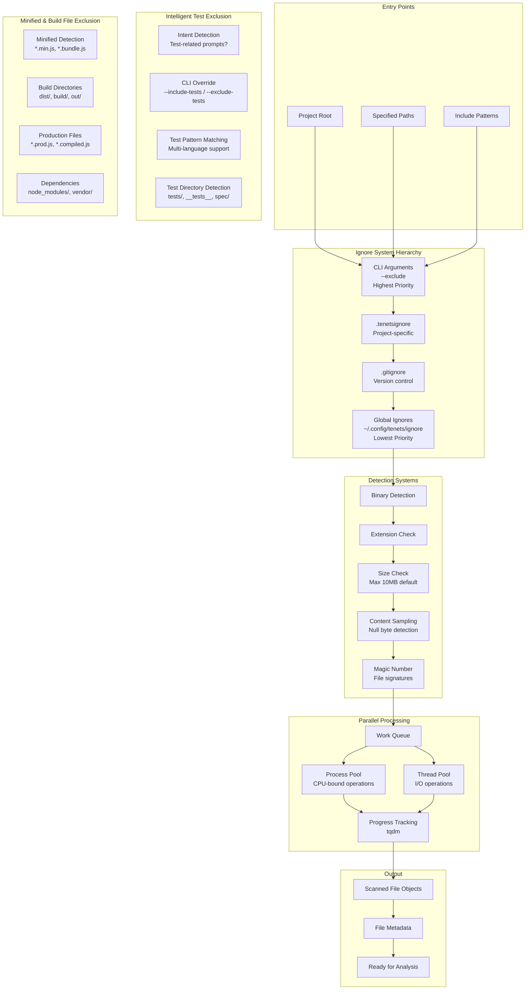
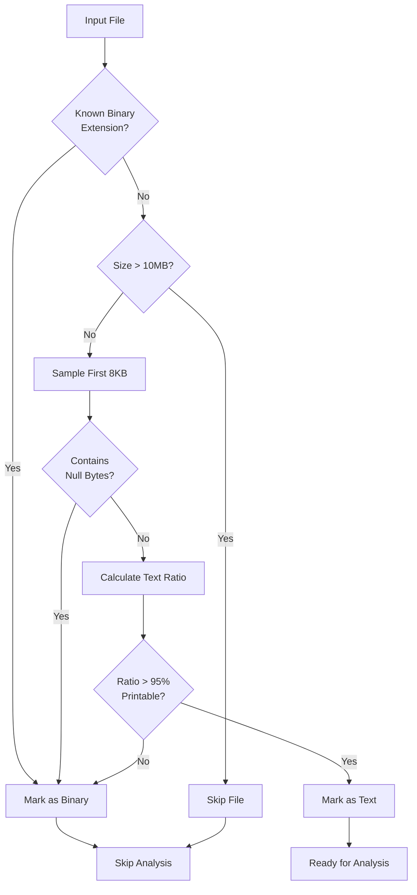
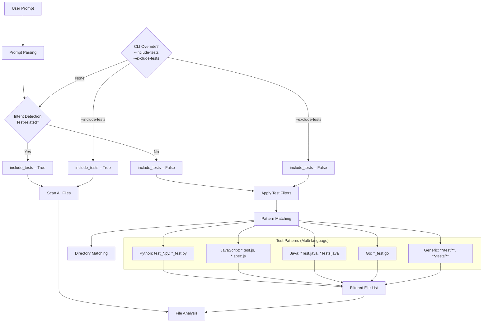

# File Discovery & Scanning System

## Scanner Architecture Flow

```mermaid
graph TD
    subgraph "Entry Points"
        ROOT[Project Root]
        PATHS[Specified Paths]
        PATTERNS[Include Patterns]
    end

    subgraph "Ignore System Hierarchy"
        CLI_IGNORE[CLI Arguments<br/>--exclude<br/>Highest Priority]
        TENETS_IGNORE[.tenetsignore<br/>Project-specific]
        GIT_IGNORE[.gitignore<br/>Version control]
        GLOBAL_IGNORE[Global Ignores<br/>~/.config/tenets/ignore<br/>Lowest Priority]
    end
    
    subgraph "Intelligent Test Exclusion"
        INTENT_DETECT[Intent Detection<br/>Test-related prompts?]
        CLI_OVERRIDE[CLI Override<br/>--include-tests / --exclude-tests]
        TEST_PATTERNS[Test Pattern Matching<br/>Multi-language support]
        TEST_DIRS[Test Directory Detection<br/>tests/, __tests__, spec/]
    end

    subgraph "Minified & Build File Exclusion"
        MINIFIED_CHECK[Minified Detection<br/>*.min.js, *.bundle.js]
        BUILD_DIRS[Build Directories<br/>dist/, build/, out/]
        PROD_FILES[Production Files<br/>*.prod.js, *.compiled.js]
        NODE_MODULES[Dependencies<br/>node_modules/, vendor/]
    end

    subgraph "Detection Systems"
        BINARY_DET[Binary Detection]
        EXT_CHECK[Extension Check]
        SIZE_CHECK[Size Check<br/>Max 10MB default]
        CONTENT_CHECK[Content Sampling<br/>Null byte detection]
        MAGIC_CHECK[Magic Number<br/>File signatures]
    end

    subgraph "Parallel Processing"
        WORK_QUEUE[Work Queue]
        PROCESS_POOL[Process Pool<br/>CPU-bound operations]
        THREAD_POOL[Thread Pool<br/>I/O operations]
        PROGRESS[Progress Tracking<br/>tqdm]
    end

    subgraph "Output"
        SCANNED_FILE[Scanned File Objects]
        METADATA[File Metadata]
        ANALYSIS_READY[Ready for Analysis]
    end

    ROOT --> CLI_IGNORE
    PATHS --> CLI_IGNORE
    PATTERNS --> CLI_IGNORE

    CLI_IGNORE --> TENETS_IGNORE
    TENETS_IGNORE --> GIT_IGNORE
    GIT_IGNORE --> GLOBAL_IGNORE

    GLOBAL_IGNORE --> BINARY_DET
    BINARY_DET --> EXT_CHECK
    EXT_CHECK --> SIZE_CHECK
    SIZE_CHECK --> CONTENT_CHECK
    CONTENT_CHECK --> MAGIC_CHECK

    MAGIC_CHECK --> WORK_QUEUE
    WORK_QUEUE --> PROCESS_POOL
    WORK_QUEUE --> THREAD_POOL
    PROCESS_POOL --> PROGRESS
    THREAD_POOL --> PROGRESS

    PROGRESS --> SCANNED_FILE
    SCANNED_FILE --> METADATA
    METADATA --> ANALYSIS_READY
```

## Binary Detection Strategy

```mermaid
flowchart TD
    FILE[Input File] --> EXT{Known Binary<br/>Extension?}
    EXT -->|Yes| BINARY[Mark as Binary]
    EXT -->|No| SIZE{Size > 10MB?}
    SIZE -->|Yes| SKIP[Skip File]
    SIZE -->|No| SAMPLE[Sample First 8KB]
    SAMPLE --> NULL{Contains<br/>Null Bytes?}
    NULL -->|Yes| BINARY
    NULL -->|No| RATIO[Calculate Text Ratio]
    RATIO --> THRESHOLD{Ratio > 95%<br/>Printable?}
    THRESHOLD -->|Yes| TEXT[Mark as Text]
    THRESHOLD -->|No| BINARY
    TEXT --> ANALYZE[Ready for Analysis]
    BINARY --> IGNORE[Skip Analysis]
    SKIP --> IGNORE
```

## Intelligent Test File Exclusion

```mermaid
flowchart TD
    PROMPT[User Prompt] --> PARSE[Prompt Parsing]
    PARSE --> INTENT{Intent Detection<br/>Test-related?}

    INTENT -->|Yes| INCLUDE_TESTS[include_tests = True]
    INTENT -->|No| EXCLUDE_TESTS[include_tests = False]

    CLI_OVERRIDE{CLI Override?<br/>--include-tests<br/>--exclude-tests}
    CLI_OVERRIDE -->|--include-tests| FORCE_INCLUDE[include_tests = True]
    CLI_OVERRIDE -->|--exclude-tests| FORCE_EXCLUDE[include_tests = False]
    CLI_OVERRIDE -->|None| INTENT

    INCLUDE_TESTS --> SCAN_ALL[Scan All Files]
    EXCLUDE_TESTS --> TEST_FILTER[Apply Test Filters]
    FORCE_INCLUDE --> SCAN_ALL
    FORCE_EXCLUDE --> TEST_FILTER

    TEST_FILTER --> PATTERN_MATCH[Pattern Matching]
    PATTERN_MATCH --> DIR_MATCH[Directory Matching]

    subgraph "Test Patterns (Multi-language)"
        PY_PATTERNS["Python: test_*.py, *_test.py"]
        JS_PATTERNS["JavaScript: *.test.js, *.spec.js"]
        JAVA_PATTERNS["Java: *Test.java, *Tests.java"]
        GO_PATTERNS["Go: *_test.go"]
        GENERIC_PATTERNS["Generic: **/test/**, **/tests/**"]
    end

    PATTERN_MATCH --> PY_PATTERNS
    PATTERN_MATCH --> JS_PATTERNS
    PATTERN_MATCH --> JAVA_PATTERNS
    PATTERN_MATCH --> GO_PATTERNS
    PATTERN_MATCH --> GENERIC_PATTERNS

    PY_PATTERNS --> FILTERED_FILES[Filtered File List]
    JS_PATTERNS --> FILTERED_FILES
    JAVA_PATTERNS --> FILTERED_FILES
    GO_PATTERNS --> FILTERED_FILES
    GENERIC_PATTERNS --> FILTERED_FILES

    SCAN_ALL --> ANALYSIS[File Analysis]
    FILTERED_FILES --> ANALYSIS
```