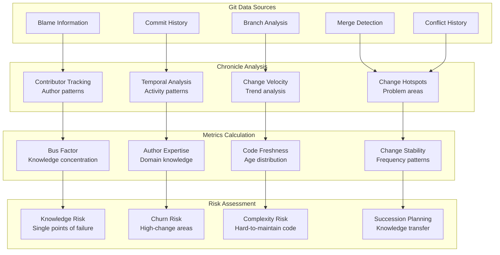
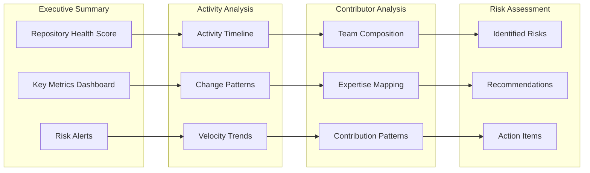

# Git Integration & Chronicle System

## Git Analysis Architecture

```mermaid
graph TD
    subgraph "Git Data Sources"
        COMMIT_LOG[Commit History]
        BLAME_DATA[Blame Information]
        BRANCH_INFO[Branch Analysis]
        MERGE_DATA[Merge Detection]
        CONFLICT_HIST[Conflict History]
    end

    subgraph "Chronicle Analysis"
        TEMPORAL[Temporal Analysis<br/>Activity patterns]
        CONTRIBUTORS[Contributor Tracking<br/>Author patterns]
        VELOCITY[Change Velocity<br/>Trend analysis]
        HOTSPOTS[Change Hotspots<br/>Problem areas]
    end

    subgraph "Metrics Calculation"
        BUS_FACTOR[Bus Factor<br/>Knowledge concentration]
        EXPERTISE[Author Expertise<br/>Domain knowledge]
        FRESHNESS[Code Freshness<br/>Age distribution]
        STABILITY[Change Stability<br/>Frequency patterns]
    end

    subgraph "Risk Assessment"
        KNOWLEDGE_RISK[Knowledge Risk<br/>Single points of failure]
        CHURN_RISK[Churn Risk<br/>High-change areas]
        COMPLEXITY_RISK[Complexity Risk<br/>Hard-to-maintain code]
        SUCCESSION[Succession Planning<br/>Knowledge transfer]
    end

    COMMIT_LOG --> TEMPORAL
    BLAME_DATA --> CONTRIBUTORS
    BRANCH_INFO --> VELOCITY
    MERGE_DATA --> HOTSPOTS
    CONFLICT_HIST --> HOTSPOTS

    CONTRIBUTORS --> BUS_FACTOR
    TEMPORAL --> EXPERTISE
    VELOCITY --> FRESHNESS
    HOTSPOTS --> STABILITY

    BUS_FACTOR --> KNOWLEDGE_RISK
    EXPERTISE --> CHURN_RISK
    FRESHNESS --> COMPLEXITY_RISK
    STABILITY --> SUCCESSION
```

## Chronicle Report Structure

```mermaid
graph LR
    subgraph "Executive Summary"
        HEALTH[Repository Health Score]
        KEY_METRICS[Key Metrics Dashboard]
        ALERTS[Risk Alerts]
    end

    subgraph "Activity Analysis"
        TIMELINE[Activity Timeline]
        PATTERNS[Change Patterns]
        TRENDS[Velocity Trends]
    end

    subgraph "Contributor Analysis"
        TEAM[Team Composition]
        EXPERTISE_MAP[Expertise Mapping]
        CONTRIBUTION[Contribution Patterns]
    end

    subgraph "Risk Assessment"
        RISKS[Identified Risks]
        RECOMMENDATIONS[Recommendations]
        ACTION_ITEMS[Action Items]
    end

    HEALTH --> TIMELINE
    KEY_METRICS --> PATTERNS
    ALERTS --> TRENDS

    TIMELINE --> TEAM
    PATTERNS --> EXPERTISE_MAP
    TRENDS --> CONTRIBUTION

    TEAM --> RISKS
    EXPERTISE_MAP --> RECOMMENDATIONS
    CONTRIBUTION --> ACTION_ITEMS
```