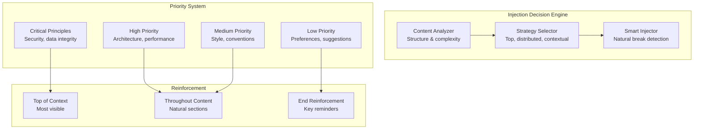

# Guiding Principles (Tenets) System

## Overview

The Guiding Principles system provides persistent, context-aware instructions to maintain consistency across AI interactions and combat context drift.

## Injection Strategy



## Output Formats

**Markdown:**
```markdown
**🎯 Key Guiding Principle:** Always validate user input before processing
**📌 Important Guiding Principle:** Use async/await for all I/O operations
**💡 Guiding Principle:** Prefer composition over inheritance
```

**XML (Recommended by OpenAI):**
```xml
<guiding_principle priority="high" category="security">
  Always validate and sanitize user input
</guiding_principle>

<guiding_principles>
  <guiding_principle priority="critical">Maintain backward compatibility</guiding_principle>
  <guiding_principle priority="medium">Use descriptive variable names</guiding_principle>
</guiding_principles>
```

## Configuration

```yaml
tenet:
  auto_instill: true
  max_per_context: 5
  injection_strategy: strategic
  injection_frequency: adaptive  # 'always', 'periodic', 'adaptive', 'manual'
  injection_interval: 3          # For periodic mode
  min_session_length: 1          # First injection always happens
  system_instruction: "Prefer small, safe diffs and add tests"
  system_instruction_enabled: true
```