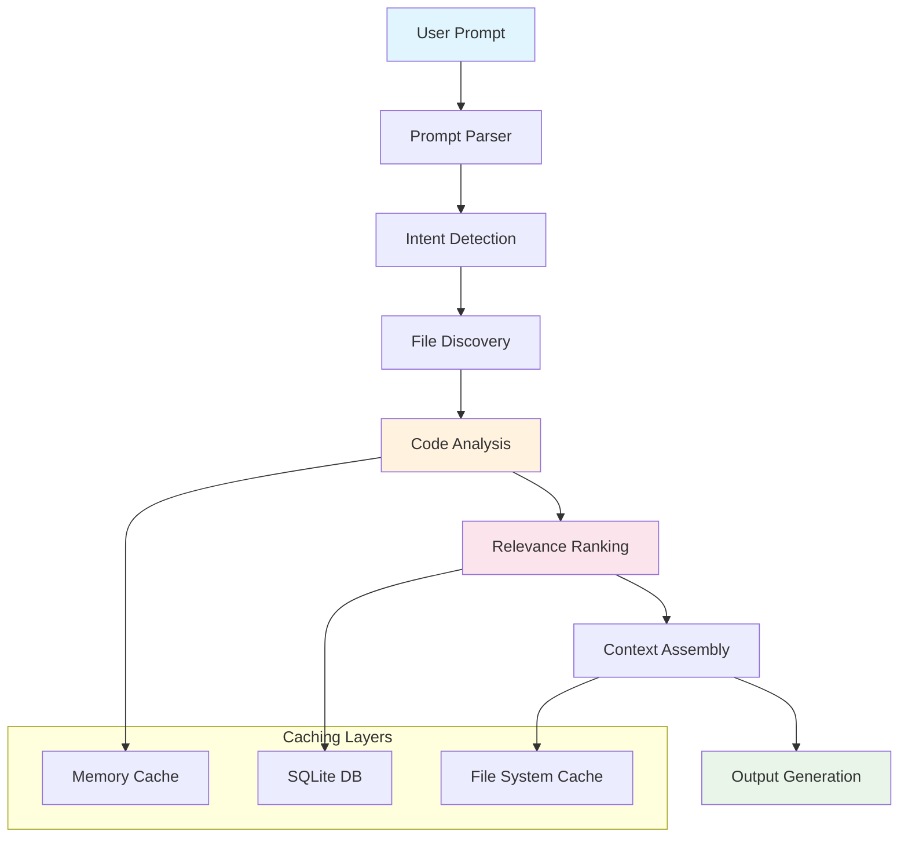

# Tenets Architecture Overview

## Quick Navigation

Choose your level of detail:

### **[System Overview](overview.md)**
High-level architecture, core principles, and system design philosophy.

### **[Core Systems](core-systems.md)**
Detailed breakdown of analysis engines, ranking systems, and processing pipelines.

### **[Data & Storage](data-storage.md)**
Session management, caching architecture, and persistence layers.

### **[Integration & APIs](integration.md)**
CLI architecture, Git integration, and extensibility systems.

### **[Performance & Deployment](performance.md)**
Performance architecture, scalability, and deployment strategies.

---

## What is Tenets?

Tenets is a sophisticated, **local-first code intelligence platform** that revolutionizes how developers interact with their codebases when working with AI assistants.

## Core Architecture Principles

### 1. **Local-First Processing**
All analysis, ranking, and context generation happens on the developer's machine. No code ever leaves the local environment.

### 2. **Progressive Enhancement**
The system provides value immediately with just Python installed, and scales up with optional dependencies.

### 3. **Intelligent Caching**
Every expensive operation is cached at multiple levels - memory, SQLite, disk, and specialized embedding caches.

### 4. **Configurable Intelligence**
Every aspect of ranking and analysis can be configured. Users can adjust factor weights, enable/disable features, and add custom functions.

### 5. **Streaming Architecture**
Uses streaming and incremental processing. Files are analyzed as discovered, rankings computed in parallel, results stream to users.

---

## 🗺️ High-Level System Flow

---

## 📚 Documentation Sections

| Section | What You'll Learn | Best For |
|---------|-------------------|----------|
| **[Overview](overview.md)** | System design, philosophy, key concepts | Product managers, architects |
| **[Core Systems](core-systems.md)** | Analysis engines, ML pipelines, ranking | Senior developers, integrators |
| **[Data & Storage](data-storage.md)** | Database design, caching, sessions | Backend developers, DBAs |
| **[Integration](integration.md)** | APIs, CLI, Git integration, plugins | DevOps, tool builders |
| **[Performance](performance.md)** | Scalability, optimization, deployment | Performance engineers, SREs |

---

## 🔍 Quick Architecture Facts

  

    <h4>🏗️ Modular Design</h4>
    
20+ specialized modules working in harmony

  

  

    <h4>⚡ Performance First</h4>
    
Multi-level caching, parallel processing, streaming

  

  

    <h4>🔒 Privacy Focused</h4>
    
100% local processing, no data leaves your machine

  

  

    <h4>🔧 Highly Configurable</h4>
    
Every ranking factor and feature can be tuned

  

---

## 🎯 Where to Start?

- **New to Tenets?** → [System Overview](overview.md)
- **Want technical details?** → [Core Systems](core-systems.md)
- **Building integrations?** → [Integration & APIs](integration.md)
- **Performance questions?** → [Performance & Deployment](performance.md)

