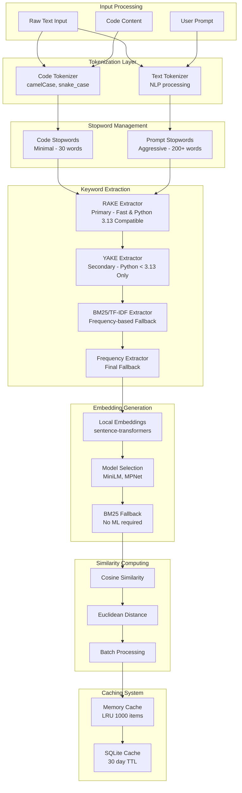
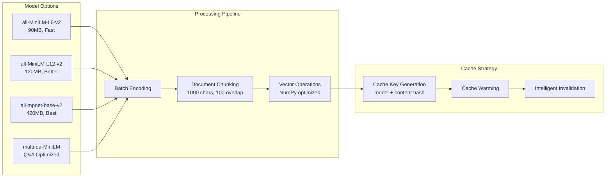

# NLP/ML Pipeline Architecture

## Centralized NLP Components

```
tenets/core/nlp/
├── __init__.py          # Main NLP API exports
├── similarity.py        # Centralized similarity computations
├── keyword_extractor.py # Unified keyword extraction with SimpleRAKE
├── tokenizer.py        # Code and text tokenization
├── stopwords.py        # Stopword management with fallbacks
├── embeddings.py       # Embedding generation (ML optional)
├── ml_utils.py         # ML utility functions
├── bm25.py            # BM25 ranking algorithm (primary)
└── tfidf.py           # TF-IDF calculations (optional alternative)
```

## Pipeline Component Flow



## Keyword Extraction Algorithms Comparison

| Algorithm | Speed | Quality | Memory | Python 3.13 | Best For | Limitations |
|-----------|-------|----------|---------|-------------|----------|-------------|
| **RAKE** | Fast | Good | Low | ✅ Yes | Technical docs, Multi-word phrases | No semantic understanding |
| **SimpleRAKE** | Fast | Good | Minimal | ✅ Yes | No NLTK dependencies, Built-in | Basic tokenization only |
| **YAKE** | Moderate | Very Good | Low | ❌ No | Statistical analysis, Capital aware | Python 3.13 bug |
| **BM25** | Fast | Excellent | High | ✅ Yes | Primary ranking, Length variation | Needs corpus |
| **TF-IDF** | Fast | Good | Medium | ✅ Yes | Alternative to BM25 | Less effective for varying lengths |
| **Frequency** | Very Fast | Basic | Minimal | ✅ Yes | Fallback option | Very basic |

## Embedding Model Architecture

