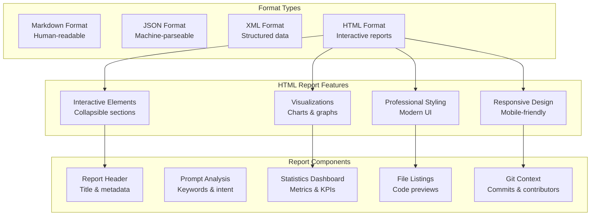
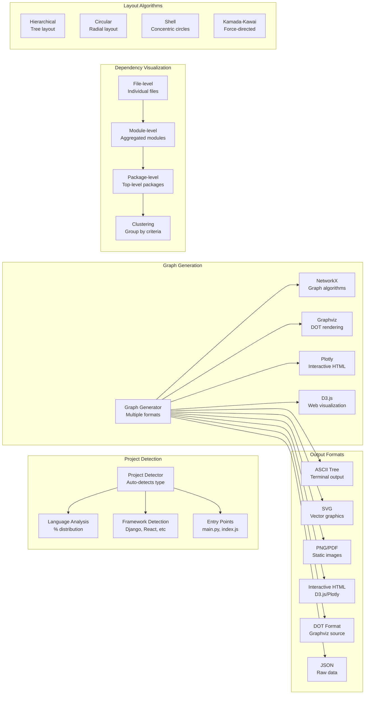

# Output Generation & Visualization

## Output Formatting System

```mermaid
graph TB
    subgraph "Format Types"
        MARKDOWN[Markdown Format<br/>Human-readable]
        JSON[JSON Format<br/>Machine-parseable]
        XML[XML Format<br/>Structured data]
        HTML[HTML Format<br/>Interactive reports]
    end

    subgraph "HTML Report Features"
        INTERACTIVE[Interactive Elements<br/>Collapsible sections]
        VISUALS[Visualizations<br/>Charts & graphs]
        STYLING[Professional Styling<br/>Modern UI]
        RESPONSIVE[Responsive Design<br/>Mobile-friendly]
    end

    subgraph "Report Components"
        HEADER[Report Header<br/>Title & metadata]
        PROMPT_DISPLAY[Prompt Analysis<br/>Keywords & intent]
        STATS[Statistics Dashboard<br/>Metrics & KPIs]
        FILES[File Listings<br/>Code previews]
        GIT[Git Context<br/>Commits & contributors]
    end

    HTML --> INTERACTIVE
    HTML --> VISUALS
    HTML --> STYLING
    HTML --> RESPONSIVE

    INTERACTIVE --> HEADER
    VISUALS --> STATS
    STYLING --> FILES
    RESPONSIVE --> GIT
```

## Visualization Components

```mermaid
graph LR
    subgraph "Project Detection"
        DETECTOR[Project Detector<br/>Auto-detects type]
        LANGUAGES[Language Analysis<br/>% distribution]
        FRAMEWORKS[Framework Detection<br/>Django, React, etc]
        ENTRYPOINTS[Entry Points<br/>main.py, index.js]
    end

    subgraph "Graph Generation"
        GRAPHGEN[Graph Generator<br/>Multiple formats]
        NETWORKX[NetworkX<br/>Graph algorithms]
        GRAPHVIZ[Graphviz<br/>DOT rendering]
        PLOTLY[Plotly<br/>Interactive HTML]
        D3JS[D3.js<br/>Web visualization]
    end

    subgraph "Dependency Visualization"
        FILE_DEPS[File-level<br/>Individual files]
        MODULE_DEPS[Module-level<br/>Aggregated modules]
        PACKAGE_DEPS[Package-level<br/>Top-level packages]
        CLUSTERING[Clustering<br/>Group by criteria]
    end

    subgraph "Output Formats"
        ASCII[ASCII Tree<br/>Terminal output]
        SVG[SVG<br/>Vector graphics]
        PNG[PNG/PDF<br/>Static images]
        HTML_INT[Interactive HTML<br/>D3.js/Plotly]
        DOT[DOT Format<br/>Graphviz source]
        JSON_OUT[JSON<br/>Raw data]
    end

    subgraph "Layout Algorithms"
        HIERARCHICAL[Hierarchical<br/>Tree layout]
        CIRCULAR[Circular<br/>Radial layout]
        SHELL[Shell<br/>Concentric circles]
        KAMADA[Kamada-Kawai<br/>Force-directed]
    end

    DETECTOR --> LANGUAGES
    DETECTOR --> FRAMEWORKS
    DETECTOR --> ENTRYPOINTS

    GRAPHGEN --> NETWORKX
    GRAPHGEN --> GRAPHVIZ
    GRAPHGEN --> PLOTLY
    GRAPHGEN --> D3JS

    FILE_DEPS --> MODULE_DEPS
    MODULE_DEPS --> PACKAGE_DEPS
    PACKAGE_DEPS --> CLUSTERING

    GRAPHGEN --> ASCII
    GRAPHGEN --> SVG
    GRAPHGEN --> PNG
    GRAPHGEN --> HTML_INT
    GRAPHGEN --> DOT
    GRAPHGEN --> JSON_OUT
```