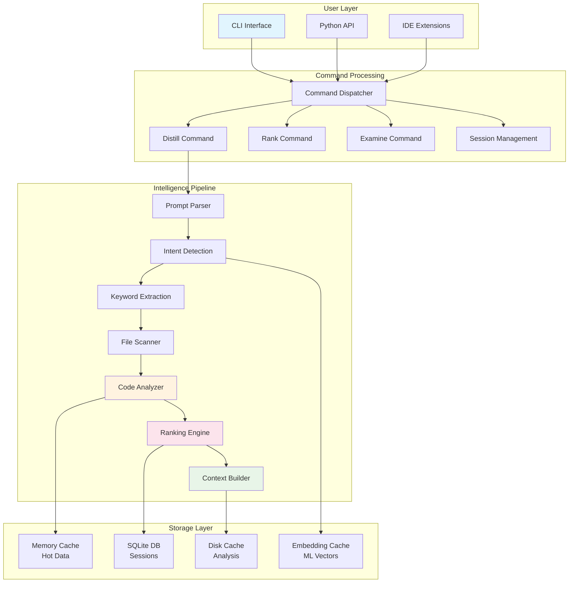
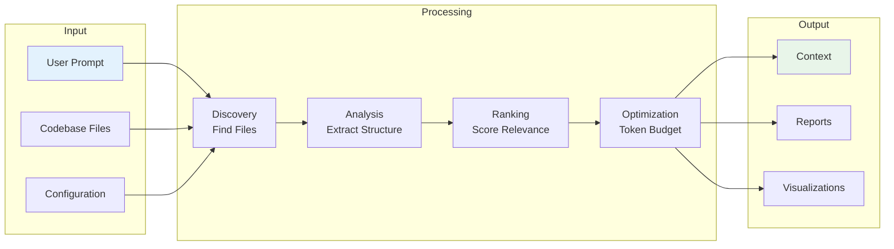
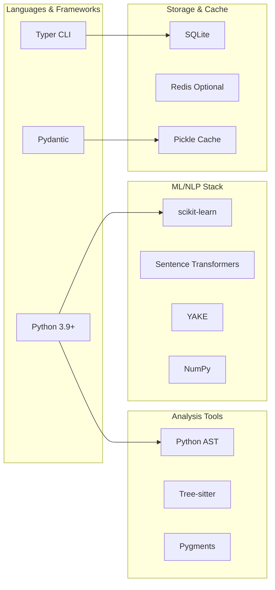

# System Overview

Loading optimized content...

## What is Tenets?

Tenets is a sophisticated, local-first code intelligence platform that revolutionizes how developers interact with their codebases when working with AI assistants.

## Core Philosophy & Design Principles

### 1. Local-First Processing
All analysis, ranking, and context generation happens on the developer's machine. No code ever leaves the local environment. External API calls are only made for optional LLM-based summarization, and even then, only with explicit user consent.

### 2. Progressive Enhancement
The system provides value immediately with just Python installed, and scales up with optional dependencies. Core functionality works without any ML libraries, git integration works without any configuration, and advanced features gracefully degrade when dependencies are missing.

### 3. Intelligent Caching
Every expensive operation is cached at multiple levels - memory caches for hot data, SQLite for structured data, disk caches for analysis results, and specialized caches for embeddings. Cache invalidation is intelligent, using file modification times, git commits, and content hashes.

### 4. Configurable Intelligence
Every aspect of the ranking and analysis can be configured. Users can adjust factor weights, enable/disable features, add custom ranking functions, and tune performance parameters. The system adapts to different codebases and use cases.

### 5. Streaming Architecture
The system uses streaming and incremental processing wherever possible. Files are analyzed as they're discovered, rankings are computed in parallel, and results stream to the user as they become available.

## Complete System Architecture

### Data Flow Architecture

## System Components Overview

The Tenets system consists of several key architectural layers:

### 🔍 **Discovery Layer**
- File discovery and scanning
- Git repository analysis
- Language detection and classification

### 🧠 **Analysis Layer**
- Multi-language static analysis
- Code complexity measurement
- Pattern recognition and extraction

### 📊 **Intelligence Layer**
- Relevance ranking algorithms
- Machine learning pipelines
- Natural language processing

### 💾 **Storage Layer**
- Session management
- Caching architecture
- Data persistence

### 🔌 **Interface Layer**
- CLI commands
- API endpoints
- Configuration management

## Technology Stack

### Core Technologies

### Key Components by Feature

| Component | Technology | Purpose |
|-----------|------------|---------|
| **CLI Framework** | Typer + Rich | Modern CLI with progress bars |
| **Configuration** | YAML + Pydantic | Type-safe configuration |
| **Code Parsing** | AST + Tree-sitter | Multi-language analysis |
| **Text Analysis** | BM25 (primary) | Probabilistic relevance scoring |
| **ML Models** | Sentence Transformers | Semantic similarity |
| **Keyword Extraction** | YAKE | Statistical extraction |
| **Git Integration** | GitPython | Version control mining |
| **Database** | SQLite | Session storage |
| **Caching** | LRU + Disk | Multi-level caching |
| **Visualization** | Graphviz + D3.js | Dependency graphs |

---

## 🔗 Related Documentation

- **[Core Systems →](core-systems.md)** - Detailed analysis engines and pipelines
- **[Data & Storage →](data-storage.md)** - Database design and caching
- **[Performance →](performance.md)** - Optimization and scalability

---

💡 This is a performance-optimized version. For the complete technical documentation, see the [original architecture file](../ARCHITECTURE-original.md).

