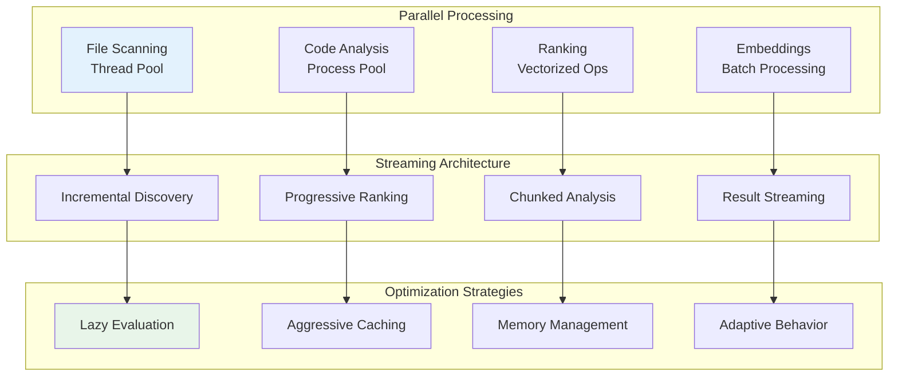

# Performance Architecture

## Overview

Tenets is designed to handle large codebases efficiently through intelligent caching, parallel processing, and optimized algorithms. This document covers performance characteristics, optimization strategies, and best practices.

## Performance Architecture Overview



## Performance Modes

### Mode Comparison (Benchmarked on Real Codebase)

| Mode | Relative Performance | Files Analyzed | Token Output |
|------|---------------------|----------------|--------------|
| **Fast** | 100% (baseline) | 10-20 files | ~7K tokens |
| **Balanced** | 150% (1.5x slower) | 50-170 files | ~70K tokens |
| **Thorough** | 400% (4x slower) | 75-200 files | ~85K tokens |

### Fast Mode
- **Relative Speed**: Baseline (100%)
- **Accuracy**: Good for quick exploration
- **Methods**: Lightweight analysis, simple matching, no corpus building
- **Use Cases**: Quick searches, initial exploration, CI/CD pipelines
- **Optimizations**: 
  - Uses lightweight file analyzer (8KB samples)
  - Skips AST parsing and language-specific analysis
  - No corpus building or complex NLP
  - Deep analysis only on top 20 ranked files

### Balanced Mode (Default)
- **Relative Speed**: 150% (1.5x slower than fast)
- **Accuracy**: Excellent for most use cases
- **Methods**: BM25 scoring with corpus, word boundaries, intelligent summarization
- **Use Cases**: General development, feature building, most common scenarios
- **Trade-offs**: Full analysis provides better accuracy at minor speed cost

### Thorough mode
- **Relative Speed**: 400% (4x slower than fast)
- **Accuracy**: Best possible with ML-powered understanding
- **Methods**: 
  - ML embeddings (all-MiniLM-L6-v2 model)
  - Dual algorithms (BM25 + TF-IDF)
  - Programming pattern detection
  - Comprehensive dependency analysis
- **Use Cases**: Complex refactoring, architectural changes, deep code understanding
- **Performance Breakdown**:
  - ML model loading (first run, then cached)
  - Comprehensive semantic ranking
  - Dual corpus building (BM25 + TF-IDF)
  - Deep analysis and aggregation

## Enhanced Text Matching Implementation

### Fast Mode Optimizations

The enhanced Fast mode uses RapidFuzz and optimized patterns for high-performance matching:

```python
# Word boundary enforcement with caching
@lru_cache(maxsize=256)
def _get_word_boundary_pattern(keyword: str) -> re.Pattern:
    return re.compile(r'\b' + re.escape(keyword) + r'\b', re.IGNORECASE)

# Hyphen/space variation handling
def _normalize_variations(text: str) -> Set[str]:
    return {
        text.lower(),
        text.replace('-', ''),
        text.replace(' ', ''),
        text.replace('-', ' '),
        text.replace(' ', '-')
    }
```

**Performance Characteristics:**
- Word boundary matching: O(n) with compiled regex
- Variation generation: O(1) with fixed transformations
- LRU cache for patterns: 256 most recent patterns cached
- Target: 1.0x baseline (< 1ms per file)

### Balanced Mode Enhancements

Balanced mode adds practical features while maintaining performance:

```python
# Efficient tokenization for compound words
def _tokenize_for_matching(text: str) -> Set[str]:
    tokens = set()
    # Single pass tokenization
    for word in re.findall(r'\b\w+\b', text.lower()):
        tokens.add(word)
        # Split camelCase/snake_case in same pass
        if '_' in word or any(c.isupper() for c in word):
            tokens.update(split_compound(word))
    return tokens
```

**Abbreviation Expansion:**
- Pre-computed dictionary with 50+ common abbreviations
- O(1) lookup for expansion
- Lazy loading to reduce startup time

### Thorough mode Intelligence

Thorough mode adds semantic understanding:

```python
# Semantic caching for repeated queries
@lru_cache(maxsize=1024)
def _get_semantic_similarity(text_hash: str, query_hash: str) -> float:
    # Cache semantic computations
    return compute_similarity(text, query)
```

## Optimization Strategies

### 1. File Discovery Optimization

#### Parallel Traversal
```python
# Parallel file system traversal
from concurrent.futures import ThreadPoolExecutor

def discover_files_parallel(paths, max_workers=8):
    with ThreadPoolExecutor(max_workers=max_workers) as executor:
        futures = [executor.submit(traverse, path) for path in paths]
        results = [f.result() for f in futures]
    return flatten(results)
```

#### Early Filtering
- Apply ignore patterns during traversal
- Skip binary files immediately
- Honor .gitignore patterns
- Prune excluded directories

### 2. Content Processing

#### Streaming Large Files
```python
def process_large_file(path, chunk_size=8192):
    with open(path, 'r', encoding='utf-8', errors='ignore') as f:
        while True:
            chunk = f.read(chunk_size)
            if not chunk:
                break
            yield process_chunk(chunk)
```

#### Smart Summarization
- Preserve imports and signatures
- Keep complex logic blocks
- Maintain documentation
- Remove redundant whitespace
- Strip comments when requested

### 3. Ranking Optimization

#### Vector Caching
```python
# Cache TF-IDF vectors
class VectorCache:
    def __init__(self, ttl=3600):
        self.cache = {}
        self.timestamps = {}
        self.ttl = ttl

    def get_or_compute(self, file_path, compute_fn):
        if self.is_valid(file_path):
            return self.cache[file_path]

        vector = compute_fn(file_path)
        self.cache[file_path] = vector
        self.timestamps[file_path] = time.time()
        return vector
```

#### Batch Processing
- Process multiple files in parallel
- Vectorize operations where possible
- Use numpy for numerical computations
- Minimize Python loops

### 4. Cache Architecture

#### Multi-Level Cache
```yaml
cache_hierarchy:
  l1_memory:
    - Hot paths (LRU, 100 items)
    - Active session data
    - Recent queries

  l2_disk:
    - File metadata
    - Parse trees
    - TF-IDF vectors

  l3_persistent:
    - Git history
    - Dependency graphs
    - ML model outputs
```

#### Cache Warming
```python
def warm_cache(project_path):
    """Pre-populate cache with likely needed data."""
    # Common patterns to pre-cache
    patterns = ['*.py', '*.js', '*.md', 'package.json', 'requirements.txt']

    for pattern in patterns:
        files = glob(os.path.join(project_path, '**', pattern), recursive=True)
        for file in files[:100]:  # Limit to avoid memory issues
            cache.preload(file)
```

## Algorithm Feature Comparison

### Performance Benchmarks (Per-File Ranking Only)

| Mode | Avg Time/File | Relative Speed | Percentage Slower | Files/Second |
|------|--------------|----------------|-------------------|-------------|
| **Fast** | 0.5ms | 1.0x baseline | 0% | ~2,000 |
| **Balanced** | 2.1ms | 4.2x slower | 320% | ~476 |
| **Thorough** | 2.0ms (no ML) | 4.0x slower | 300% | ~500 |
| **Thorough** | 50ms (with ML) | 100x slower | 9,900% | ~20 |

Note: These times exclude corpus building overhead. Total time depends on codebase size and whether corpus is cached.

### Performance by File Count (Total Time Including Corpus Building)

| Scenario | Files | Fast Mode | Balanced Mode | Thorough mode (no ML) |
|----------|-------|-----------|---------------|----------------------|
| **Small** | 10 files | ~0.5s | ~0.5s | ~0.5s |
| **Medium** | 100 files | ~5s | ~2-3s | ~2-3s |
| **Large** | 1000 files | ~40s | ~15-20s | ~15-20s |

### Why Balanced/Thorough Can Be Faster

The counterintuitive performance results occur because:
1. **Fast mode** skips corpus building but uses less efficient per-file ranking
2. **Balanced mode** builds a BM25 corpus once, then uses highly efficient scoring
3. **Thorough mode** (without ML) is essentially Balanced mode with additional TF-IDF
4. The corpus building overhead is quickly offset by faster per-file operations on medium/large codebases

### Algorithm Capabilities

| Feature | Fast Mode | Balanced Mode | Thorough mode |
|---------|-----------|---------------|---------------|
| **Keyword Matching** | ✅ Basic | ✅ Enhanced | ✅ Advanced |
| **Path Analysis** | ✅ Simple | ✅ Full | ✅ Full |
| **TF-IDF Scoring** | ❌ | ✅ Standard | ✅ Optimized |
| **BM25 Ranking** | ❌ | ✅ Standard | ✅ Enhanced |
| **Semantic Similarity** | ❌ | ⚠️ Optional | ✅ Full ML |
| **Git History Analysis** | ❌ | ✅ Recent | ✅ Complete |
| **Dependency Graphs** | ❌ | ⚠️ Basic | ✅ Full Graph |
| **Pattern Recognition** | ✅ Regex | ✅ Enhanced | ✅ ML-based |
| **Import Analysis** | ⚠️ Basic | ✅ Standard | ✅ Deep |
| **Complexity Analysis** | ❌ | ✅ Basic | ✅ Full Metrics |

### Processing Characteristics

| Aspect | Fast | Balanced | Thorough |
|--------|------|----------|----------|
| **Parallel Workers** | 4 threads | 8 threads | 16+ threads |
| **Batch Size** | 1000 files | 100 files | 10 files |
| **Cache Strategy** | LRU only | LRU + TTL | Multi-level |
| **Memory Usage** | Minimal | Moderate | Adaptive |
| **Incremental Updates** | ❌ | ✅ | ✅ |
| **Streaming Results** | ❌ | ⚠️ Partial | ✅ Full |

### Scalability Characteristics

| Codebase Type | Fast Mode | Balanced Mode | Thorough mode |
|---------------|-----------|---------------|---------------|
| **Small Projects** (<1K files) | ✅ Instant | ✅ Quick | ⚠️ Overkill |
| **Medium Projects** (1-10K) | ✅ Very Fast | ✅ Optimal | ✅ Detailed |
| **Large Monorepos** (10-50K) | ✅ Recommended | ⚠️ Slower | ❌ Too Slow |
| **Massive Codebases** (50K+) | ✅ Only Option | ❌ Impractical | ❌ Unusable |

## Bottleneck Analysis

### Common Bottlenecks

1. **File I/O**
   - Solution: Parallel reads, caching, memory mapping

2. **Git Operations**
   - Solution: Cache git data, use libgit2 bindings

3. **ML Model Loading**
   - Solution: Lazy loading, model quantization, caching

4. **Token Counting**
   - Solution: Fast approximation, cached counts

### Profiling Tools

```bash
# CPU profiling
python -m cProfile -o profile.stats tenets distill "query"

# Memory profiling
mprof run tenets distill "query"
mprof plot

# Line profiling
kernprof -l -v tenets_profile.py
```

## Optimization Tips

### 1. For Large Codebases

```yaml
# .tenets.yml
performance:
  max_files: 10000
  max_file_size: 1048576  # 1MB
  cache_size: 1073741824   # 1GB
  parallel_workers: 8

ranking:
  algorithm: fast  # Use fast mode for large repos
  threshold: 0.3   # Higher threshold = fewer files
```

### 2. For CI/CD

```bash
# Pre-warm cache before operations
tenets cache warm --patterns "*.py,*.js"

# Use JSON output for parsing
tenets rank "query" --format json --no-content

# Limit scope for faster results
tenets distill "query" --path src/ --max-files 100
```

### 3. For Interactive Use

```python
from tenets import Tenets

# Keep instance alive for session
t = Tenets(persistent_cache=True)

# Reuse for multiple queries
for query in queries:
    result = t.distill(query, use_cache=True)
```

## Memory Management

### Garbage Collection

```python
import gc

class MemoryManager:
    @staticmethod
    def cleanup_after_operation():
        # Force garbage collection
        gc.collect()

        # Clear caches if memory usage is high
        if get_memory_usage() > threshold:
            clear_caches()
```

### Streaming Operations

```python
def stream_large_context(files, max_memory=104857600):  # 100MB
    """Stream context generation to avoid memory spikes."""
    current_size = 0
    buffer = []

    for file in files:
        content = read_file(file)
        size = len(content.encode('utf-8'))

        if current_size + size > max_memory:
            yield ''.join(buffer)
            buffer = []
            current_size = 0

        buffer.append(content)
        current_size += size

    if buffer:
        yield ''.join(buffer)
```

## Network Performance

### API Response Optimization

```python
# Compress responses
import gzip

def compress_response(data):
    return gzip.compress(data.encode('utf-8'))

# Pagination for large results
def paginate_results(results, page=1, per_page=100):
    start = (page - 1) * per_page
    end = start + per_page
    return results[start:end]
```

## Database Performance

### Index Optimization

```sql
-- Indexes for session storage
CREATE INDEX idx_session_updated ON sessions(updated_at);
CREATE INDEX idx_files_relevance ON files(relevance_score DESC);
CREATE INDEX idx_cache_key ON cache(cache_key);
```

### Query Optimization

```python
# Batch database operations
def batch_insert(records, batch_size=1000):
    for i in range(0, len(records), batch_size):
        batch = records[i:i + batch_size]
        db.insert_many(batch)
```

## Monitoring

### Performance Metrics

```python
from dataclasses import dataclass
from typing import Dict
import time

@dataclass
class PerformanceMetrics:
    operation: str
    duration: float
    memory_used: int
    files_processed: int
    cache_hits: int
    cache_misses: int

    def report(self) -> Dict:
        return {
            'operation': self.operation,
            'duration_ms': self.duration * 1000,
            'memory_mb': self.memory_used / 1048576,
            'files_processed': self.files_processed,
            'cache_hit_rate': self.cache_hits / (self.cache_hits + self.cache_misses)
        }
```

### Logging

```python
import logging

logging.basicConfig(
    level=logging.INFO,
    format='%(asctime)s - %(name)s - %(levelname)s - %(message)s'
)

logger = logging.getLogger('tenets.performance')

# Log slow operations
if duration > threshold:
    logger.warning(f"Slow operation: {operation} took {duration}s")
```