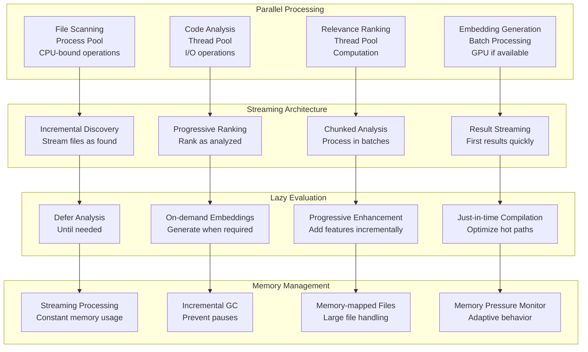

# Performance Architecture

## Optimization Strategy Overview

```mermaid
graph TD
    subgraph "Parallel Processing"
        FILE_SCAN[File Scanning<br/>Process Pool<br/>CPU-bound operations]
        ANALYSIS[Code Analysis<br/>Thread Pool<br/>I/O operations]
        RANKING[Relevance Ranking<br/>Thread Pool<br/>Computation]
        EMBEDDING[Embedding Generation<br/>Batch Processing<br/>GPU if available]
    end

    subgraph "Streaming Architecture"
        INCREMENTAL[Incremental Discovery<br/>Stream files as found]
        PROGRESSIVE[Progressive Ranking<br/>Rank as analyzed]
        CHUNKED[Chunked Analysis<br/>Process in batches]
        STREAMING[Result Streaming<br/>First results quickly]
    end

    subgraph "Lazy Evaluation"
        DEFER[Defer Analysis<br/>Until needed]
        ON_DEMAND[On-demand Embeddings<br/>Generate when required]
        PROGRESSIVE_ENH[Progressive Enhancement<br/>Add features incrementally]
        JIT[Just-in-time Compilation<br/>Optimize hot paths]
    end

    subgraph "Memory Management"
        STREAMING_PROC[Streaming Processing<br/>Constant memory usage]
        GC[Incremental GC<br/>Prevent pauses]
        MMAP[Memory-mapped Files<br/>Large file handling]
        PRESSURE[Memory Pressure Monitor<br/>Adaptive behavior]
    end

    FILE_SCAN --> INCREMENTAL
    ANALYSIS --> PROGRESSIVE
    RANKING --> CHUNKED
    EMBEDDING --> STREAMING

    INCREMENTAL --> DEFER
    PROGRESSIVE --> ON_DEMAND
    CHUNKED --> PROGRESSIVE_ENH
    STREAMING --> JIT

    DEFER --> STREAMING_PROC
    ON_DEMAND --> GC
    PROGRESSIVE_ENH --> MMAP
    JIT --> PRESSURE
```