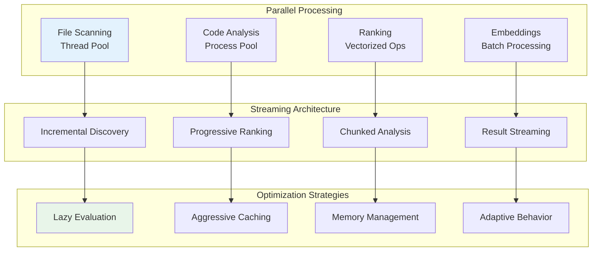

# Performance Architecture

## Overview

Tenets is designed to handle large codebases efficiently through intelligent caching, parallel processing, and optimized algorithms. This document covers performance characteristics, optimization strategies, and best practices.

## Performance Architecture Overview



## Performance Modes

### Fast Mode
- **Response Time**: Fastest (1.0x baseline)
- **Accuracy**: Good for quick exploration
- **Methods**: Keyword matching, path analysis, basic scoring
- **Use Cases**: Interactive exploration, quick searches
- **Performance**: Baseline for all comparisons

### Balanced Mode (Default)
- **Response Time**: ~6.4x slower than Fast mode
- **Accuracy**: Excellent for most use cases
- **Methods**: TF-IDF, BM25, structural analysis
- **Use Cases**: General development, feature building
- **Performance**: 540% slower than Fast mode

### Thorough Mode
- **Response Time**: ~13.3x slower than Fast mode (~2.1x slower than Balanced)
- **Accuracy**: Typically makes for best possible relevance
- **Methods**: ML models, semantic similarity, dependency graphs
- **Use Cases**: Complex refactoring, architectural changes
- **Performance**: 1230% slower than Fast mode

## Optimization Strategies

### 1. File Discovery Optimization

#### Parallel Traversal
```python
# Parallel file system traversal
from concurrent.futures import ThreadPoolExecutor

def discover_files_parallel(paths, max_workers=8):
    with ThreadPoolExecutor(max_workers=max_workers) as executor:
        futures = [executor.submit(traverse, path) for path in paths]
        results = [f.result() for f in futures]
    return flatten(results)
```

#### Early Filtering
- Apply ignore patterns during traversal
- Skip binary files immediately
- Honor .gitignore patterns
- Prune excluded directories

### 2. Content Processing

#### Streaming Large Files
```python
def process_large_file(path, chunk_size=8192):
    with open(path, 'r', encoding='utf-8', errors='ignore') as f:
        while True:
            chunk = f.read(chunk_size)
            if not chunk:
                break
            yield process_chunk(chunk)
```

#### Smart Summarization
- Preserve imports and signatures
- Keep complex logic blocks
- Maintain documentation
- Remove redundant whitespace
- Strip comments when requested

### 3. Ranking Optimization

#### Vector Caching
```python
# Cache TF-IDF vectors
class VectorCache:
    def __init__(self, ttl=3600):
        self.cache = {}
        self.timestamps = {}
        self.ttl = ttl

    def get_or_compute(self, file_path, compute_fn):
        if self.is_valid(file_path):
            return self.cache[file_path]

        vector = compute_fn(file_path)
        self.cache[file_path] = vector
        self.timestamps[file_path] = time.time()
        return vector
```

#### Batch Processing
- Process multiple files in parallel
- Vectorize operations where possible
- Use numpy for numerical computations
- Minimize Python loops

### 4. Cache Architecture

#### Multi-Level Cache
```yaml
cache_hierarchy:
  l1_memory:
    - Hot paths (LRU, 100 items)
    - Active session data
    - Recent queries

  l2_disk:
    - File metadata
    - Parse trees
    - TF-IDF vectors

  l3_persistent:
    - Git history
    - Dependency graphs
    - ML model outputs
```

#### Cache Warming
```python
def warm_cache(project_path):
    """Pre-populate cache with likely needed data."""
    # Common patterns to pre-cache
    patterns = ['*.py', '*.js', '*.md', 'package.json', 'requirements.txt']

    for pattern in patterns:
        files = glob(os.path.join(project_path, '**', pattern), recursive=True)
        for file in files[:100]:  # Limit to avoid memory issues
            cache.preload(file)
```

## Algorithm Feature Comparison

### Performance Benchmarks

| Mode | Relative Speed | Performance Multiplier | Percentage Slower |
|------|---------------|------------------------|-------------------|
| **Fast** | 1.0x | Baseline | 0% |
| **Balanced** | 6.4x slower | 6.4x | 540% |
| **Thorough** | 13.3x slower | 13.3x | 1230% |

### Performance by File Count

| Files | Fast Mode | Balanced Mode | Thorough Mode |
|-------|-----------|---------------|---------------|
| **10 files** | 1.0x | 10.2x slower | 17.6x slower |
| **50 files** | 1.0x | 4.9x slower | 11.5x slower |
| **100 files** | 1.0x | 3.5x slower | 10.2x slower |
| **200 files** | 1.0x | 7.1x slower | 13.9x slower |\n\n### Algorithm Capabilities\n\n| Feature | Fast Mode | Balanced Mode | Thorough Mode |\n|---------|-----------|---------------|---------------|\n| **Keyword Matching** | \u2705 Basic | \u2705 Enhanced | \u2705 Advanced |\n| **Path Analysis** | \u2705 Simple | \u2705 Full | \u2705 Full |\n| **TF-IDF Scoring** | \u274c | \u2705 Standard | \u2705 Optimized |\n| **BM25 Ranking** | \u274c | \u2705 Standard | \u2705 Enhanced |\n| **Semantic Similarity** | \u274c | \u26a0\ufe0f Optional | \u2705 Full ML |\n| **Git History Analysis** | \u274c | \u2705 Recent | \u2705 Complete |\n| **Dependency Graphs** | \u274c | \u26a0\ufe0f Basic | \u2705 Full Graph |\n| **Pattern Recognition** | \u2705 Regex | \u2705 Enhanced | \u2705 ML-based |\n| **Import Analysis** | \u26a0\ufe0f Basic | \u2705 Standard | \u2705 Deep |\n| **Complexity Analysis** | \u274c | \u2705 Basic | \u2705 Full Metrics |\n\n### Processing Characteristics\n\n| Aspect | Fast | Balanced | Thorough |\n|--------|------|----------|----------|\n| **Parallel Workers** | 4 threads | 8 threads | 16+ threads |\n| **Batch Size** | 1000 files | 100 files | 10 files |\n| **Cache Strategy** | LRU only | LRU + TTL | Multi-level |\n| **Memory Usage** | Minimal | Moderate | Adaptive |\n| **Incremental Updates** | \u274c | \u2705 | \u2705 |\n| **Streaming Results** | \u274c | \u26a0\ufe0f Partial | \u2705 Full |\n\n### Scalability Characteristics\n\n| Codebase Type | Fast Mode | Balanced Mode | Thorough Mode |\n|---------------|-----------|---------------|---------------|\n| **Small Projects** (<1K files) | \u2705 Instant | \u2705 Quick | \u26a0\ufe0f Overkill |\n| **Medium Projects** (1-10K) | \u2705 Very Fast | \u2705 Optimal | \u2705 Detailed |\n| **Large Monorepos** (10-50K) | \u2705 Recommended | \u26a0\ufe0f Slower | \u274c Too Slow |\n| **Massive Codebases** (50K+) | \u2705 Only Option | \u274c Impractical | \u274c Unusable |


## Bottleneck Analysis

### Common Bottlenecks

1. **File I/O**
   - Solution: Parallel reads, caching, memory mapping

2. **Git Operations**
   - Solution: Cache git data, use libgit2 bindings

3. **ML Model Loading**
   - Solution: Lazy loading, model quantization, caching

4. **Token Counting**
   - Solution: Fast approximation, cached counts

### Profiling Tools

```bash
# CPU profiling
python -m cProfile -o profile.stats tenets distill "query"

# Memory profiling
mprof run tenets distill "query"
mprof plot

# Line profiling
kernprof -l -v tenets_profile.py
```

## Optimization Tips

### 1. For Large Codebases

```yaml
# .tenets.yml
performance:
  max_files: 10000
  max_file_size: 1048576  # 1MB
  cache_size: 1073741824   # 1GB
  parallel_workers: 8

ranking:
  algorithm: fast  # Use fast mode for large repos
  threshold: 0.3   # Higher threshold = fewer files
```

### 2. For CI/CD

```bash
# Pre-warm cache before operations
tenets cache warm --patterns "*.py,*.js"

# Use JSON output for parsing
tenets rank "query" --format json --no-content

# Limit scope for faster results
tenets distill "query" --path src/ --max-files 100
```

### 3. For Interactive Use

```python
from tenets import Tenets

# Keep instance alive for session
t = Tenets(persistent_cache=True)

# Reuse for multiple queries
for query in queries:
    result = t.distill(query, use_cache=True)
```

## Memory Management

### Garbage Collection

```python
import gc

class MemoryManager:
    @staticmethod
    def cleanup_after_operation():
        # Force garbage collection
        gc.collect()

        # Clear caches if memory usage is high
        if get_memory_usage() > threshold:
            clear_caches()
```

### Streaming Operations

```python
def stream_large_context(files, max_memory=104857600):  # 100MB
    """Stream context generation to avoid memory spikes."""
    current_size = 0
    buffer = []

    for file in files:
        content = read_file(file)
        size = len(content.encode('utf-8'))

        if current_size + size > max_memory:
            yield ''.join(buffer)
            buffer = []
            current_size = 0

        buffer.append(content)
        current_size += size

    if buffer:
        yield ''.join(buffer)
```

## Network Performance

### API Response Optimization

```python
# Compress responses
import gzip

def compress_response(data):
    return gzip.compress(data.encode('utf-8'))

# Pagination for large results
def paginate_results(results, page=1, per_page=100):
    start = (page - 1) * per_page
    end = start + per_page
    return results[start:end]
```

## Database Performance

### Index Optimization

```sql
-- Indexes for session storage
CREATE INDEX idx_session_updated ON sessions(updated_at);
CREATE INDEX idx_files_relevance ON files(relevance_score DESC);
CREATE INDEX idx_cache_key ON cache(cache_key);
```

### Query Optimization

```python
# Batch database operations
def batch_insert(records, batch_size=1000):
    for i in range(0, len(records), batch_size):
        batch = records[i:i + batch_size]
        db.insert_many(batch)
```

## Monitoring

### Performance Metrics

```python
from dataclasses import dataclass
from typing import Dict
import time

@dataclass
class PerformanceMetrics:
    operation: str
    duration: float
    memory_used: int
    files_processed: int
    cache_hits: int
    cache_misses: int

    def report(self) -> Dict:
        return {
            'operation': self.operation,
            'duration_ms': self.duration * 1000,
            'memory_mb': self.memory_used / 1048576,
            'files_processed': self.files_processed,
            'cache_hit_rate': self.cache_hits / (self.cache_hits + self.cache_misses)
        }
```

### Logging

```python
import logging

logging.basicConfig(
    level=logging.INFO,
    format='%(asctime)s - %(name)s - %(levelname)s - %(message)s'
)

logger = logging.getLogger('tenets.performance')

# Log slow operations
if duration > threshold:
    logger.warning(f"Slow operation: {operation} took {duration}s")
```

## Best Practices

1. **Use appropriate mode for the task**
   - Fast for exploration
   - Balanced for development
   - Thorough for major changes

2. **Leverage caching**
   - Keep cache warm
   - Use persistent cache for sessions
   - Clear cache periodically

3. **Optimize scope**
   - Limit search paths
   - Use ignore patterns
   - Set reasonable thresholds

4. **Monitor and profile**
   - Track performance metrics
   - Profile bottlenecks
   - Optimize based on data
