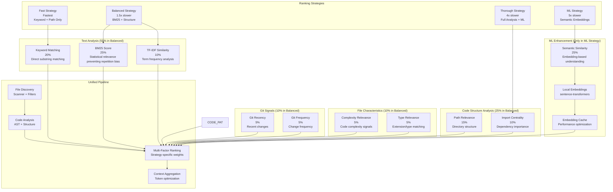
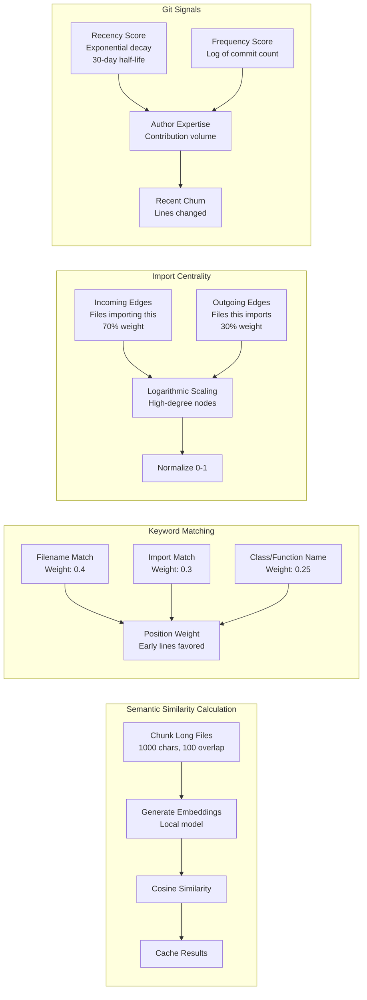

# Relevance Ranking System

## Unified Ranking Architecture

## Strategy Comparison

| Strategy | Speed | Accuracy | Use Cases | Factors Used |
|----------|-------|----------|-----------|--------------|
| **Fast** | Fastest | Basic | Quick file discovery | Keyword (60%), Path (30%), File type (10%) |
| **Balanced** | 1.5x slower | Good | **DEFAULT** Production usage | BM25 (25%), Keyword (20%), Path (15%), TF-IDF (10%), Import (10%), Git (10%), Complexity (5%), Type (5%) |
| **Thorough** | 4x slower | High | Complex codebases | All balanced factors + enhanced analysis |
| **ML** | 5x slower | Highest | Semantic search | Embeddings (25%) + all thorough factors |

## Factor Calculation Details

