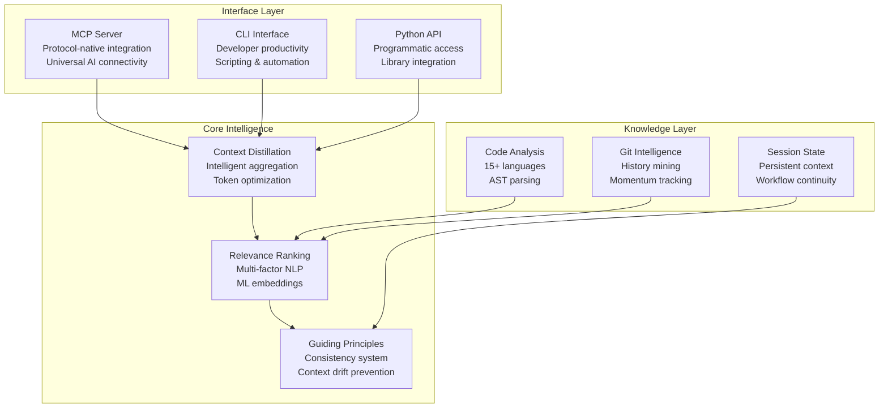
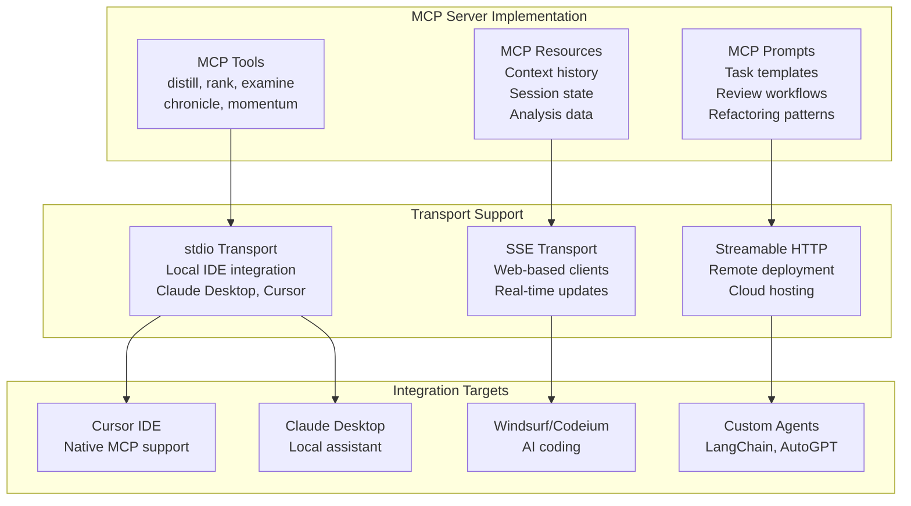
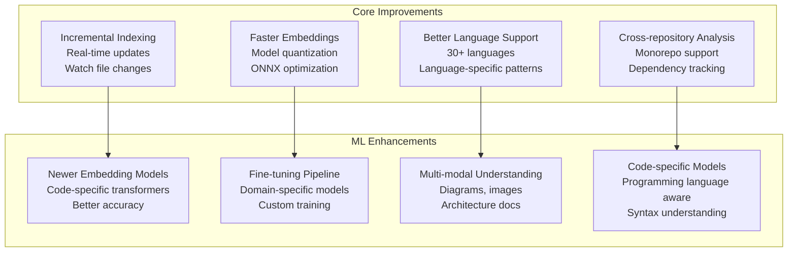
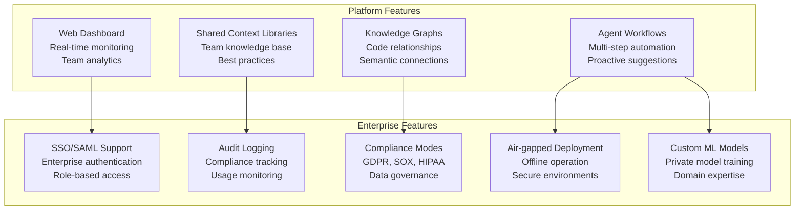
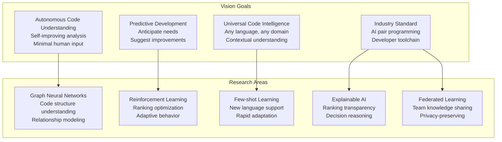
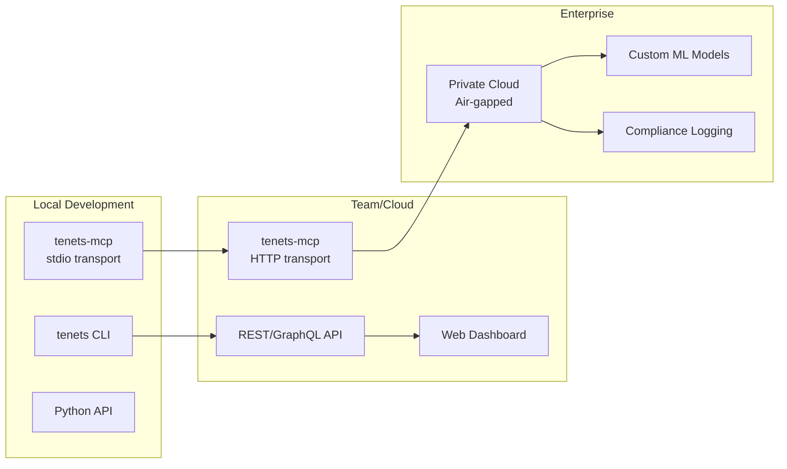

# Future Roadmap & Vision

Tenets is designed as a **protocol-native code intelligence platform**. The Model Context Protocol (MCP) serves as the foundational communication layer, enabling tenets to integrate seamlessly with any AI coding assistant, agent framework, or development environment.

## Strategic Vision

## Phase 1: MCP Foundation (Current)

The MCP server is the primary integration point for AI coding assistants including Cursor, Claude Desktop, Windsurf, Codex CLI, and custom AI agents.

### MCP Tools Roadmap

| Tool | Status | Description |
|------|--------|-------------|
| `distill` | ✅ Core | Intelligent context extraction |
| `rank_files` | ✅ Core | File relevance ranking |
| `examine` | ✅ Core | Codebase analysis |
| `chronicle` | ✅ Core | Git history analysis |
| `momentum` | ✅ Core | Velocity tracking |
| `session_create` | 🔄 Planning | Session management |
| `session_pin` | 🔄 Planning | File pinning |
| `tenet_add` | 🔄 Planning | Guiding principles |
| `viz_dependencies` | 🔄 Planning | Dependency graphs |

## Phase 2: Enhanced Intelligence

## Phase 3: Platform & Enterprise

## Long Term Vision

Tenets aims to become the **industry standard for AI-powered code intelligence** - the essential context layer between codebases and AI assistants.

## Deployment Architecture

## Integration Ecosystem

| Platform | Integration Type | Status |
|----------|-----------------|--------|
| **Cursor** | Native MCP | 🔄 Planning |
| **Claude Desktop** | MCP Server | 🔄 Planning |
| **Windsurf** | MCP/API | 🔄 Planning |
| **VS Code** | Extension + MCP | 📋 Roadmap |
| **JetBrains** | Plugin + MCP | 📋 Roadmap |
| **Codex CLI** | MCP Client | 📋 Roadmap |
| **LangChain** | Tool Integration | 📋 Roadmap |
| **AutoGPT** | MCP Server | 📋 Roadmap |

---

*For detailed MCP integration specifications, see [MCP Integration Plan](mcp-integration-plan.md).*