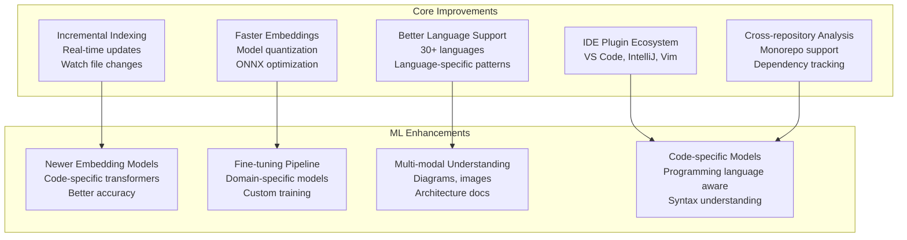
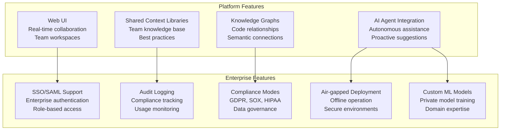
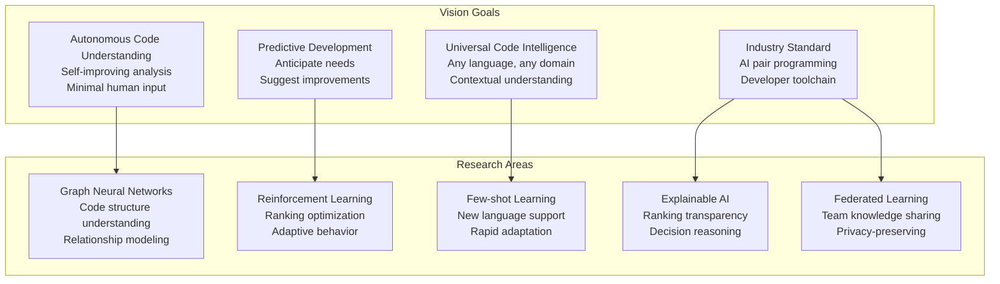

# Future Roadmap & Vision

## Near Term

```mermaid
graph TB
    subgraph "Core Improvements"
        INCREMENTAL[Incremental Indexing<br/>Real-time updates<br/>Watch file changes]
        FASTER_EMBED[Faster Embeddings<br/>Model quantization<br/>ONNX optimization]
        LANGUAGE_SUP[Better Language Support<br/>30+ languages<br/>Language-specific patterns]
        IDE_PLUGINS[IDE Plugin Ecosystem<br/>VS Code, IntelliJ, Vim]
        CROSS_REPO[Cross-repository Analysis<br/>Monorepo support<br/>Dependency tracking]
    end

    subgraph "ML Enhancements"
        NEWER_MODELS[Newer Embedding Models<br/>Code-specific transformers<br/>Better accuracy]
        FINE_TUNING[Fine-tuning Pipeline<br/>Domain-specific models<br/>Custom training]
        MULTIMODAL[Multi-modal Understanding<br/>Diagrams, images<br/>Architecture docs]
        CODE_TRANSFORMERS[Code-specific Models<br/>Programming language aware<br/>Syntax understanding]
    end

    INCREMENTAL --> NEWER_MODELS
    FASTER_EMBED --> FINE_TUNING
    LANGUAGE_SUP --> MULTIMODAL
    IDE_PLUGINS --> CODE_TRANSFORMERS
    CROSS_REPO --> CODE_TRANSFORMERS
```

## Medium Term

```mermaid
graph TB
    subgraph "Platform Features"
        WEB_UI[Web UI<br/>Real-time collaboration<br/>Team workspaces]
        SHARED_CONTEXT[Shared Context Libraries<br/>Team knowledge base<br/>Best practices]
        KNOWLEDGE_GRAPHS[Knowledge Graphs<br/>Code relationships<br/>Semantic connections]
        AI_AGENTS[AI Agent Integration<br/>Autonomous assistance<br/>Proactive suggestions]
    end

    subgraph "Enterprise Features"
        SSO[SSO/SAML Support<br/>Enterprise authentication<br/>Role-based access]
        AUDIT[Audit Logging<br/>Compliance tracking<br/>Usage monitoring]
        COMPLIANCE[Compliance Modes<br/>GDPR, SOX, HIPAA<br/>Data governance]
        AIR_GAPPED[Air-gapped Deployment<br/>Offline operation<br/>Secure environments]
        CUSTOM_ML[Custom ML Models<br/>Private model training<br/>Domain expertise]
    end

    WEB_UI --> SSO
    SHARED_CONTEXT --> AUDIT
    KNOWLEDGE_GRAPHS --> COMPLIANCE
    AI_AGENTS --> AIR_GAPPED
    AI_AGENTS --> CUSTOM_ML
```

## Long Term Vision

```mermaid
graph TB
    subgraph "Vision Goals"
        AUTONOMOUS[Autonomous Code Understanding<br/>Self-improving analysis<br/>Minimal human input]
        PREDICTIVE[Predictive Development<br/>Anticipate needs<br/>Suggest improvements]
        UNIVERSAL[Universal Code Intelligence<br/>Any language, any domain<br/>Contextual understanding]
        INDUSTRY_STANDARD[Industry Standard<br/>AI pair programming<br/>Developer toolchain]
    end

    subgraph "Research Areas"
        GRAPH_NEURAL[Graph Neural Networks<br/>Code structure understanding<br/>Relationship modeling]
        REINFORCEMENT[Reinforcement Learning<br/>Ranking optimization<br/>Adaptive behavior]
        FEW_SHOT[Few-shot Learning<br/>New language support<br/>Rapid adaptation]
        EXPLAINABLE[Explainable AI<br/>Ranking transparency<br/>Decision reasoning]
        FEDERATED[Federated Learning<br/>Team knowledge sharing<br/>Privacy-preserving]
    end

    AUTONOMOUS --> GRAPH_NEURAL
    PREDICTIVE --> REINFORCEMENT
    UNIVERSAL --> FEW_SHOT
    INDUSTRY_STANDARD --> EXPLAINABLE
    INDUSTRY_STANDARD --> FEDERATED
```