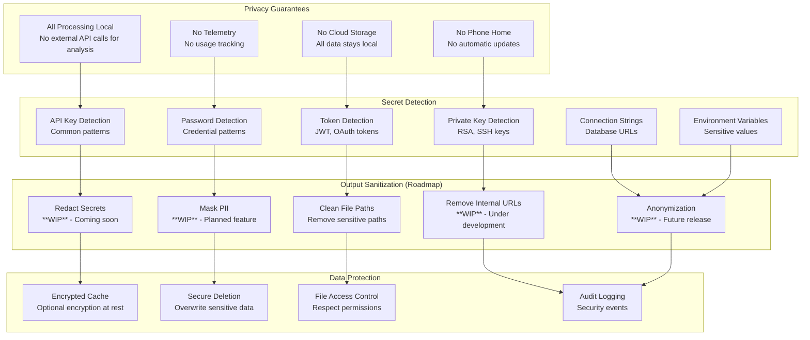

# Security & Privacy Architecture

## Local-First Security Model



## Secret Detection Patterns (Roadmap)

```mermaid
graph LR
    subgraph "Detection Methods"
        REGEX[Regex Patterns<br/>Known formats]
        ENTROPY[Entropy Analysis<br/>Random strings]
        CONTEXT[Context Analysis<br/>Variable names]
        KEYWORDS[Keyword Detection<br/>password, secret, key]
    end

    subgraph "Secret Types"
        AWS[AWS Access Keys<br/>AKIA...]
        GITHUB[GitHub Tokens<br/>ghp_, gho_]
        JWT[JWT Tokens<br/>eyJ pattern]
        RSA[RSA Private Keys<br/>-----BEGIN RSA]
        DATABASE[Database URLs<br/>postgres://, mysql://]
        GENERIC[Generic Secrets<br/>High entropy strings]
    end

    subgraph "Response Actions"
        FLAG[Flag for Review<br/>Warn user]
        REDACT_AUTO[Auto Redaction<br/>Replace with [REDACTED]]
        EXCLUDE[Exclude File<br/>Skip entirely]
        LOG[Security Log<br/>Record detection]
    end

    REGEX --> AWS
    ENTROPY --> GITHUB
    CONTEXT --> JWT
    KEYWORDS --> RSA

    AWS --> FLAG
    GITHUB --> REDACT_AUTO
    JWT --> EXCLUDE
    RSA --> LOG
    DATABASE --> LOG
    GENERIC --> FLAG
```