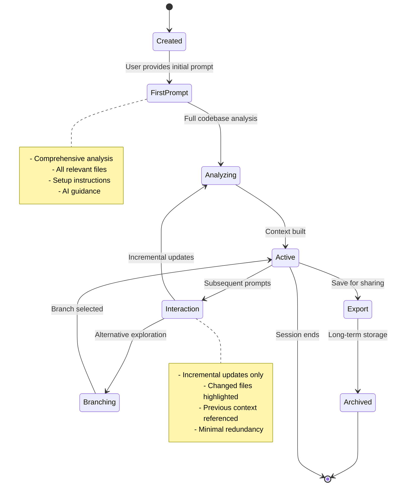
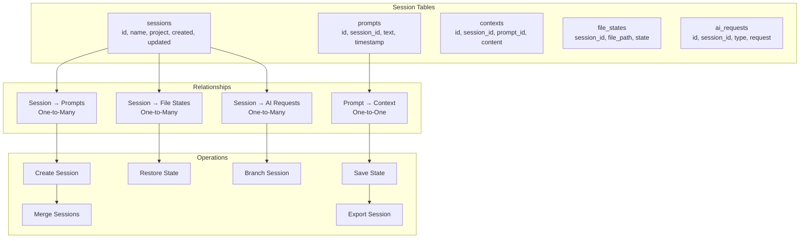

# Session Management Architecture

## Session Lifecycle Flow

```mermaid
stateDiagram-v2
    [*] --> Created
    Created --> FirstPrompt: User provides initial prompt
    FirstPrompt --> Analyzing: Full codebase analysis
    Analyzing --> Active: Context built
    Active --> Interaction: Subsequent prompts
    Interaction --> Analyzing: Incremental updates
    Interaction --> Branching: Alternative exploration
    Branching --> Active: Branch selected
    Active --> Export: Save for sharing
    Export --> Archived: Long-term storage
    Archived --> [*]
    Active --> [*]: Session ends

    note right of FirstPrompt
        - Comprehensive analysis
        - All relevant files
        - Setup instructions
        - AI guidance
    end note

    note right of Interaction
        - Incremental updates only
        - Changed files highlighted
        - Previous context referenced
        - Minimal redundancy
    end note
```

## Session Storage Architecture

```mermaid
graph TB
    subgraph "Session Tables"
        SESSIONS[sessions<br/>id, name, project, created, updated]
        PROMPTS[prompts<br/>id, session_id, text, timestamp]
        CONTEXTS[contexts<br/>id, session_id, prompt_id, content]
        FILE_STATES[file_states<br/>session_id, file_path, state]
        AI_REQUESTS[ai_requests<br/>id, session_id, type, request]
    end

    subgraph "Relationships"
        SESSION_PROMPT[Session → Prompts<br/>One-to-Many]
        PROMPT_CONTEXT[Prompt → Context<br/>One-to-One]
        SESSION_FILES[Session → File States<br/>One-to-Many]
        SESSION_AI[Session → AI Requests<br/>One-to-Many]
    end

    subgraph "Operations"
        CREATE[Create Session]
        SAVE[Save State]
        RESTORE[Restore State]
        BRANCH[Branch Session]
        MERGE[Merge Sessions]
        EXPORT[Export Session]
    end

    SESSIONS --> SESSION_PROMPT
    SESSIONS --> SESSION_FILES
    SESSIONS --> SESSION_AI
    PROMPTS --> PROMPT_CONTEXT

    SESSION_PROMPT --> CREATE
    PROMPT_CONTEXT --> SAVE
    SESSION_FILES --> RESTORE
    SESSION_AI --> BRANCH
    CREATE --> MERGE
    SAVE --> EXPORT
```