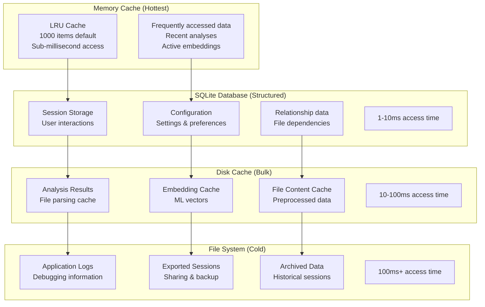
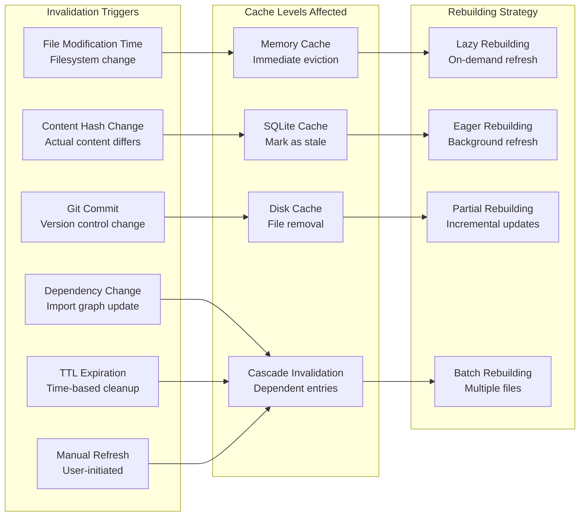

# Storage & Caching Architecture

## Storage Hierarchy

```mermaid
graph TB
    subgraph "Memory Cache (Hottest)"
        LRU[LRU Cache<br/>1000 items default<br/>Sub-millisecond access]
        HOT_DATA[Frequently accessed data<br/>Recent analyses<br/>Active embeddings]
    end

    subgraph "SQLite Database (Structured)"
        SESSIONS_DB[Session Storage<br/>User interactions]
        CONFIG_DB[Configuration<br/>Settings & preferences]
        RELATIONS[Relationship data<br/>File dependencies]
        PERF[1-10ms access time]
    end

    subgraph "Disk Cache (Bulk)"
        ANALYSIS[Analysis Results<br/>File parsing cache]
        EMBEDDINGS[Embedding Cache<br/>ML vectors]
        FILE_CONTENT[File Content Cache<br/>Preprocessed data]
        BULK_PERF[10-100ms access time]
    end

    subgraph "File System (Cold)"
        LOGS[Application Logs<br/>Debugging information]
        EXPORTS[Exported Sessions<br/>Sharing & backup]
        ARCHIVES[Archived Data<br/>Historical sessions]
        COLD_PERF[100ms+ access time]
    end

    LRU --> SESSIONS_DB
    HOT_DATA --> CONFIG_DB

    SESSIONS_DB --> ANALYSIS
    CONFIG_DB --> EMBEDDINGS
    RELATIONS --> FILE_CONTENT

    ANALYSIS --> LOGS
    EMBEDDINGS --> EXPORTS
    FILE_CONTENT --> ARCHIVES
```

## Cache Invalidation Strategy

```mermaid
graph LR
    subgraph "Invalidation Triggers"
        FILE_MTIME[File Modification Time<br/>Filesystem change]
        CONTENT_HASH[Content Hash Change<br/>Actual content differs]
        GIT_COMMIT[Git Commit<br/>Version control change]
        DEP_CHANGE[Dependency Change<br/>Import graph update]
        TTL_EXPIRE[TTL Expiration<br/>Time-based cleanup]
        MANUAL[Manual Refresh<br/>User-initiated]
    end

    subgraph "Cache Levels Affected"
        MEMORY_INV[Memory Cache<br/>Immediate eviction]
        SQLITE_INV[SQLite Cache<br/>Mark as stale]
        DISK_INV[Disk Cache<br/>File removal]
        CASCADE[Cascade Invalidation<br/>Dependent entries]
    end

    subgraph "Rebuilding Strategy"
        LAZY[Lazy Rebuilding<br/>On-demand refresh]
        EAGER[Eager Rebuilding<br/>Background refresh]
        PARTIAL[Partial Rebuilding<br/>Incremental updates]
        BATCH[Batch Rebuilding<br/>Multiple files]
    end

    FILE_MTIME --> MEMORY_INV
    CONTENT_HASH --> SQLITE_INV
    GIT_COMMIT --> DISK_INV
    DEP_CHANGE --> CASCADE
    TTL_EXPIRE --> CASCADE
    MANUAL --> CASCADE

    MEMORY_INV --> LAZY
    SQLITE_INV --> EAGER
    DISK_INV --> PARTIAL
    CASCADE --> BATCH
```