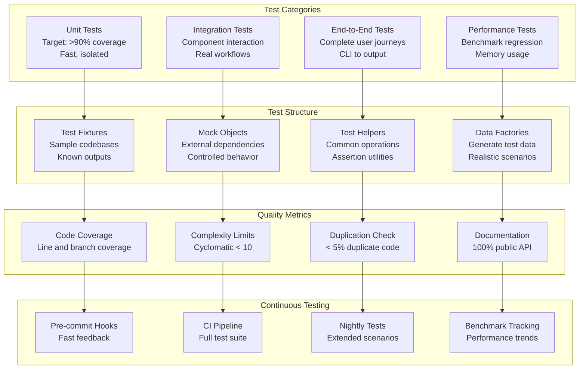
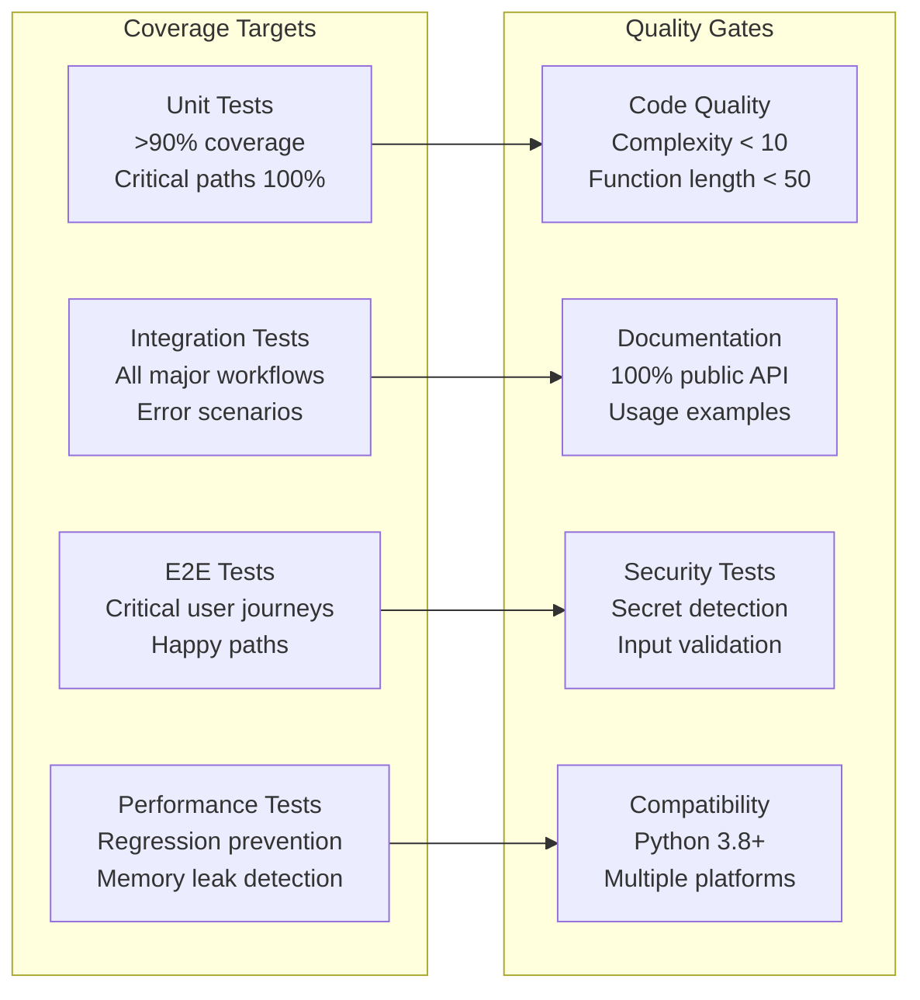

# Testing & Quality Assurance

## Test Architecture

```mermaid
graph TB
    subgraph "Test Categories"
        UNIT[Unit Tests<br/>Target: >90% coverage<br/>Fast, isolated]
        INTEGRATION[Integration Tests<br/>Component interaction<br/>Real workflows]
        E2E[End-to-End Tests<br/>Complete user journeys<br/>CLI to output]
        PERFORMANCE[Performance Tests<br/>Benchmark regression<br/>Memory usage]
    end

    subgraph "Test Structure"
        FIXTURES[Test Fixtures<br/>Sample codebases<br/>Known outputs]
        MOCKS[Mock Objects<br/>External dependencies<br/>Controlled behavior]
        HELPERS[Test Helpers<br/>Common operations<br/>Assertion utilities]
        FACTORIES[Data Factories<br/>Generate test data<br/>Realistic scenarios]
    end

    subgraph "Quality Metrics"
        COVERAGE[Code Coverage<br/>Line and branch coverage]
        COMPLEXITY[Complexity Limits<br/>Cyclomatic < 10]
        DUPLICATION[Duplication Check<br/>< 5% duplicate code]
        DOCUMENTATION[Documentation<br/>100% public API]
    end

    subgraph "Continuous Testing"
        PRE_COMMIT[Pre-commit Hooks<br/>Fast feedback]
        CI_PIPELINE[CI Pipeline<br/>Full test suite]
        NIGHTLY[Nightly Tests<br/>Extended scenarios]
        BENCHMARKS[Benchmark Tracking<br/>Performance trends]
    end

    UNIT --> FIXTURES
    INTEGRATION --> MOCKS
    E2E --> HELPERS
    PERFORMANCE --> FACTORIES

    FIXTURES --> COVERAGE
    MOCKS --> COMPLEXITY
    HELPERS --> DUPLICATION
    FACTORIES --> DOCUMENTATION

    COVERAGE --> PRE_COMMIT
    COMPLEXITY --> CI_PIPELINE
    DUPLICATION --> NIGHTLY
    DOCUMENTATION --> BENCHMARKS
```

## Test Coverage Requirements

```mermaid
graph LR
    subgraph "Coverage Targets"
        UNIT_COV[Unit Tests<br/>>90% coverage<br/>Critical paths 100%]
        INTEGRATION_COV[Integration Tests<br/>All major workflows<br/>Error scenarios]
        E2E_COV[E2E Tests<br/>Critical user journeys<br/>Happy paths]
        PERF_COV[Performance Tests<br/>Regression prevention<br/>Memory leak detection]
    end

    subgraph "Quality Gates"
        CODE_QUALITY[Code Quality<br/>Complexity < 10<br/>Function length < 50]
        DOCUMENTATION[Documentation<br/>100% public API<br/>Usage examples]
        SECURITY[Security Tests<br/>Secret detection<br/>Input validation]
        COMPATIBILITY[Compatibility<br/>Python 3.8+<br/>Multiple platforms]
    end

    UNIT_COV --> CODE_QUALITY
    INTEGRATION_COV --> DOCUMENTATION
    E2E_COV --> SECURITY
    PERF_COV --> COMPATIBILITY
```