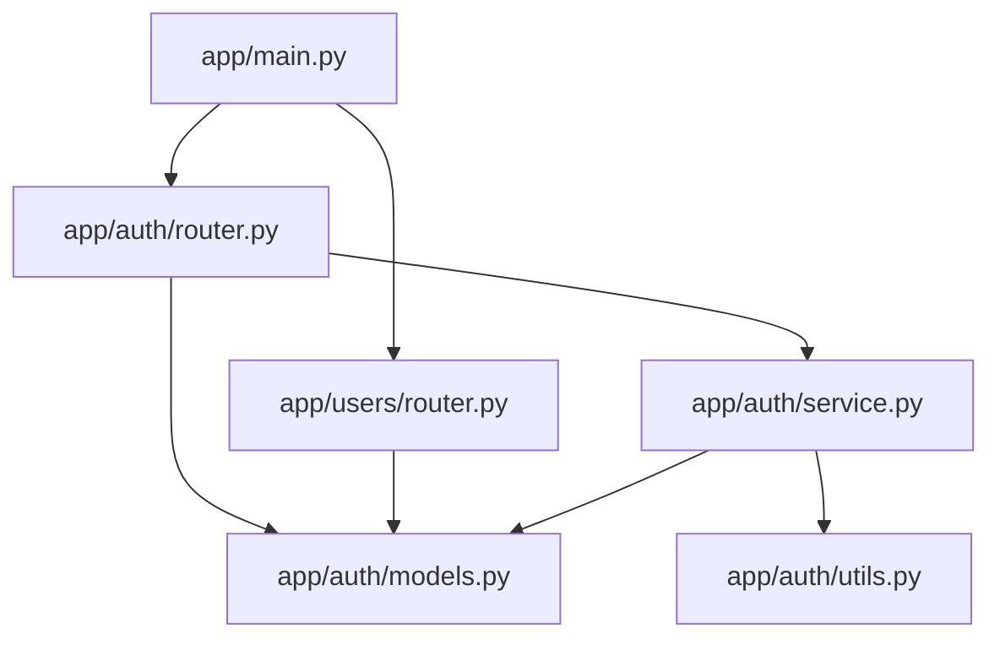

<script type="application/ld+json">
{
  "@context": "https://schema.org",
  "@type": "Article",
  "headline": "Why Context Is Everything in AI Coding",
  "description": "Why LLM code quality depends on context quality. BM25 ranking, token budgets, and how Tenets MCP server solves context for AI coding assistants.",
  "author": {
    "@type": "Person",
    "name": "Johnny Dunn",
    "url": "https://jddunn.github.io"
  },
  "publisher": {
    "@type": "Organization",
    "name": "manic.agency",
    "logo": {
      "@type": "ImageObject",
      "url": "https://tenets.dev/logos/tenets_dark_icon_transparent_cropped.png"
    }
  },
  "datePublished": "2024-09-15",
  "dateModified": "2024-12-07",
  "mainEntityOfPage": "https://tenets.dev/blog/why-context-matters/",
  "image": "https://tenets.dev/assets/og-image.png",
  "keywords": ["AI coding", "LLM context", "BM25", "code ranking", "MCP server", "Tenets"]
}
</script>

# Why Context Is Everything in AI Coding

**Author:** Johnny Dunn | **Date:** September 15, 2024

---

## The Context Problem

When you ask an LLM to write code, it generates tokens based on probability distributions conditioned on its input. The model has no access to your filesystem, your git history, or your architectural decisions—it only sees what's in the context window.

This creates two problems:

1. **Knowledge gaps**: The model fills missing information with generic training data patterns
2. **Context drift**: In long conversations, the model forgets earlier instructions and coding standards

Tenets addresses both: intelligent code context (finding relevant files) and automatic tenets injection (your guiding principles in every prompt).

```python
# You ask: "Add a user authentication endpoint"

# Without context, the LLM might generate:
from flask import Flask  # You use FastAPI
import bcrypt  # You use argon2
from sqlalchemy import create_engine  # You use async SQLAlchemy

# With proper context, it generates:
from fastapi import APIRouter, Depends  # Matches your stack
from app.auth.argon2 import hash_password  # Uses your utility
from app.db.session import get_async_session  # Your DB pattern
```

The difference isn't AI capability—it's **input quality**.

---

## The Math: Why Random File Selection Fails

Consider a 50,000-file codebase with a 128k token context window. Naive approaches fail mathematically:

### Random Selection

If you randomly select files until hitting the token budget:

- **P(relevant file)** ≈ 50/50,000 = 0.1%
- **Expected relevant files in 100 selected**: ~0.1 files
- **Result**: Context filled with irrelevant code

### Keyword Matching Only

Simple substring matching has precision problems:

```python
# Query: "authentication"
# Matches:
"authentication.py"           # ✓ Relevant
"test_authentication.py"       # Maybe relevant
"old_authentication_backup.py" # ✗ Deprecated
"docs/authentication.md"       # ✗ Wrong type
"// TODO: add authentication"  # ✗ Comment noise
```

False positives dilute context quality.

### Why Multi-Factor Ranking Works

Tenets uses **BM25 + structural analysis + git signals** to compute relevance:

```
score(file) = 
    0.25 × BM25(query, file_content) +      # Statistical text relevance
    0.20 × keyword_match(query, file) +     # Direct term matching
    0.15 × path_relevance(query, file) +    # Directory structure signals
    0.10 × tfidf_similarity(query, file) +  # Term frequency analysis
    0.10 × import_centrality(file) +        # Dependency importance
    0.10 × git_signals(file) +              # Recency + frequency
    0.05 × complexity_relevance(file) +     # Code complexity
    0.05 × type_relevance(query, file)      # File type matching
```

This multi-factor approach:

1. **Prevents repetition bias**: BM25 penalizes files that repeat terms without adding information
2. **Captures structure**: Import centrality finds files that are "hubs" in your dependency graph
3. **Prioritizes freshness**: Git signals weight recently-modified, frequently-changed files

---

## Token Budgets: The Constraint That Shapes Everything

LLMs have hard context limits. Even GPT-4's 128k tokens fills fast:

| Content Type | Tokens/File (avg) | Files in 100k |
|--------------|-------------------|---------------|
| Python modules | 800-1500 | 65-125 |
| TypeScript files | 600-1200 | 80-165 |
| Config files | 100-300 | 300+ |
| Test files | 1000-2000 | 50-100 |

**The problem**: You can't include everything. You must **rank and select**.

### Intelligent Truncation

When a file is relevant but too large, naive truncation loses signal:

```python
# Bad: First N tokens (loses the important parts)
def helper_one():
    pass

def helper_two():
    pass

# ... truncated at 500 tokens ...
# MISSED: The actual authenticate() function at line 400
```

Tenets preserves structure through intelligent summarization:

```python
# Good: Signature + docstring + key blocks
def authenticate(username: str, password: str) -> AuthResult:
    """
    Authenticate user credentials against database.
    Returns AuthResult with user data or error details.
    """
    # Implementation: 45 lines - validates credentials
    # Uses: app.auth.argon2.verify_password
    # Raises: AuthenticationError, RateLimitError
```

---

## Real Example: Debugging Authentication

Let's trace how context quality affects a real task.

**Task**: "Fix the bug where users can't reset passwords"

### Without Intelligent Context

The LLM sees random files or keyword matches:

```
Context (keyword "password"):
- docs/security-policy.md (mentions "password" 20x)
- scripts/generate_test_passwords.py
- migrations/0001_add_password_hash.sql
- tests/test_password_validation.py
```

Result: The LLM hallucinates a solution based on generic patterns.

### With Tenets Context

```bash
tenets distill "fix password reset bug" --mode balanced
```

Tenets analyzes:
1. **Query understanding**: Extracts keywords `password`, `reset`, `bug`
2. **BM25 ranking**: Scores files by statistical relevance
3. **Import graph**: Finds files that import/export password utilities
4. **Git signals**: Prioritizes recently-modified auth files

```
Context (ranked by relevance):
1. app/auth/password_reset.py      (0.89) - Reset logic
2. app/auth/token_manager.py       (0.76) - Token generation
3. app/models/user.py              (0.71) - User model
4. app/email/templates/reset.html  (0.65) - Email template
5. tests/auth/test_reset.py        (0.61) - Existing tests
```

The LLM now sees **exactly the code it needs**.

---

## The Import Centrality Signal

One of Tenets' most powerful signals is **import centrality**—measuring how "central" a file is in your dependency graph.



Files imported by many others (like `app/auth/models.py`) are **architectural keystones**. Including them gives the LLM understanding of shared data structures.

Centrality calculation:

```python
def import_centrality(file: Path, graph: ImportGraph) -> float:
    """PageRank-style centrality for import graph."""
    in_degree = len(graph.importers_of(file))
    out_degree = len(graph.imports_of(file))
    total_files = len(graph.all_files())
    
    return (in_degree + 0.5 * out_degree) / total_files
```

---

## Session State: Context Across Interactions

Coding isn't one-shot—it's iterative. Tenets maintains session state:

```bash
# Create a session for your feature work
tenets session create auth-refactor

# Pin files you'll reference repeatedly
tenets session pin src/auth/ --session auth-refactor

# Add guiding principles
tenets tenet add "Use argon2 for all password hashing" --session auth-refactor
tenets tenet add "All endpoints require rate limiting" --priority high

# Every distill now includes pinned files + tenets
tenets distill "add MFA support" --session auth-refactor
```

Your context compounds across the session.

---

## Practical Configuration

### Mode Selection

| Task | Mode | Why |
|------|------|-----|
| Quick question | `fast` | Keyword + path only, <1s |
| Feature development | `balanced` | Full NLP pipeline, ~3s |
| Major refactoring | `thorough` | Deep analysis + ML, ~10s |

### Token Budget Tuning

```yaml
# .tenets.yml
context:
  max_tokens: 100000  # Default: fits most models
  reserve_tokens: 10000  # Leave room for response
  
ranking:
  algorithm: balanced
  threshold: 0.1  # Minimum relevance score
  use_git: true  # Include git signals
```

---

## Key Takeaways

1. **Context quality determines output quality**—not model capability alone
2. **Multi-factor ranking** outperforms keyword matching for code relevance
3. **Token budgets require intelligent selection**, not random sampling
4. **Import centrality** identifies architectural keystones
5. **Automatic tenets injection** prevents context drift in long conversations
6. **Session state** compounds context across interactions

---

*Ready to try intelligent context?*

```bash
pip install tenets[mcp]
tenets distill "your task" --copy
```

See the [Architecture Documentation](../ARCHITECTURE.md) for the full technical breakdown.

---

## Related Posts

- [Model Context Protocol Explained](mcp-explained.md)
- [Setting Up Tenets with Cursor and Claude](cursor-claude-setup.md)

---

<div style="text-align: center; padding: 2rem; margin-top: 2rem; background: rgba(245, 158, 11, 0.05); border-radius: 12px;">
  <p>Built by <a href="https://manic.agency" target="_blank">manic.agency</a></p>
  <a href="https://manic.agency/contact" style="color: #f59e0b;">Need custom AI tooling? →</a>
</div>
