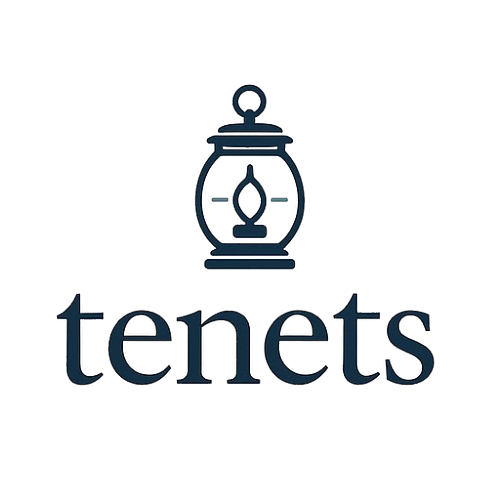

<div class="victorian-hero">
  <div class="lantern-container">
    <div class="lantern-glow"></div>
    
  </div>
  <h1 class="hero-title">
    <span class="typewriter" data-text="tenets"></span>
  </h1>
  <p class="hero-tagline">MCP server for context that feeds your prompts</p>
  <p class="hero-subtitle">Intelligent code context + automatic guiding principles injection</p>

  <!-- Single install command -->
  <div class="hero-install">
    <code>pip install tenets[mcp]</code>
    <button class="copy-btn-inline" data-clipboard-text="pip install tenets[mcp]" aria-label="Copy">
      <svg viewBox="0 0 16 16" width="14" height="14"><path fill="currentColor" d="M13 0H6a2 2 0 0 0-2 2 2 2 0 0 0-2 2v10a2 2 0 0 0 2 2h7a2 2 0 0 0 2-2 2 2 0 0 0 2-2V2a2 2 0 0 0-2-2zm0 13V4a2 2 0 0 0-2-2H5a1 1 0 0 1 1-1h7a1 1 0 0 1 1 1v10a1 1 0 0 1-1 1zM3 4a1 1 0 0 1 1-1h7a1 1 0 0 1 1 1v10a1 1 0 0 1-1 1H4a1 1 0 0 1-1-1V4z"/></svg>
    </button>
  </div>

  <!-- Feature bullets -->
  <div class="hero-features">
    <div class="feature-line">
      <span class="feature-icon">✦</span>
      <span><strong>Intelligent Context</strong> — BM25 + TF-IDF + import graphs find the right files automatically</span>
    </div>
    <div class="feature-line">
      <span class="feature-icon">✦</span>
      <span><strong>Guiding Principles</strong> — Inject tenets automatically into every prompt for consistency</span>
    </div>
    <div class="feature-line">
      <span class="feature-icon">✦</span>
      <span><strong>100% Local MCP</strong> — Native Cursor, Claude, Windsurf, VS Code integration. Your code never leaves your machine</span>
    </div>
  </div>

  <div class="hero-actions">
    <a href="https://marketplace.visualstudio.com/items?itemName=ManicAgency.tenets-mcp-server" class="btn-primary" target="_blank">
      <span class="btn-icon">
        <svg viewBox="0 0 24 24" width="20" height="20" fill="#fff">
          <path d="M23.15 2.587L18.21.21a1.494 1.494 0 0 0-1.705.29l-9.46 8.63-4.12-3.128a.999.999 0 0 0-1.276.057L.327 7.261A1 1 0 0 0 .326 8.74L3.899 12 .326 15.26a1 1 0 0 0 .001 1.479L1.65 17.94a.999.999 0 0 0 1.276.057l4.12-3.128 9.46 8.63a1.492 1.492 0 0 0 1.704.29l4.942-2.377A1.5 1.5 0 0 0 24 20.06V3.939a1.5 1.5 0 0 0-.85-1.352zm-5.146 14.861L10.826 12l7.178-5.448v10.896z"/>
        </svg>
      </span>
      VS Code Extension
    </a>
    <a href="MCP/" class="btn-secondary">
      <span class="btn-icon">
        <svg viewBox="0 0 24 24" width="20" height="20" stroke="currentColor" stroke-width="2" fill="none">
          <circle cx="12" cy="12" r="4"/>
          <path d="M12 2v4M12 18v4M4.93 4.93l2.83 2.83M16.24 16.24l2.83 2.83M2 12h4M18 12h4"/>
        </svg>
      </span>
      Setup MCP
    </a>
    <a href="https://github.com/jddunn/tenets" class="btn-secondary">
      <span class="btn-icon">
        <svg class="github-icon" viewBox="0 0 24 24">
          <path d="M12 0c-6.626 0-12 5.373-12 12 0 5.302 3.438 9.8 8.207 11.387.599.111.793-.261.793-.577v-2.234c-3.338.726-4.033-1.416-4.033-1.416-.546-1.387-1.333-1.756-1.333-1.756-1.089-.745.083-.729.083-.729 1.205.084 1.839 1.237 1.839 1.237 1.07 1.834 2.807 1.304 3.492.997.107-.775.418-1.305.762-1.604-2.665-.305-5.467-1.334-5.467-5.931 0-1.311.469-2.381 1.236-3.221-.124-.303-.535-1.524.117-3.176 0 0 1.008-.322 3.301 1.23.957-.266 1.983-.399 3.003-.404 1.02.005 2.047.138 3.006.404 2.291-1.552 3.297-1.23 3.297-1.23.653 1.653.242 2.874.118 3.176.77.84 1.235 1.911 1.235 3.221 0 4.609-2.807 5.624-5.479 5.921.43.372.823 1.102.823 2.222v3.293c0 .319.192.694.801.576 4.765-1.589 8.199-6.086 8.199-11.386 0-6.627-5.373-12-12-12z"/>
        </svg>
      </span>
      GitHub
    </a>
  </div>

  <div class="terminal-showcase">
    <div class="terminal">
      <div class="terminal-header">
        <div class="terminal-buttons">
          <span class="terminal-button red"></span>
          <span class="terminal-button yellow"></span>
          <span class="terminal-button green"></span>
        </div>
        <div class="terminal-title">MCP in Action</div>
      </div>
      <div class="terminal-body">
        <pre><code class="language-bash"><span class="prompt">AI:</span> Using tenets to find authentication code...
<span class="output">📊 Ranked 847 files by relevance
📦 Selected top 12 (48,500 tokens)
🎯 Injected 3 guiding principles
✅ Context delivered</span>

<span class="prompt">AI:</span> Found these relevant files:
<span class="output">  • src/auth/service.py (score: 0.94)
  • src/auth/middleware.py (score: 0.87)
  • src/models/user.py (score: 0.82)
  
  Tenets applied: "Always validate JWT tokens",
  "Use bcrypt for password hashing"</span></code></pre>
      </div>
    </div>
  </div>
</div>

<!-- MCP-FIRST QUICKSTART -->
<div class="features-section">
  <div class="section-header">
    <div class="ornament left"></div>
    <h2>MCP Quickstart (recommended)</h2>
    <div class="ornament right"></div>
  </div>

  <div style="max-width: 1000px; margin: 0 auto;">
    <ol style="line-height: 1.8; padding-left: 1.5rem;">
      <li><code>pip install tenets[mcp]</code></li>
      <li><code>tenets-mcp</code> (stdio transport by default)</li>
      <li>Drop the JSON below into your IDE’s MCP config</li>
    </ol>

    <div style="display: grid; grid-template-columns: repeat(auto-fit, minmax(260px, 1fr)); gap: 1rem; margin-top: 1rem;">
      <div class="card">
        <h3>Claude Code (CLI)</h3>
        <pre><code class="language-bash">claude mcp add tenets -s user -- tenets-mcp</code></pre>
        <p style="font-size: 0.85em; opacity: 0.8; margin-top: 0.5rem;">Or add to <code>~/.claude.json</code></p>
      </div>
      <div class="card">
        <h3>Cursor</h3>
        <pre><code class="language-json">{
  "mcpServers": { "tenets": { "command": "tenets-mcp" } }
}</code></pre>
      </div>
      <div class="card">
        <h3>Claude Desktop</h3>
        <pre><code class="language-json">{
  "mcpServers": { "tenets": { "command": "tenets-mcp" } }
}</code></pre>
      </div>
      <div class="card">
        <h3>VS Code Extension</h3>
        <p style="font-size: 0.9em; margin-bottom: 0.5rem;">
          <strong><a href="https://marketplace.visualstudio.com/items?itemName=ManicAgency.tenets-mcp-server" target="_blank">Install from Marketplace</a></strong>
        </p>
        <p style="font-size: 0.85em; opacity: 0.8;">Auto-starts server + status indicator</p>
      </div>
    </div>

    <p style="text-align: center; margin-top: 1.2rem; opacity: 0.85;">
      Full MCP reference (tools, transports, error semantics): <a href="MCP/">tenets.dev/MCP/</a>
    </p>
  </div>
</div>

<!-- ═══════════════════════════════════════════════════════════════════════════ -->
<!-- MCP SETUP SECTION -->
<!-- ═══════════════════════════════════════════════════════════════════════════ -->

<div class="features-section">
  <div class="section-header">
    <div class="ornament left"></div>
    <h2>Quick Setup</h2>
    <div class="ornament right"></div>
  </div>

  <div style="max-width: 1000px; margin: 0 auto;">
    <table style="width: 100%; border-collapse: collapse; margin: 2rem 0;">
      <thead>
        <tr style="border-bottom: 2px solid rgba(245, 158, 11, 0.3);">
          <th style="text-align: left; padding: 1rem; width: 30%;">Platform</th>
          <th style="text-align: left; padding: 1rem;">Configuration</th>
        </tr>
      </thead>
      <tbody>
        <tr style="border-bottom: 1px solid rgba(245, 158, 11, 0.1);">
          <td style="padding: 1rem; vertical-align: top;">
            <strong style="color: #f59e0b;">Claude Code (CLI)</strong><br>
            <small style="opacity: 0.7;">~/.claude.json</small>
          </td>
          <td style="padding: 1rem;">

```bash
claude mcp add tenets -s user -- tenets-mcp
```

</td>
        </tr>
        <tr style="border-bottom: 1px solid rgba(245, 158, 11, 0.1);">
          <td style="padding: 1rem; vertical-align: top;">
            <strong style="color: #f59e0b;">Cursor</strong><br>
            <small style="opacity: 0.7;">Settings → MCP Servers</small>
          </td>
          <td style="padding: 1rem;">

```json
{ "tenets": { "command": "tenets-mcp" } }
```

</td>
        </tr>
        <tr style="border-bottom: 1px solid rgba(245, 158, 11, 0.1);">
          <td style="padding: 1rem; vertical-align: top;">
            <strong style="color: #f59e0b;">Claude Desktop (macOS App)</strong><br>
            <small style="opacity: 0.7;">claude_desktop_config.json</small>
          </td>
          <td style="padding: 1rem;">

```json
{ "mcpServers": { "tenets": { "command": "tenets-mcp" } } }
```

</td>
        </tr>
        <tr>
          <td style="padding: 1rem; vertical-align: top;">
            <strong style="color: #f59e0b;">Windsurf</strong><br>
            <small style="opacity: 0.7;">~/.windsurf/mcp.json</small>
          </td>
          <td style="padding: 1rem;">

```json
{ "tenets": { "command": "tenets-mcp" } }
```

</td>
        </tr>
      </tbody>
    </table>

    <p style="text-align: center; opacity: 0.8;">
      Then ask your AI: <em>"Use tenets to find the payment code"</em>
    </p>
  </div>
</div>

<!-- ═══════════════════════════════════════════════════════════════════════════ -->
<!-- MCP TOOLS TABLE -->
<!-- ═══════════════════════════════════════════════════════════════════════════ -->

<div class="workflow-section">
  <div class="section-header">
    <div class="ornament left"></div>
    <h2>MCP Tools</h2>
    <div class="ornament right"></div>
  </div>

  <div style="max-width: 1100px; margin: 0 auto;">
    <table style="width: 100%; border-collapse: collapse;">
      <thead>
        <tr style="border-bottom: 2px solid rgba(245, 158, 11, 0.3);">
          <th style="text-align: left; padding: 1rem;">Tool</th>
          <th style="text-align: left; padding: 1rem;">Purpose</th>
          <th style="text-align: left; padding: 1rem;">Example</th>
        </tr>
      </thead>
      <tbody>
        <tr style="border-bottom: 1px solid rgba(245, 158, 11, 0.1);">
          <td style="padding: 1rem;"><code style="color: #f59e0b;">distill</code></td>
          <td style="padding: 1rem;">Build optimized code context</td>
          <td style="padding: 1rem; opacity: 0.8;"><code>{"prompt": "implement OAuth"}</code></td>
        </tr>
        <tr style="border-bottom: 1px solid rgba(245, 158, 11, 0.1);">
          <td style="padding: 1rem;"><code style="color: #f59e0b;">rank_files</code></td>
          <td style="padding: 1rem;">Preview file relevance</td>
          <td style="padding: 1rem; opacity: 0.8;"><code>{"prompt": "auth bug", "top": 10}</code></td>
        </tr>
        <tr style="border-bottom: 1px solid rgba(245, 158, 11, 0.1);">
          <td style="padding: 1rem;"><code style="color: #f59e0b;">examine</code></td>
          <td style="padding: 1rem;">Analyze codebase structure</td>
          <td style="padding: 1rem; opacity: 0.8;"><code>{"path": "src/", "depth": 2}</code></td>
        </tr>
        <tr style="border-bottom: 1px solid rgba(245, 158, 11, 0.1);">
          <td style="padding: 1rem;"><code style="color: #f59e0b;">session_create</code></td>
          <td style="padding: 1rem;">Persistent context sessions</td>
          <td style="padding: 1rem; opacity: 0.8;"><code>{"name": "feature-auth"}</code></td>
        </tr>
        <tr style="border-bottom: 1px solid rgba(245, 158, 11, 0.1);">
          <td style="padding: 1rem;"><code style="color: #f59e0b;">session_pin_file</code></td>
          <td style="padding: 1rem;">Pin critical files</td>
          <td style="padding: 1rem; opacity: 0.8;"><code>{"path": "src/auth.py"}</code></td>
        </tr>
        <tr style="border-bottom: 1px solid rgba(245, 158, 11, 0.1);">
          <td style="padding: 1rem;"><code style="color: #f59e0b;">tenet_add</code></td>
          <td style="padding: 1rem;">Add coding guidelines</td>
          <td style="padding: 1rem; opacity: 0.8;"><code>{"content": "Use type hints"}</code></td>
        </tr>
        <tr style="border-bottom: 1px solid rgba(245, 158, 11, 0.1);">
          <td style="padding: 1rem;"><code style="color: #f59e0b;">chronicle</code></td>
          <td style="padding: 1rem;">Query git history</td>
          <td style="padding: 1rem; opacity: 0.8;"><code>{"since": "last week"}</code></td>
        </tr>
        <tr>
          <td style="padding: 1rem;"><code style="color: #f59e0b;">momentum</code></td>
          <td style="padding: 1rem;">Track development velocity</td>
          <td style="padding: 1rem; opacity: 0.8;"><code>{"period": "sprint"}</code></td>
        </tr>
      </tbody>
    </table>
    <p style="text-align: center; margin-top: 1.5rem;">
      <a href="MCP/#available-tools" style="color: #f59e0b;">See all 13 tools →</a>
    </p>
  </div>
</div>

<!-- ═══════════════════════════════════════════════════════════════════════════ -->
<!-- RANKING FACTORS -->
<!-- ═══════════════════════════════════════════════════════════════════════════ -->

<div class="features-section" style="background: linear-gradient(180deg, rgba(245, 158, 11, 0.02) 0%, transparent 100%);">
  <div class="section-header">
    <div class="ornament left"></div>
    <h2>Ranking Intelligence</h2>
    <div class="ornament right"></div>
  </div>

  <div style="max-width: 900px; margin: 0 auto;">
    <table style="width: 100%; border-collapse: collapse;">
      <thead>
        <tr style="border-bottom: 2px solid rgba(245, 158, 11, 0.3);">
          <th style="text-align: left; padding: 1rem;">Signal</th>
          <th style="text-align: center; padding: 1rem;">Weight</th>
          <th style="text-align: left; padding: 1rem;">Description</th>
        </tr>
      </thead>
      <tbody>
        <tr style="border-bottom: 1px solid rgba(245, 158, 11, 0.1);">
          <td style="padding: 0.75rem;"><strong>BM25 Score</strong></td>
          <td style="padding: 0.75rem; text-align: center;">25%</td>
          <td style="padding: 0.75rem; opacity: 0.85;">Statistical text relevance, prevents repetition bias</td>
        </tr>
        <tr style="border-bottom: 1px solid rgba(245, 158, 11, 0.1);">
          <td style="padding: 0.75rem;"><strong>Keyword Match</strong></td>
          <td style="padding: 0.75rem; text-align: center;">20%</td>
          <td style="padding: 0.75rem; opacity: 0.85;">Direct substring matching with position weighting</td>
        </tr>
        <tr style="border-bottom: 1px solid rgba(245, 158, 11, 0.1);">
          <td style="padding: 0.75rem;"><strong>Path Relevance</strong></td>
          <td style="padding: 0.75rem; text-align: center;">15%</td>
          <td style="padding: 0.75rem; opacity: 0.85;">Directory structure and file naming patterns</td>
        </tr>
        <tr style="border-bottom: 1px solid rgba(245, 158, 11, 0.1);">
          <td style="padding: 0.75rem;"><strong>TF-IDF</strong></td>
          <td style="padding: 0.75rem; text-align: center;">10%</td>
          <td style="padding: 0.75rem; opacity: 0.85;">Term frequency-inverse document frequency</td>
        </tr>
        <tr style="border-bottom: 1px solid rgba(245, 158, 11, 0.1);">
          <td style="padding: 0.75rem;"><strong>Import Centrality</strong></td>
          <td style="padding: 0.75rem; text-align: center;">10%</td>
          <td style="padding: 0.75rem; opacity: 0.85;">Position in dependency graph</td>
        </tr>
        <tr style="border-bottom: 1px solid rgba(245, 158, 11, 0.1);">
          <td style="padding: 0.75rem;"><strong>Git Recency</strong></td>
          <td style="padding: 0.75rem; text-align: center;">5%</td>
          <td style="padding: 0.75rem; opacity: 0.85;">Recently modified files ranked higher</td>
        </tr>
        <tr style="border-bottom: 1px solid rgba(245, 158, 11, 0.1);">
          <td style="padding: 0.75rem;"><strong>Change Frequency</strong></td>
          <td style="padding: 0.75rem; text-align: center;">5%</td>
          <td style="padding: 0.75rem; opacity: 0.85;">Hot files with frequent commits</td>
        </tr>
        <tr style="border-bottom: 1px solid rgba(245, 158, 11, 0.1);">
          <td style="padding: 0.75rem;"><strong>Complexity</strong></td>
          <td style="padding: 0.75rem; text-align: center;">5%</td>
          <td style="padding: 0.75rem; opacity: 0.85;">Cyclomatic and cognitive complexity</td>
        </tr>
        <tr>
          <td style="padding: 0.75rem;"><strong>Type Relevance</strong></td>
          <td style="padding: 0.75rem; text-align: center;">5%</td>
          <td style="padding: 0.75rem; opacity: 0.85;">File type matching task intent</td>
        </tr>
      </tbody>
    </table>
  </div>

  <!-- Ranking Modes -->
  <div style="max-width: 900px; margin: 3rem auto 0;">
    <h3 style="text-align: center; margin-bottom: 1.5rem;">Three Ranking Modes</h3>
    <div style="display: grid; grid-template-columns: repeat(3, 1fr); gap: 1.5rem;">
      <div class="feature-card neumorphic" style="text-align: center;">
        <h4 style="color: #f59e0b; margin-bottom: 0.5rem;">Fast</h4>
        <p style="font-size: 0.9rem; opacity: 0.85; margin: 0;">Keyword & path matching<br><strong>&lt; 1 second</strong></p>
      </div>
      <div class="feature-card neumorphic" style="text-align: center; border: 1px solid rgba(245, 158, 11, 0.3);">
        <h4 style="color: #f59e0b; margin-bottom: 0.5rem;">Balanced ★</h4>
        <p style="font-size: 0.9rem; opacity: 0.85; margin: 0;">BM25 + structure analysis<br><strong>~3 seconds</strong></p>
      </div>
      <div class="feature-card neumorphic" style="text-align: center;">
        <h4 style="color: #f59e0b; margin-bottom: 0.5rem;">Thorough</h4>
        <p style="font-size: 0.9rem; opacity: 0.85; margin: 0;">ML embeddings + patterns<br><strong>~10 seconds</strong></p>
      </div>
    </div>
  </div>
</div>

<!-- ═══════════════════════════════════════════════════════════════════════════ -->
<!-- PIPELINE -->
<!-- ═══════════════════════════════════════════════════════════════════════════ -->

<div class="workflow-section">
  <div class="section-header">
    <div class="ornament left"></div>
    <h2>How It Works</h2>
    <div class="ornament right"></div>
  </div>

  <div class="workflow-diagram">
    <div class="workflow-step">
      <div class="step-number">1</div>
      <h4>Parse</h4>
      <p>NLP extracts intent & keywords</p>
    </div>
    <div class="workflow-arrow">→</div>
    <div class="workflow-step">
      <div class="step-number">2</div>
      <h4>Scan</h4>
      <p>Parallel file discovery</p>
    </div>
    <div class="workflow-arrow">→</div>
    <div class="workflow-step">
      <div class="step-number">3</div>
      <h4>Analyze</h4>
      <p>AST & dependency graphs</p>
    </div>
    <div class="workflow-arrow">→</div>
    <div class="workflow-step">
      <div class="step-number">4</div>
      <h4>Rank</h4>
      <p>Multi-factor scoring</p>
    </div>
    <div class="workflow-arrow">→</div>
    <div class="workflow-step">
      <div class="step-number">5</div>
      <h4>Output</h4>
      <p>Token-aware aggregation</p>
    </div>
  </div>

  <!-- Detailed Pipeline Cards -->
  <div style="display: grid; grid-template-columns: repeat(auto-fit, minmax(300px, 1fr)); gap: 1.5rem; max-width: 1200px; margin: 3rem auto 0;">
    
    <div class="feature-card neumorphic">
      <h4 style="color: #f59e0b; margin-top: 0;">📝 Input & Parsing</h4>
      <ul style="margin: 0; padding-left: 1.25rem; font-size: 0.9rem; line-height: 1.7;">
        <li>Natural language processing extracts intent</li>
        <li>Temporal parsing ("last week", "since Monday")</li>
        <li>GitHub/JIRA/Linear reference detection</li>
        <li>Intent classification (implement, debug, refactor)</li>
        <li>Auto include/exclude test files</li>
      </ul>
    </div>

    <div class="feature-card neumorphic">
      <h4 style="color: #f59e0b; margin-top: 0;">🔍 Scan & Discover</h4>
      <ul style="margin: 0; padding-left: 1.25rem; font-size: 0.9rem; line-height: 1.7;">
        <li>Parallel file discovery</li>
        <li>Respects .gitignore and custom filters</li>
        <li>Language detection for 15+ languages</li>
        <li>Incremental caching for speed</li>
      </ul>
    </div>

    <div class="feature-card neumorphic">
      <h4 style="color: #f59e0b; margin-top: 0;">🧠 Analyze & Extract</h4>
      <ul style="margin: 0; padding-left: 1.25rem; font-size: 0.9rem; line-height: 1.7;">
        <li>AST parsing for classes, functions, imports</li>
        <li>Dependency graph building</li>
        <li>Complexity metrics (cyclomatic, cognitive)</li>
        <li>Git history mining</li>
      </ul>
    </div>

    <div class="feature-card neumorphic">
      <h4 style="color: #f59e0b; margin-top: 0;">📊 Rank & Score</h4>
      <ul style="margin: 0; padding-left: 1.25rem; font-size: 0.9rem; line-height: 1.7;">
        <li>8+ ranking signals combined</li>
        <li>Adaptive weighting per intent</li>
        <li>ML embeddings in thorough mode</li>
        <li>Cross-encoder reranking option</li>
      </ul>
    </div>

    <div class="feature-card neumorphic" style="border: 1px solid rgba(245, 158, 11, 0.3);">
      <h4 style="color: #f59e0b; margin-top: 0;">🎯 Automatic Tenets Injection</h4>
      <ul style="margin: 0; padding-left: 1.25rem; font-size: 0.9rem; line-height: 1.7;">
        <li><strong>Guiding principles auto-injected</strong> into every prompt</li>
        <li>Prevents context drift in long conversations</li>
        <li>Priority levels: critical, high, medium, low</li>
        <li>Session-scoped or global tenets</li>
        <li>Pinned files guaranteed in context</li>
      </ul>
    </div>

    <div class="feature-card neumorphic">
      <h4 style="color: #f59e0b; margin-top: 0;">📦 Aggregate & Output</h4>
      <ul style="margin: 0; padding-left: 1.25rem; font-size: 0.9rem; line-height: 1.7;">
        <li>Token-aware budgeting</li>
        <li>Intelligent summarization</li>
        <li>Markdown, XML, JSON, HTML formats</li>
        <li>Progressive enhancement</li>
      </ul>
    </div>

  </div>
</div>

<!-- ═══════════════════════════════════════════════════════════════════════════ -->
<!-- FEATURES GRID -->
<!-- ═══════════════════════════════════════════════════════════════════════════ -->

<div class="features-section">
  <div class="section-header">
    <div class="ornament left"></div>
    <h2>Features</h2>
    <div class="ornament right"></div>
  </div>

  <div class="features-grid">
    <div class="feature-card neumorphic featured">
      <span class="new-badge">MCP</span>
      <div class="feature-icon">
        <svg viewBox="0 0 24 24" width="36" height="36" stroke="#FFD600" stroke-width="2" fill="none">
          <circle cx="12" cy="12" r="4"/>
          <path d="M12 2v4M12 18v4M4.93 4.93l2.83 2.83M16.24 16.24l2.83 2.83M2 12h4M18 12h4"/>
        </svg>
      </div>
      <h3>MCP Server</h3>
      <p>Native Model Context Protocol. Works with Cursor, Claude, Windsurf, and any MCP client.</p>
      <a href="MCP/" class="feature-link">Setup guide →</a>
    </div>

    <div class="feature-card neumorphic">
      <div class="feature-icon">
        <svg viewBox="0 0 24 24" width="36" height="36" stroke="#f59e0b" stroke-width="2" fill="none">
          <circle cx="12" cy="12" r="8"/>
          <circle cx="12" cy="12" r="3"/>
          <line x1="12" y1="4" x2="12" y2="7"/>
          <line x1="12" y1="20" x2="12" y2="17"/>
        </svg>
      </div>
      <h3>Intelligent Ranking</h3>
      <p>Multi-factor scoring finds exactly what you need. No more manual file hunting.</p>
    </div>

    <div class="feature-card neumorphic">
      <div class="feature-icon">
        <svg viewBox="0 0 24 24" width="36" height="36" stroke="#f59e0b" stroke-width="2" fill="none">
          <path d="M12 2l8 4v5c0 5.5-3.5 10.7-8 12-4.5-1.3-8-6.5-8-12V6l8-4z"/>
        </svg>
      </div>
      <h3>100% Local</h3>
      <p>All processing on your machine. Zero API calls. Complete privacy.</p>
    </div>

    <div class="feature-card neumorphic">
      <div class="feature-icon">
        <svg viewBox="0 0 24 24" width="36" height="36" stroke="#f59e0b" stroke-width="2" fill="none">
          <polyline points="13 2 3 14 11 14 11 22 21 10 13 10 13 2"/>
        </svg>
      </div>
      <h3>Lightning Fast</h3>
      <p>Analyzes thousands of files in seconds with intelligent caching.</p>
    </div>

    <div class="feature-card neumorphic featured">
      <span class="new-badge">NEW</span>
      <div class="feature-icon">
        <svg viewBox="0 0 24 24" width="36" height="36" stroke="#FFD600" stroke-width="2" fill="none">
          <circle cx="12" cy="12" r="9"/>
          <line x1="12" y1="4" x2="12" y2="20"/>
          <line x1="4" y1="12" x2="20" y2="12"/>
        </svg>
      </div>
      <h3>Auto-Injected Tenets</h3>
      <p>Define guiding principles once—they're automatically injected into every prompt. Prevents context drift, ensures coding standards.</p>
      <a href="concepts/tenets/" class="feature-link">Learn more →</a>
    </div>

    <div class="feature-card neumorphic">
      <div class="feature-icon">
        <svg viewBox="0 0 24 24" width="36" height="36" stroke="none" fill="#f59e0b">
          <rect x="4" y="10" width="3" height="10" rx="1"></rect>
          <rect x="10" y="6" width="3" height="14" rx="1"></rect>
          <rect x="16" y="13" width="3" height="7" rx="1"></rect>
        </svg>
      </div>
      <h3>Code Intelligence</h3>
      <p>Visualize dependencies, track velocity, identify hotspots.</p>
    </div>
  </div>
</div>

<!-- ═══════════════════════════════════════════════════════════════════════════ -->
<!-- ALSO WORKS AS (CLI/Python) -->
<!-- ═══════════════════════════════════════════════════════════════════════════ -->

<div class="see-action">
  <div class="section-header">
    <div class="ornament left"></div>
    <h2>Also Works As</h2>
    <div class="ornament right"></div>
  </div>

  <div class="see-grid">
    <div class="see-code">
      <div class="see-header">
        <div class="see-dots">
          <span class="see-dot red"></span>
          <span class="see-dot yellow"></span>
          <span class="see-dot green"></span>
        </div>
        <div class="see-title">CLI</div>
      </div>
      <div class="see-body">

```bash
# Build context and copy to clipboard
$ tenets distill "implement OAuth" --copy

# Preview ranked files
$ tenets rank "fix auth bug" --top 10 --factors

# Analyze codebase
$ tenets examine . --complexity
```

</div>
    </div>
    <div class="see-code">
      <div class="see-header">
        <div class="see-dots">
          <span class="see-dot red"></span>
          <span class="see-dot yellow"></span>
          <span class="see-dot green"></span>
        </div>
        <div class="see-title">Python</div>
      </div>
      <div class="see-body">

```python
from tenets import Tenets

t = Tenets()
result = t.distill("implement webhooks")

print(f"Files: {result.file_count}")
print(f"Tokens: {result.token_count}")
print(result.context)
```

</div>
    </div>
  </div>

  <p style="text-align: center; margin-top: 2rem;">
    <a href="CLI/" style="color: #f59e0b;">CLI Reference →</a> · 
    <a href="api/" style="color: #f59e0b;">Python API →</a> · 
    <a href="quickstart/" style="color: #f59e0b;">Quick Start →</a>
  </p>
</div>

<!-- ═══════════════════════════════════════════════════════════════════════════ -->
<!-- ENTERPRISE -->
<!-- ═══════════════════════════════════════════════════════════════════════════ -->

<div class="enterprise-section" style="padding: 4rem 2rem; background: linear-gradient(135deg, rgba(245, 158, 11, 0.08) 0%, rgba(251, 191, 36, 0.03) 100%); margin: 2rem 0;">
  <div style="max-width: 900px; margin: 0 auto; text-align: center;">
    <span style="background: linear-gradient(135deg, #f59e0b, #fbbf24); color: #1a1a1a; padding: 0.25rem 1rem; border-radius: 20px; font-size: 0.85rem; font-weight: 600;">ENTERPRISE</span>
    <h2 style="margin: 1.5rem 0 1rem;">Need More?</h2>
    <p style="opacity: 0.9; margin-bottom: 2rem;">
      Tenets is 100% open source. For teams needing advanced features, we offer enterprise support.
    </p>
    <div style="display: grid; grid-template-columns: repeat(auto-fit, minmax(200px, 1fr)); gap: 1.5rem; margin-bottom: 2rem;">
      <div style="padding: 1.5rem; background: rgba(0,0,0,0.2); border-radius: 12px;">
        <div style="font-size: 1.5rem; margin-bottom: 0.5rem;">🔒</div>
        <strong>Privacy Redaction</strong>
      </div>
      <div style="padding: 1.5rem; background: rgba(0,0,0,0.2); border-radius: 12px;">
        <div style="font-size: 1.5rem; margin-bottom: 0.5rem;">📊</div>
        <strong>Audit Logging</strong>
      </div>
      <div style="padding: 1.5rem; background: rgba(0,0,0,0.2); border-radius: 12px;">
        <div style="font-size: 1.5rem; margin-bottom: 0.5rem;">🔑</div>
        <strong>SSO Integration</strong>
      </div>
      <div style="padding: 1.5rem; background: rgba(0,0,0,0.2); border-radius: 12px;">
        <div style="font-size: 1.5rem; margin-bottom: 0.5rem;">🛡️</div>
        <strong>Air-Gapped Deploy</strong>
      </div>
    </div>
    <a href="https://manic.agency/contact" target="_blank" rel="noopener" style="display: inline-block; background: linear-gradient(135deg, #f59e0b 0%, #fbbf24 100%); color: #1a2332; padding: 0.875rem 2.5rem; border-radius: 8px; text-decoration: none; font-weight: 600;">Contact manic.agency →</a>
  </div>
</div>

<!-- ═══════════════════════════════════════════════════════════════════════════ -->
<!-- FINAL CTA -->
<!-- ═══════════════════════════════════════════════════════════════════════════ -->

<div class="cta-section">
  <div class="cta-content neumorphic">
    <h2>MCP server for context that feeds your prompts</h2>
    <p>Intelligent code context aggregation + automatic guiding principles injection. 100% local, works with Cursor, Claude, Windsurf.</p>
    <div class="cta-actions">
      <a href="MCP/" class="btn-primary large">Setup MCP</a>
      <div class="install-command">
        <code>pip install tenets[mcp]</code>
        <button class="copy-btn" data-clipboard-text="pip install tenets[mcp]">
          <svg viewBox="0 0 24 24" width="20" height="20" stroke="currentColor" stroke-width="2" fill="none">
            <rect x="6" y="5" width="12" height="15" rx="2" ry="2" />
            <rect x="9" y="2" width="6" height="3" rx="1" ry="1" />
          </svg>
        </button>
      </div>
    </div>
    <p style="margin-top: 1.5rem; font-size: 0.9rem; opacity: 0.8;">
      <a href="faq/">FAQ</a> · <a href="about/">About</a> · <a href="tutorial/">Tutorial</a>
    </p>
  </div>
</div>
